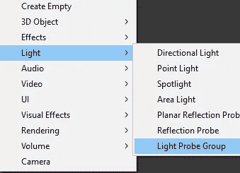
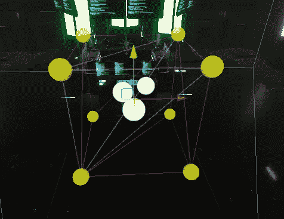
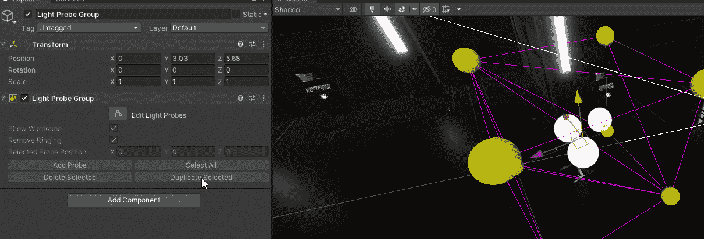
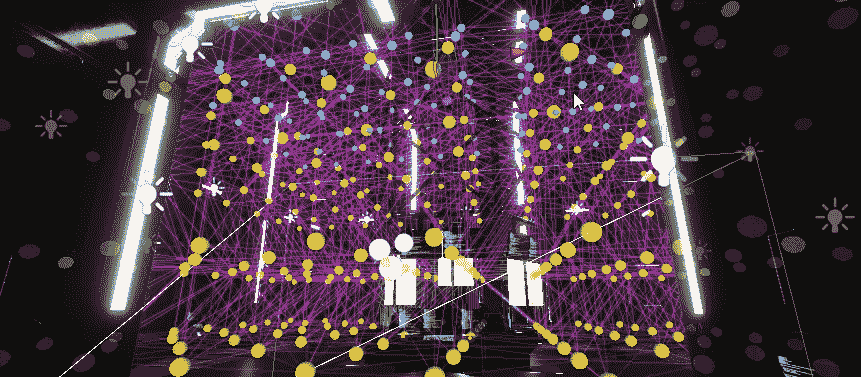
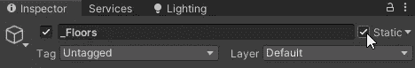
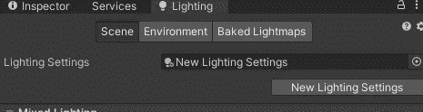
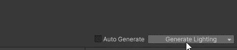
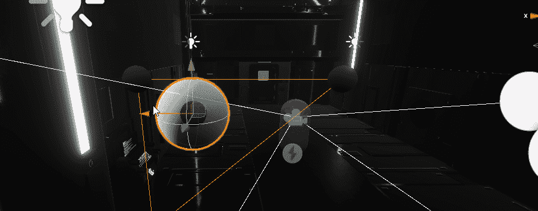
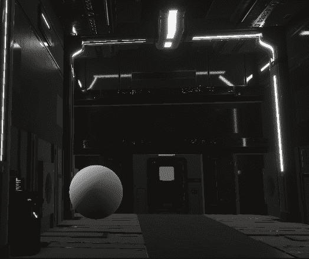

# 游戏开发第 58 天:Unity 中的光探头是什么？

> 原文：<https://blog.devgenius.io/day-58-of-game-dev-what-are-light-probes-in-unity-fcb1e39d0cc2?source=collection_archive---------11----------------------->

**目的:**回顾什么是**光探头**，并在我的 **HDRP Unity** 项目中举例说明。

*"灯光探针的主要用途是* ***为场景*** *中的运动物体提供高质量的照明(包括间接反弹光)。"—统一*

**灯光探针**是一个光源网格，根据灯光贴图离网格最近的亮度，将灯光发射到动态对象上。

我将向你展示我的意思，从给我的场景添加一个**光探测器组**开始。

这将取决于你的项目，但如果我想，我可以在这个组中复制单独的光源，并在我的场景中移动它们。

如果我想让**实时/动态照明**出现在我的整个场景中，我可以把**灯光** **探测器**放在任何地方，例如。不是说我也需要，因为我的球员永远不需要去那么高，但它看起来很酷:)

**光探头**只对动态物体起作用，但需要周围的静态物体才能投射到动态物体上。使用天花板、地板和墙壁作为静态物体似乎效果不错。

要将对象设置为**静态**点击此按钮。

还要确保你已经在场景中生成了光照，点击**光照**选项卡中的生成光照。

作为例子，我把一个球体放到我的场景中。当我移动它时，你应该能看到球体从最靠近它的**探测器**接收光数据。这有助于显示其附近的**探头**，并随着您的移动而更新。

注意球体的左侧，你可以看到它越靠近光源，上面的实时光照就越变化。

这是我对 **HDRP 联合**项目中**光探测器**的基本概述。关于它们还有更多的内容，但是我希望这篇文章是对它们是什么以及如何使用它们的可靠介绍。

他们可能看起来和听起来像昂贵的照明源，但他们实际上是非常高性能的！

***如有任何问题或建议，欢迎评论。让我们做一些很棒的游戏吧！***