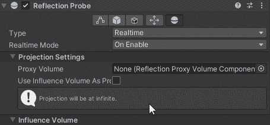

# 游戏开发第 59 天:Unity 中的屏幕空间反射是什么？

> 原文：<https://blog.devgenius.io/day-59-of-game-dev-what-are-screen-space-reflections-in-unity-506c0d1c5dc9?source=collection_archive---------7----------------------->

**目的:**用我的 **HDRP** 项目中的一个例子回顾**屏幕空间反射**。

什么是**屏幕空间反射**？谷歌说得好:

但是如果我们已经有了**反射探头**，在 Unity 场景中使用它有什么好处呢？还有如果有好处，我们怎么设置**屏幕空间** **倒影**？

我将尽力解释，首先给我的场景添加一个**反射探头**。为此，你必须使用 **HDRP** 。

然后我会将它的类型从烘焙改为实时。

当设置为实时:D 时，它变得非常闪亮，如此美丽:“)

我还将调整**反射探头**的半径来适应我的场景

目前在我的场景中，反射从整个**统一**“无限”世界空间中获取反射数据，但是我只想要反射在这个探测半径内获取数据。

为此，我需要选中**使用影响体积作为代理体积**框，它将从**探头半径**内获取反射数据，这将给我更真实的反射。

现在实际打开屏幕空间反射。我需要在我的项目中使用我的 HDRP 资源，在检查器中打开屏幕空间反射，这会给反射添加更多的细节！

这样做可以给你的场景增加更多的生命，但是你不必就此止步。你也可以调整一些反射的设置。去你的**全局体积**，如果你使用 **HDRP** ，你很可能已经在你的场景中了。添加**屏幕空间反射**覆盖。

确保添加“反射”而不是“折射”

**启用**所有选项并开始编辑。请记住，您不必启用每个选项。

让**反射探头**只在**半径**内使用**反射**，启用**屏幕空间反射**并调整它们让我的场景感觉好了很多。

以前

:D 之后

***本文就到此，如有任何问题或建议，欢迎评论。让我们做一些很棒的游戏吧！***