# 游戏开发的第 6 天:统一中简单的 2D 玩家运动！

> 原文：<https://blog.devgenius.io/day-6-of-game-dev-simple-2d-player-movement-in-unity-60d12e098494?source=collection_archive---------1----------------------->

目标:为一款太空射击游戏创建一个简单的 **2D 角色控制器**。更重要的是，记住用 **Unity** 中的 **C#** 编程的核心概念。

这篇文章涵盖了很多内容，我的目标是帮助你理解如何尽快在 Unity 中制作一个基本的 **2D 角色控制器，同时解释它是如何工作的！这将带你一步一步地了解 **C#** 的一些非常重要的特性，你会经常用到这些特性，并为你打下一些核心概念的坚实基础。**

这将假设您有一些基本的 **Unity** 和 **C#** 知识，比如知道脚本中 [**Start()**](https://docs.unity3d.com/ScriptReference/MonoBehaviour.Start.html) 和[**【Update()**](https://docs.unity3d.com/ScriptReference/MonoBehaviour.Update.html)的区别。你也会想知道一个 [**变量**](https://www.w3schools.com/cs/cs_variables.php)[**方法**](https://docs.microsoft.com/en-us/dotnet/csharp/programming-guide/classes-and-structs/methods) 是什么。

我将对一些主题进行简要的解释，但是这篇文章的重点并不在于面面俱到。这是在银河射击游戏的背景下制作的，敌人从屏幕上方向你扑来。无论哪种方式，它都有大量有用的信息，你可以把它们应用到你的项目中。你可以从头到尾复制代码，称之为好的，但如果你想了解它是如何工作的，我建议通读一遍。让我们开始吧！

我将向您展示的脚本的最终结果是让您能够上下左右移动…

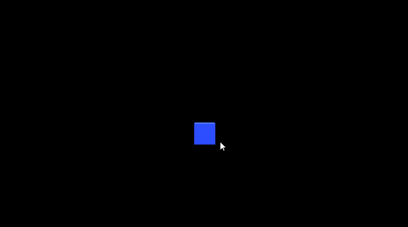

确保你的角色不会向上或向下移动的能力。另外，当它们向左或向右移动时，它们会从另一侧突出来！

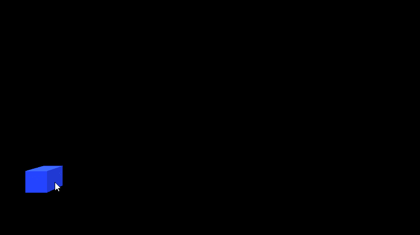

首先制作一个原始的游戏物体，并把它放到你的场景中，在我的例子中，我使用了一个立方体。

我会告诉你如何让你的角色停在某个点上，这样他们就不会离开屏幕，但是为了让你能够跟随，我们需要在 3D 环境中处于相同的位置，以确保我们使用相同的数字。如果现在这还没有意义，不要担心。相信我，你会发现为什么需要这样。

如果你在场景中已经有了一个你想要控制的游戏对象，制作一个**脚本**，你想怎么叫都行。比如我把我的**剧本****玩家**。一旦完成，打开脚本。

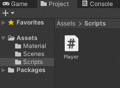

为了确保我们将使用相同的数字设置你的游戏对象**位置**为 0，0，0。

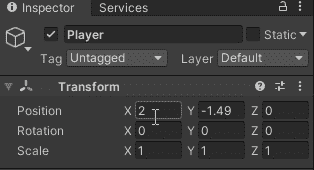

我们可以添加一行代码来确保播放器总是在那个**位置**开始，即使我们在编辑模式下不小心移动了它们。

要通过代码做到这一点，我们需要访问保存玩家**位置**的东西，并告诉计算机我们希望玩家被放置在 x、y 和 z 轴上的 0，0，0 处。在之前的**检查器**中，我让你将玩家 x，y 和 z 设置为 0，0，0。所以把它想象成一个自上而下的层级。你点击了**玩家**，因此他们所有的数据都可以使用。你想改变球员目前的位置。玩家**变换** **组件**保存玩家**位置**、**旋转**和**缩放**的数据。(对象的层次结构是 1。**玩家** 2。**变换** 3。**位置**。现在我们知道我们需要通过代码访问那个**位置**。

继续之前，请确保您的**播放器脚本**已连接到您的播放器。无论是拖放到播放器或去播放器，点击“添加组件”在检查和类型的名称您的脚本。单击它进行添加。

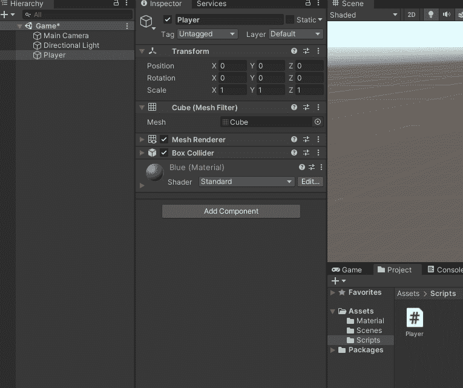

在脚本中，要将玩家的起始位置设置为 0，0，0，请输入以下代码。如果你想理解它，一定要通读解释。

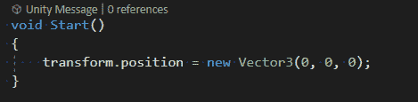

{开始解释

在上面的脚本中，我们正在访问播放器的“ **transform** ”，因为它有我们想要操作的数据。添加一个“.”在 **C#** 中的**转换后**相当于访问它所拥有的东西。例如，在工具带中，您可以通过从工具带中取出东西来使用工具。在 C# 中你放了一个“.”并打出你想要访问的数据。所以 **transform.position** 就是简单地说，我希望玩家**变换组件**，在该组件内部，我希望玩家的**位置**。就像说我想要我的工具带，里面是我的锤子。

你可能会问为什么不用输入 player.transform.position 这样的东西呢？那是因为你的**脚本**被附加到播放器上，所以它假设你想要它所附加的对象的位置。

那行代码的第二部分是你想要设置玩家**的位置**的位置。放入“=”符号表示我希望球员**的位置**“=”(期望的位置)。在这种情况下，我们通过键入 **new** **Vector3(0，0，0)** 来设置**位置**。什么是**向量 3** ？奇怪的词，但在这种情况下很简单。这只是你在世界上的位置。所以 **Vector3** 就是你的 **x** 、 **y** 和 **z** 的坐标顺序。您希望玩家在 **x** 上处于**位置** 0，在 **y** 上处于 0，在 **z** 上处于 0。专注于概念，如果你忘记了语法，那就用谷歌搜索一下，尽你最大努力专注于概念本身，因为现在这更重要。

你必须键入" **new** 关键字的原因是因为 **transform.position** 本身就是一个 **Vector3** ，所以你基本上是说我希望玩家**vector 3(position)**set " = "为一个 **new Vector3** 。

最后这一行代码应该放到[**Start()**](https://docs.unity3d.com/ScriptReference/MonoBehaviour.Start.html)**方法中，因为这是游戏中**脚本**一启用就调用的方法，在游戏刚开始的情况下，就会调用**脚本**将玩家**位置**设置为首选的开始**位置**。**

**现在你已经很好的理解了上面那行代码的作用，你可以把它理解为“我想要玩家的位置，我想要它在游戏开始时被设置到这个位置”。**

**解释结束}**

****重要！**下面的所有代码都将被放入 **Update()** 方法中！**

**首先，为了让玩家移动，我们需要访问输入系统。这包括用于左右移动的水平轴和用于上下移动的垂直轴。**

**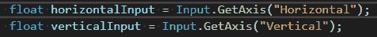**

**关于这个主题的更多信息，请查看官方的 [API](https://docs.unity3d.com/ScriptReference/Input.GetAxis.html) ！请记住，这是需要给我们的能力，要么点击箭头键或(w，a，s，d)移动。**

**从这里我们应该还不能移动。我们所做的只是获得了点击按钮所需的数据。因此，我们还没有设置它来实际推动我们，因为当涉及到这个等式时，不仅仅是单击一个按钮。**

**我们希望当我们点击一个按钮时，玩家**将**(当前位置)转换为**(移动)到另一个位置，到目前为止，我们只有我们想要点击的按钮。我们可以使用内置的方法 **Unity** 已经做出了名为**的翻译**。****

****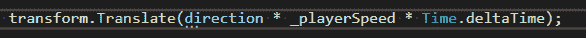****

****这里所发生的事情的一个简短的分解是我们正在**转换**玩家**在给定方向的位置**乘以一定的速度，乘以实际时间，而不是每次发送的帧数。有关 Time.deltaTime 的更多信息，请查看 API。****

****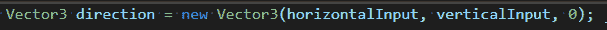****

****玩家前进的方向是**水平输入**和**垂直输入**的组合。z 被设置为 0，因为这是一个 2D 控制器，玩家不需要在 z 轴上的 3D 空间中移动。****

****有了上面所有的代码，你现在应该可以用箭头键或(w，a，s，d)键来上下左右移动你的播放器，播放器应该总是从 0，0，0 位置开始。为了测试，你可以移动玩家，然后开始游戏，每次游戏开始时，它应该跳回到我们设置的开始位置。****

****现在让玩家停留在屏幕上。****

****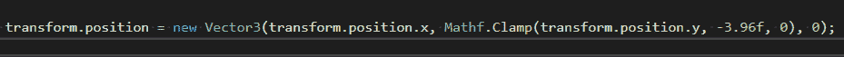****

****就像前面一样，我们使用一个**向量 3** ，它是 3d 空间中的一个 **x** 、 **y** ，z 坐标。在这里，我们将玩家的位置设置为" = "一个新的矢量 3 。通过键入 t**transform . position . x**中的 **x 位置**，我们只是说我们想要使用玩家当前的 **x 位置**，这意味着我们想要玩家在 **x 轴**上自由移动(水平)，而不受这行代码的影响。对于 **y 位置**，我们使用[**Mathf。Clamp**](https://docs.unity3d.com/ScriptReference/Mathf.Clamp.html) 方法，这意味着我们可以选择一个轴和 2 个数字作为轴之间的界限。在这种情况下，我们将限制玩家**位置**在 y 轴(垂直)上的变化范围。这意味着玩家只能在我们选择的最小和最大的两个数字之间移动。****

****在你的屏幕上移动玩家并查看其当前的**位置**会告诉你你想要输入什么数字作为你的最小和最大边界。****

****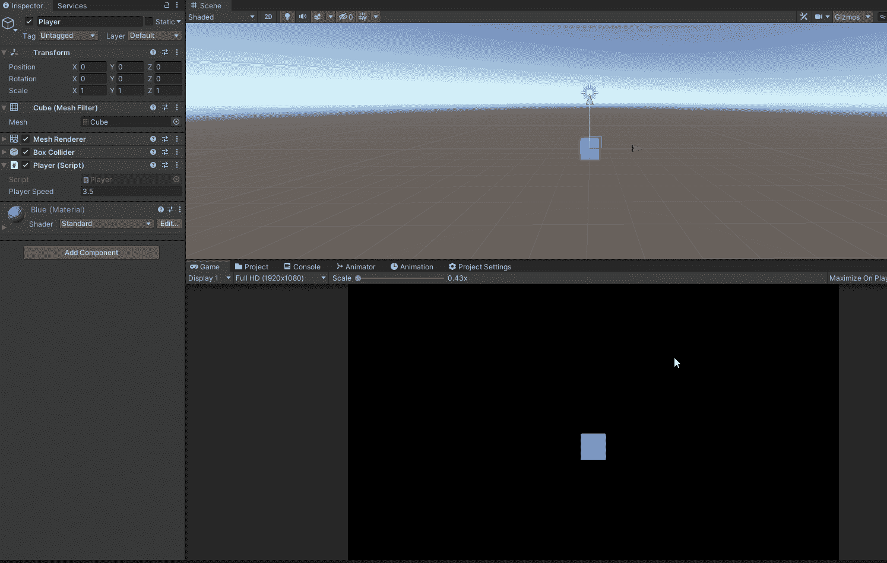****

****最后让你的**角色**弹出到屏幕的另一边，如果移动到最左边或者最右边的话。它非常简单，而且在整篇文章中，您已经使用了完成这项工作所需的大部分特性。****

****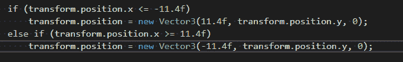****

****如你所见，这里有一些熟悉的信息被操纵。像玩家**变换位置**以及使用**矢量 3** 将那个**位置**设置为一个新的位置。我们还将使用一个[**if** 和 **if else** 语句以及相同的**基本数学符号**](https://www.w3schools.com/cs/cs_conditions.php) 。****

****基本上我们是说，如果玩家点击了 x 轴**上的这个位置**(水平)，那么我们要将其设置为新的**位置**。像前面一样，移动场景中的玩家，看看当它到达初始**位置**时 **if 语句**正在检查的**位置**是你想要设置的。****

****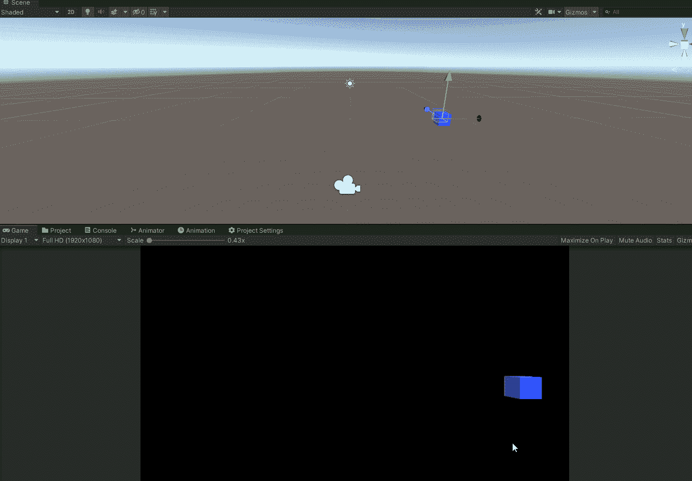****

****厉害！你现在已经知道了 **C#** 的一些基本特性，以及如何在 **Unity** 的上下文中使用它们！****

****我希望这能帮助你理解用 **Unity** 中的 **C#** 编程的一些核心概念，这样你就可以把它应用到你自己的项目中。如果你有任何问题，我知道这不是详尽无遗的，请随时提问。****

******继续前进，即使你很难理解这些。我向你保证，直到 2 个月前我才自信地理解它，而那是我学习如何使用 Unity 和 C#的 7 个月。这是一个过程，还有很多我不知道的。不要让这压倒你，以至于不采取行动。让它激励你前进！******