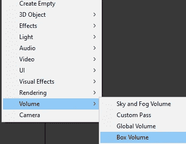
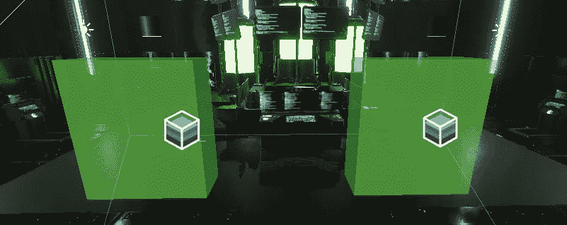
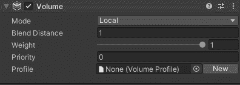
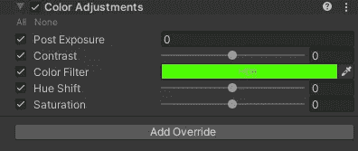
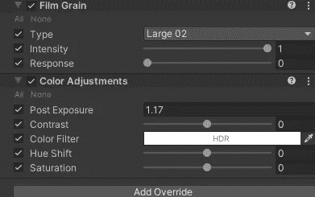
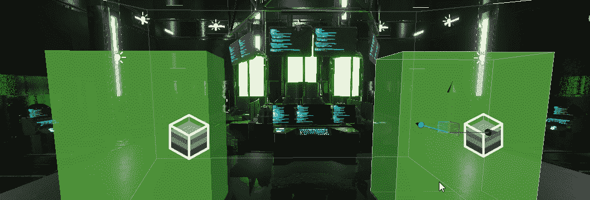
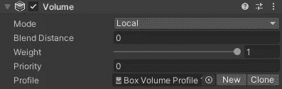
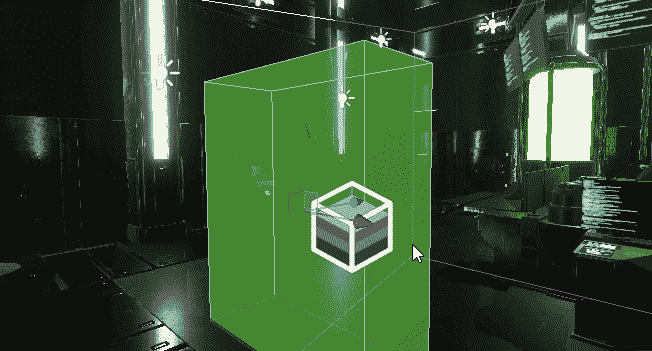
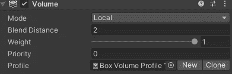
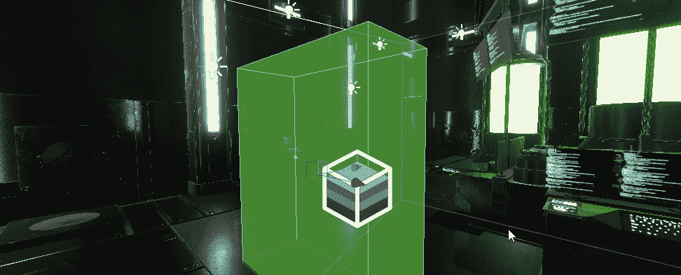

# 游戏开发的第 60 天:在 Unity 中使用多个后处理体积和/或反射探头！

> 原文：<https://blog.devgenius.io/day-60-of-game-dev-using-multiple-post-processing-volumes-and-or-reflections-probes-in-unity-2bb84dfc8850?source=collection_archive---------8----------------------->

**目标:**回顾如何在 **HDRP Unity** 项目中使用多个后处理配置文件和/或反射探头！

从**反射探头**开始。你会注意到，如果你对多个房间使用一个以上的反射探头，你的反射可能会有点偏离。这是一个相对容易解决的问题。根据需要，在每个不同的房间或区域放置不同的反射探头。当**反射探针**重叠时，它们往往会造成意想不到的影响。

现在进入**后处理卷**。您不必使用**全局音量**来设置后期处理效果。取而代之的是，你可以制作多个具有不同效果的区域。一种方法是使用盒体积。

我将开始添加 2 个盒子体积到我的场景中，并调整它们的大小。

在每个卷上，我都会添加一个新的配置文件。

在每个方框区域内，您可以将**后处理**效果设置为仅在区域内及其周围产生效果。

在左边的框中，我将设置一个颜色变化效果。

在右边的框中，我将为视图添加一些颗粒感，并设置一些曝光。请记住，您可以做任何您想做的事情，但这只是为了让演示更加明显。

现在我可以带着不同的效果进出每个区域。当我不在任一区域时，我使用我已经设置好的**全局卷**。

还有一个有用的设置叫做**混合距离**。如果你设置为 0 并移动到其中一个区域，效果会更有一种“啪嗒”的感觉。但是如果你把它设置的高一点，那么它会融合而不是折断。

“混合距离”设定为 0 会创建快速过渡

“混合距离”设定为大于 0 的任何值都会产生混合过渡

***这就是我这篇文章的全部内容！如果你有任何问题或想法，请随意评论。让我们制作一些令人敬畏的游戏！***