# 游戏开发的第 61 天:回顾在 HDRP 30 多天的场景建设！

> 原文：<https://blog.devgenius.io/day-61-of-game-dev-looking-back-on-30ish-days-of-scene-building-in-hdrp-4fb8024b486e?source=collection_archive---------13----------------------->

**目的:**回顾一下我在 **Unity** 最近 30 多天场景搭建中所学到的东西。包括我觉得难的，有趣的等等。

在过去的大约 30 天里，我被**游戏开发总部**催促着去学习一些我从未想过要学的东西。作为一个真正对编程感兴趣的人，并且把我的大部分精力都集中在这个领域，这对我来说是一次非常有趣的新的学习经历。

到目前为止，我不是一个专家，但由于我在最近的课程中学到的东西，我现在对谈论和使用**照明**、 **HDRP** 、 **URP** 、**水平建筑/设计**和更多的 **Unity** 更有信心了。

我不得不做一个办公室场景作为期末项目，要么通过，要么不及格。老实说，虽然它看起来真的很好，但我还是有一些问题，我的教练向我展示并解释了如何解决这些问题，他回答了我所有的问题。我确信理解了他教我的东西，并把这些修正应用到我的场景中。感谢阿尔·海克对我们的帮助。

在我解释我学到的一些东西之前，我想给你们看一些我在课程结束时看到的两个场景的截图。

从我在 HDRP 拍的科幻片开始。我也有一个 URP 版本，但 HDRP 版本将在这里显示。

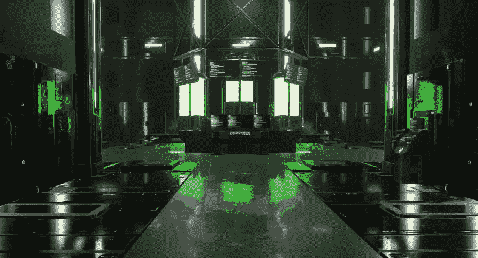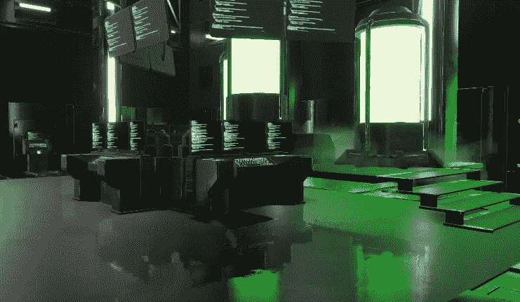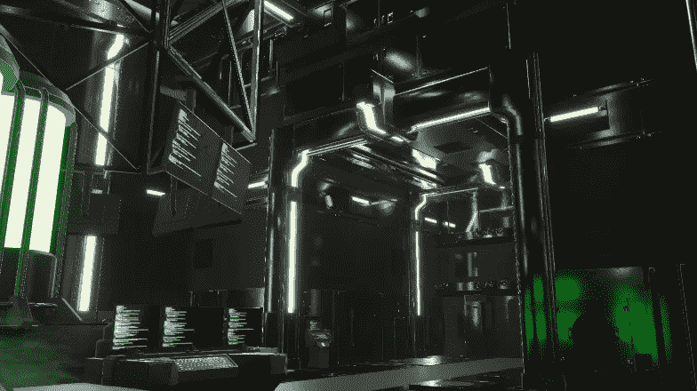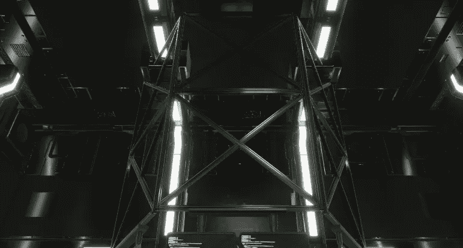

现在我的最后一个项目，HDRP 制造的办公室场景。

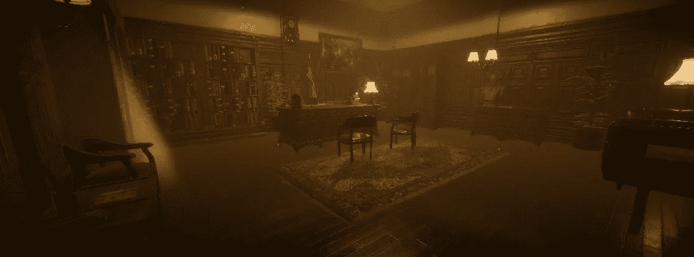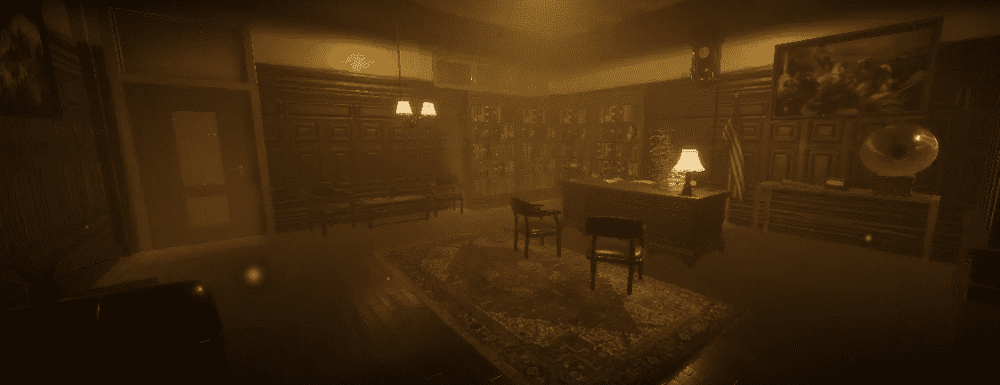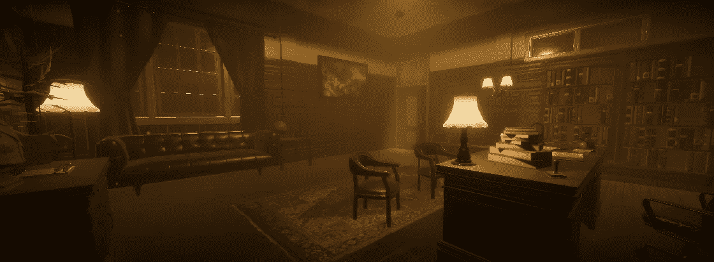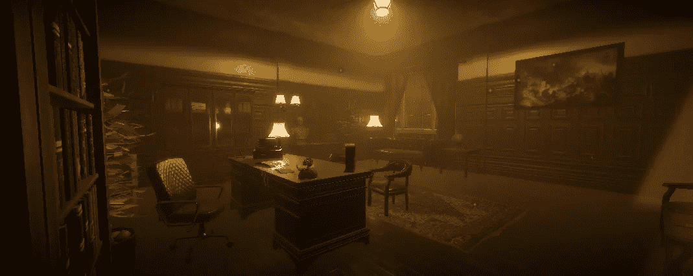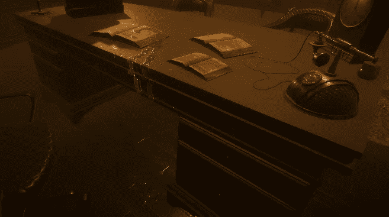

在 GameDevHQ 的帮助下，我从勉强摆弄一个方向灯变成了制作这些！

首先，一些我觉得最酷最有趣的话题是，

*   遮挡剔除
*   光探头
*   排放
*   反射探针
*   饼干
*   顶点捕捉
*   后加工
*   贴花纸

其次，我发现下面的主题对我来说更难理解(列表重叠，因为我仍然觉得很有趣:)

*   纹理贴图
*   光探头
*   发射通道
*   某些后期处理效果，如曝光(如何使用)
*   创建进入房间的真实太阳光
*   产生尘埃粒子

到目前为止，在艾尔·赫克的帮助下，我对这些话题都更有信心了。虽然一开始它们对我来说是更具挑战性的话题，难以理解它们是如何工作的。

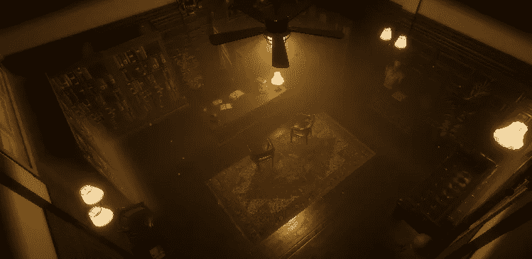

最后我学到了很多，我的意思是像很多。我肯定没有包括这里的所有内容，但我对课程的结果非常满意。尽管我失败了很多，但我学到了很多。在这之前的 30 天里，我最多摆弄过方向灯。最多…

这是一次非常好的学习经历，我喜欢学习编程之外的其他游戏开发领域，尽管编程是我的专长。

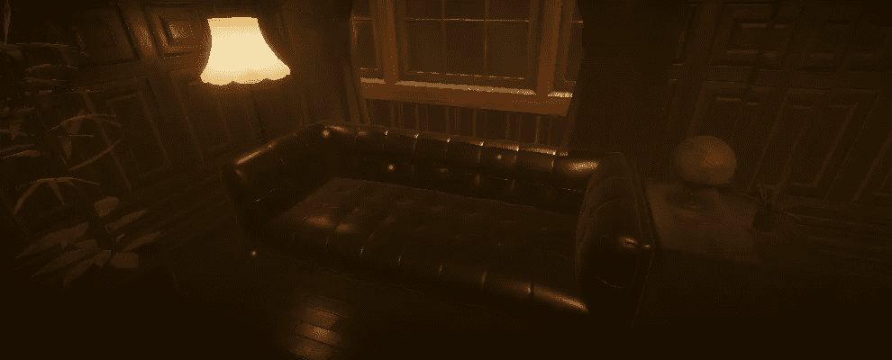

如果你对你的学习经历有任何问题或想法，请随时发表评论，我真诚地希望这篇文章能激励你继续前进，继续学习！让我们做一些很棒的游戏吧！