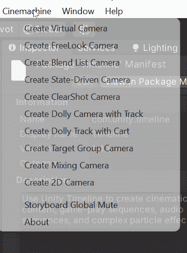
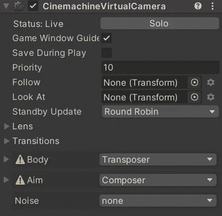
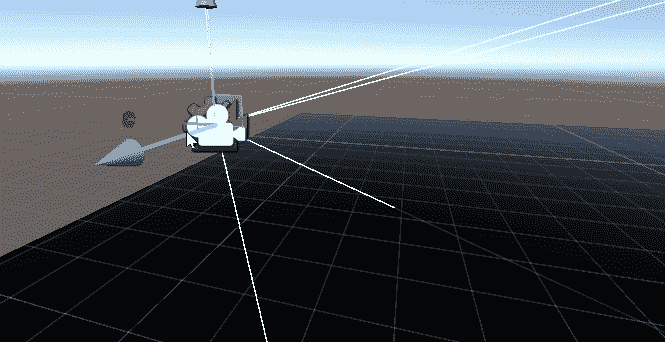
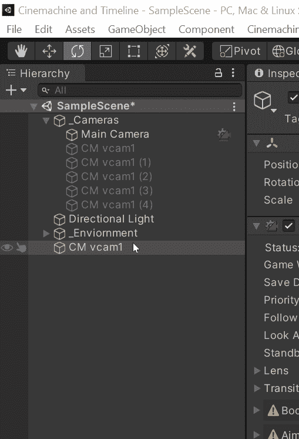
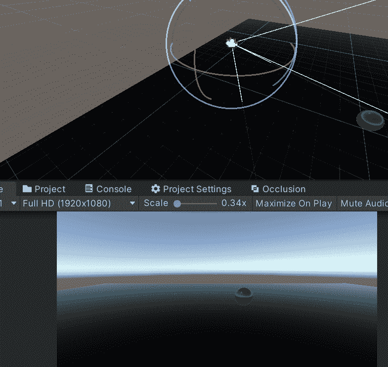
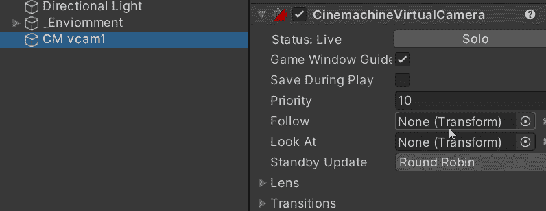
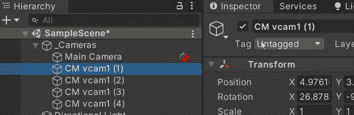
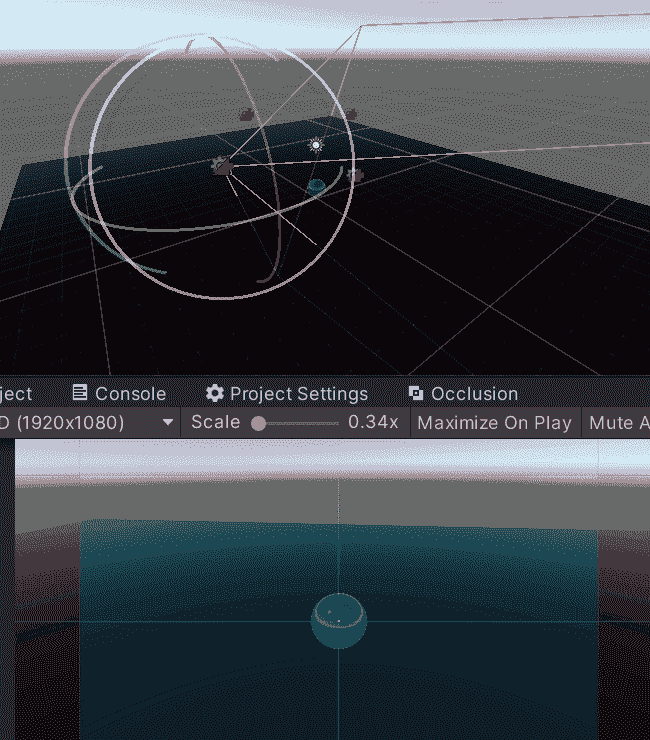

# 游戏开发的第 63 天:用 Cinemachine 设置虚拟摄像机！

> 原文：<https://blog.devgenius.io/day-63-of-game-dev-setting-up-virtual-cameras-w-cinemachine-39d905039504?source=collection_archive---------13----------------------->

**目的:**在我的 **Unity** 场景中设置一些**虚拟摄像机**并回顾它们是什么以及它们有哪些有趣的设置。

Cinemachine 提供了许多不同类型的摄像机，但最基本的，也是你可能会用得最多的是虚拟摄像机。其他类型的相机是虚拟相机的非常不同的变体/附件。

关于**虚拟摄像机**有一点需要注意，当你将它们添加到场景中时，你可能会注意到它们并不是真正的摄像机。**虚拟摄像机**是控制主摄像机的摄像机设置和预设。这意味着您可以在每个虚拟相机之间切换，以应用不同的效果等等。最后，我将向你展示两种不同的方法来切换你的虚拟相机。

让我们从给场景添加一个**虚拟** **摄像机**开始。

让我们回顾一下虚拟摄像机的一些设置。

**播放期间保存:**允许您在播放模式下配置相机上的设置，并保存这些设置，而不会在退出播放模式时被恢复。

**优先级:**具有最高值的虚拟摄像机将是主摄像机使用的虚拟摄像机。

**跟随:**相机将使用游戏对象位置跟随游戏对象。

**查看:**相机将使用游戏对象位置查看游戏对象。

这些是与你正在关注的游戏对象相关的设置。

这些是与你正在看的游戏对象相关的设置。

这些相机的另一个很酷的功能是**与**对齐**视图**。

当试图将你的相机移动到场景视图中的正确位置时，有时会很麻烦。

相反，您可以在层级中选择您想要移动的摄像机，并单击**与视图**对齐设置，摄像机将移动到您的场景视图摄像机所在的任何位置，使其更容易定位。

之前我说过我会向你展示两种不同的方式来切换你的虚拟相机。

第一种方法是更改摄像机的**优先级**，将您想要打开的摄像机设置为最高优先级。

其次，如果您禁用其他摄像机，那么即使其他摄像机的优先级更高，也只会使用启用的 1 个摄像机。

你可以并且可能会结合这两种方法。例如，如果您有 4 台摄像机。将每个值设置为比另一个值低 1。所以你有一个优先级为 4 的摄像机，接下来是 3，然后是 2，然后是 1。然后，当您从第一个到最后一个禁用它们时，您将在它们之间切换。相当甜蜜！

***关于虚拟相机的这篇文章到此为止！如果您有任何问题或建议，请随时评论。让我们做一些很棒的游戏吧！***