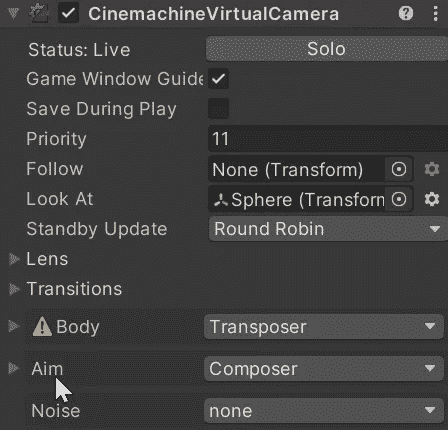
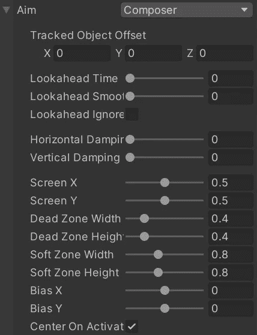
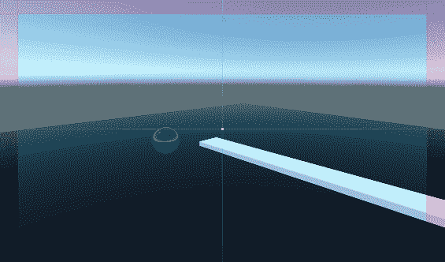
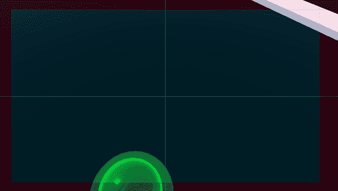
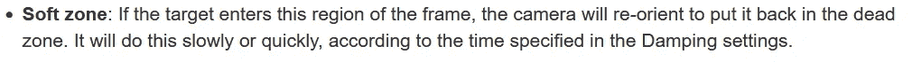
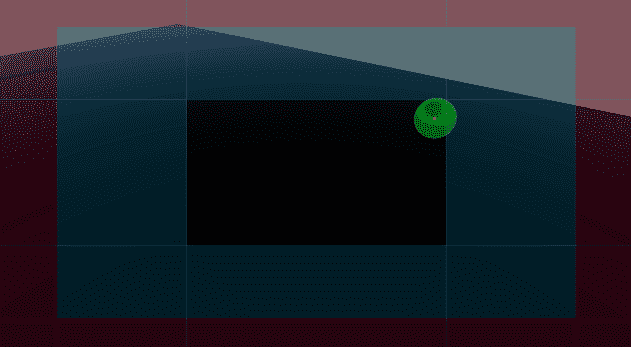

# 游戏开发的第 64 天:Cinemachine 中的瞄准/注视功能！

> 原文：<https://blog.devgenius.io/day-64-of-game-dev-aiming-lookat-features-in-cinemachine-e611b5a15f4d?source=collection_archive---------6----------------------->

**目标:**回顾一下**影院**中的**目标**是什么，并回顾一下它附带的一些设置。

在这个虚拟相机上，你可以看到我在部分的 **Look** **中有一个**游戏对象**。目标设置用于实现我希望如何看待这个**游戏对象**的特定效果。**

让我们检查一下这些设置中的一些设置。

**Lookahead Time:** 用于让相机看向你正在看的物体的前方。

**前瞻平滑度:**用于使相机在前瞻时不会突然从一个位置跳到另一个位置，而是平滑。

**水平和垂直阻尼:**用于让相机跟随你所看的物体后面。

**死区宽度和高度:**用于控制死区宽度和高度。

**软区宽度和高度:**用于控制软区宽度和高度。

Cinemachine 还有很多类似这样的高级功能，那会花我们很多时间去编程。这是一个多么棒的工具啊，我们可以用它来让我们的生活变得更轻松:)谢谢 Cinemachine 的创作者们！

关于 Cinemachine 的目标的简要概述就到此为止。如果你有任何问题或想法，请随时告诉我。让我们做一些很棒的游戏吧！