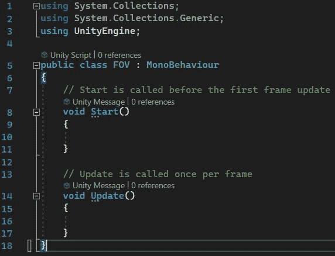
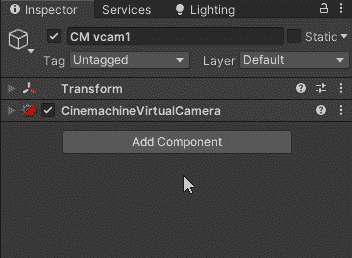
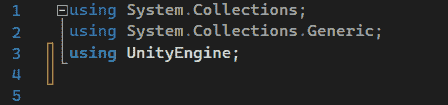
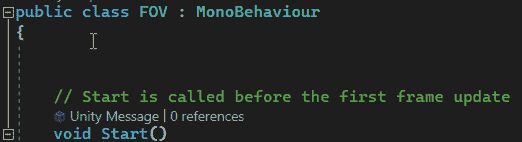
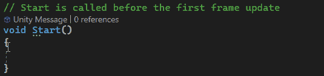
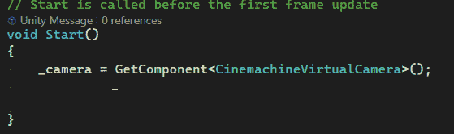
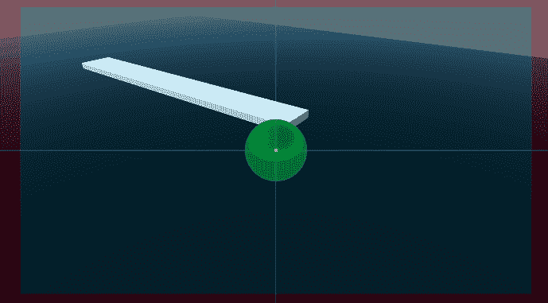
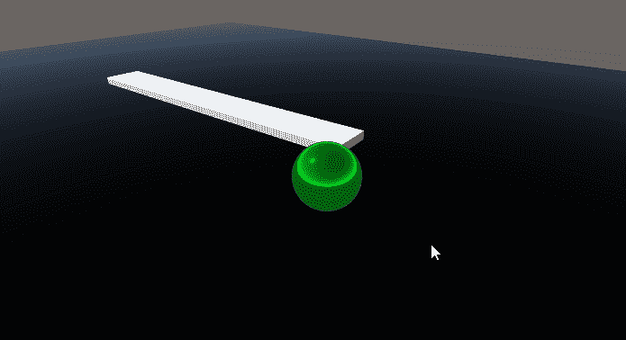

# 游戏开发第 65 天:如何使用 C#访问 Cinemachine！

> 原文：<https://blog.devgenius.io/day-65-of-game-dev-how-to-access-cinemachine-using-c-b2d4694f3371?source=collection_archive---------11----------------------->

**目的:**通过 **Unity** 中的代码操纵虚拟摄像机。

这很像在 **Unity** 中操纵任何游戏对象。

首先，我将为这个例子编写一个新的脚本。

它被称为 FOV 公元前我将操纵摄像机的视野

我会确保将这个脚本附加到我想要影响的相机上。

回到脚本，为了能够访问与 **Cinemachine** 相关的摄像机，您将需要 **Cinemachine** 名称空间。

然后我需要一个类型为**cinemachinevitualcamera**的变量。

接下来我需要给这个变量赋值。

现在我有了需要操作的组件的引用，我将访问它的视野设置并更改它。

相机上当前的视野被设置为 60 °,这意味着每当游戏开始时，它将变为 40 °,放大相机。

不要就此打住，记住你现在可以访问虚拟摄像机上几乎所有的设置。玩得开心！

这是另一个简单的例子。通过代码每当我点击空格按钮，我从 60 放大到 40，然后 20，然后回到 60。每当我点击“E”的时候，我也会切换我正在看的对象。只要我有参考，我就可以通过代码在相机上操纵任何我想要的东西。

***如有任何问题或建议，欢迎评论。让我们做一些很棒的游戏吧！***