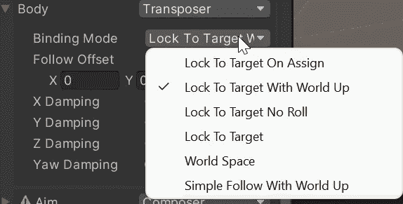
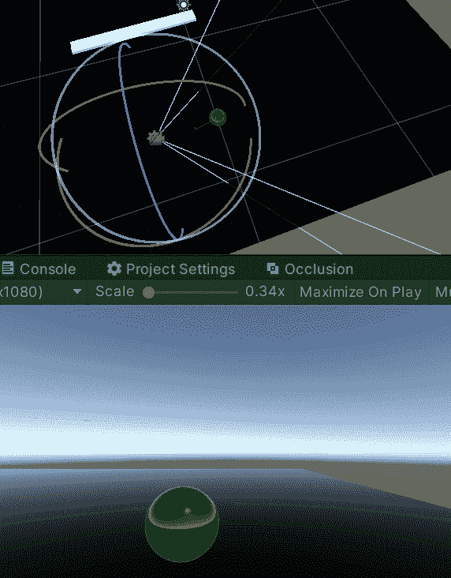

# 游戏开发的第 66 天:Cinemahine 中的跟随/身体特征！

> 原文：<https://blog.devgenius.io/day-66-of-game-dev-follow-body-features-in-cinemahine-998ccaffbbbf?source=collection_archive---------10----------------------->

**目标:**查看/测试**跟随**和**身体**在我的虚拟相机上设置。

这篇文章的目的是给你一个关于 **Cinemachine** 中 **Body** 特性的可靠概述。如果你有任何具体的问题，请随意评论。这是一篇较长的文章，主要是因为所有的图片，所以不要让那个小滚动条吓到你:)

**跟**是什么……

当您将变换分配给**跟随变量**时，虚拟摄像机的位置将跟随您分配的任何游戏对象。

什么是**体** …？

如果您将目标分配给**跟随变量**，您将可以访问**主体设置**，该设置用于调整您希望摄像机如何跟随该对象。

让我们回顾一下这些设置中的一些:

如果您选择了**移位器**(在**装订模式**的正上方)，您将拥有这些不同的**装订模式选项**。每种绑定模式都略有不同。例如，**锁定目标**允许摄像机不仅使用跟随物体位置，还可以旋转。当**锁定目标时**号**滚动**只跟随物体位置。

你也可以改变**的体型**。例如**成帧换位器**。

**帧换位器**比默认的**换位器**给你更多的选择。它基本上结合了主体和目标设置，这样你就可以在 1 中同时拥有主体和目标。或者你可以只使用默认的**移位器**并单独使用 Aim。取决于你的项目。(**瞄准**设置与**查看**相关，而**主体**设置与**跟随**相关)。

让我们来看看更多的**车身**类型。像**一样硬锁定目标**。

**锁定目标**选项最少，主要用于将非常简单的相机安装到某物上。也许就像一个完全静止的安全摄像头。

还有超赞的**第三人称相机**！

您可以更改相机打开的**偏移**和**侧**！在我看来很可爱。节省了大量时间。将来可能会有另一篇关于这方面的文章，但是你也可以设置你的相机与其他碰撞器碰撞的位置，使相机不会移动到其他物体中，例如，穿过或进入墙壁。

什么是**变轨器**？

这正是我们喜欢第三人称摄像机的原因。它可以让你围绕指定的游戏对象旋转你的相机。我会告诉你我的意思。

要使用**轨道变换**，你还需要分配一个**注视**变换。

还有一种选择，即**履带式小车**。

测试用的**机架式移动摄像机**基本上需要安装在一个轨道上，它将根据它所观察的游戏对象的距离沿着轨道移动。

我举个简单的例子。**履带式小车**类型也需要分配一个**查看**并需要一个**路径**(轨道)才能使用。我将创建一个空的游戏对象并添加 **CinemachinePath** 组件。

这是起始轨道，我会把它做成一个圆。

一个很不好的圈子…

然后，如果我启用**自动推车**，我们应该都设置好了:)

这是很多，但人是令人敬畏的！

***如有任何问题或想法，欢迎评论。让我们做一些很棒的游戏吧！***