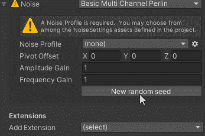

# 游戏开发的第 67 天:如何使用噪声在 Cinemachine 摄像机上创建手持外观！

> 原文：<https://blog.devgenius.io/day-67-of-game-dev-how-to-create-the-hand-held-look-on-cinemachine-cameras-using-noise-32007d9621f4?source=collection_archive---------3----------------------->

目标:用 **Cinemachine** 制作一个看起来像有人拿着的相机。

在我进入这篇文章的主要焦点之前，我只想说，作为一名程序员，我喜欢一个工具，它允许我在没有太多编程工具的情况下，不用一遍又一遍地编写相同的东西。 **Cinemachine** 给了我如此多的选择，而我几乎不用编写任何代码，这让我节省了很多时间和压力。不要误解我的意思，对于过渡和其他什么的，仍然需要进行一些编码，但是如果你还没有的话，请认真地尝试一下。(顺便说一句，如果你不确定，这是一个照相工具)

回到当前的主题，我们如何在 Unity 中实现这一点:

Cinemachine 让这一切变得非常简单。

在我的例子中，我设置了一个虚拟摄像机**，绿色球体被指定为它的**注视**变量。**

然后我去**噪点设置**。

将**噪声类型**从**无**更改为**基本多声道柏林**(有点啰嗦)。

从那里你可以设置**噪音模式**为最适合你的模式。在文章开头的例子中，我将它设置为**hand held _ normal _ extreme**。

除了**噪声模式**之外，您还可以调整一些**设置**。

很可爱吧？而且没有多余的编码！一定要弄乱设置，找出你想要的，并享受这个过程

***这就是我对这篇文章的全部介绍，如果您有任何问题或想法，请随时发表评论。让我们做一些很棒的游戏吧！***