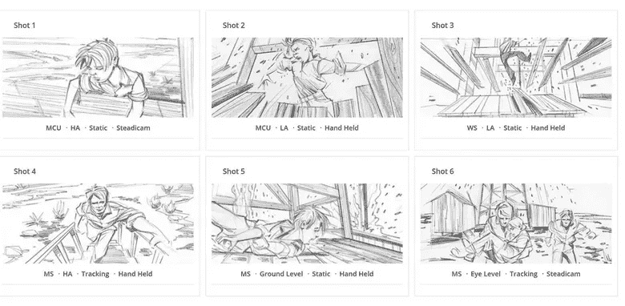
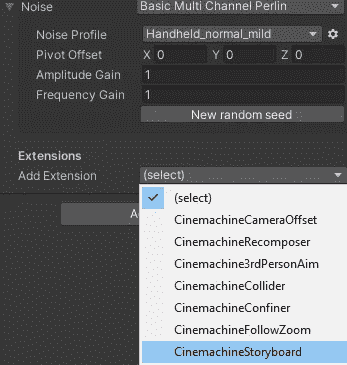
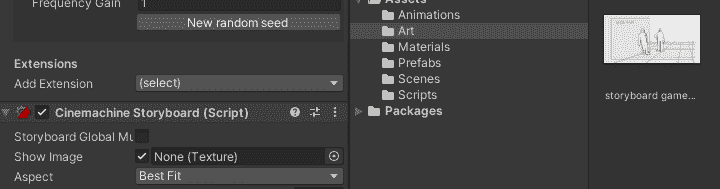
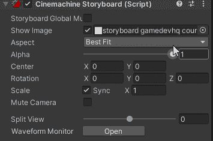
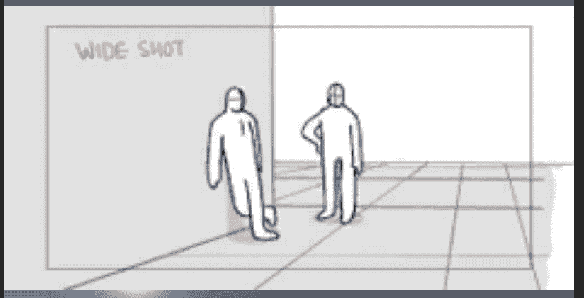
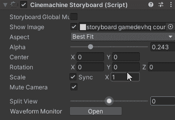
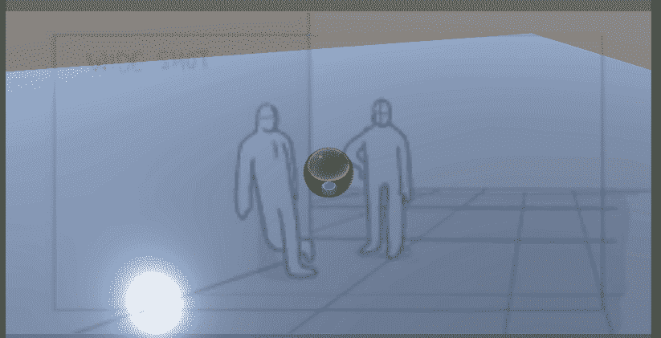
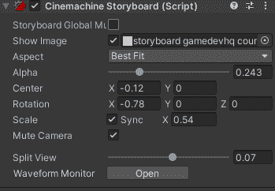
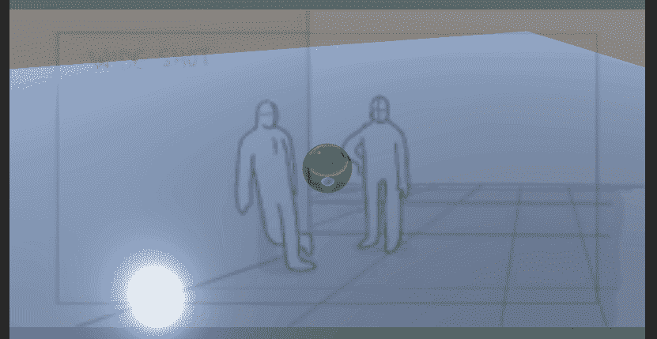
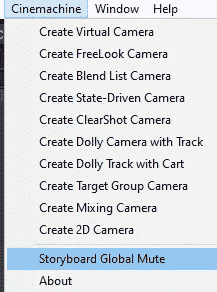

# 游戏开发的第 68 天:在 Unity 中使用带有虚拟摄像机的故事板！

> 原文：<https://blog.devgenius.io/day-68-of-game-dev-using-storyboards-with-virtual-cameras-in-unity-74f47a8ec3e?source=collection_archive---------8----------------------->

**目标:**回顾什么是与虚拟摄像机相关的**故事板**，并以一个 **Unity** 项目为例。

首先，什么是故事板？

***故事板是一种图形组织器，由按顺序显示的插图或图像组成，用于预可视化电影、动画、运动图形或交互式媒体序列。*** —维基百科

有时你会在故事板之外工作，当试图设置摄像机角度和所有电影镜头时，你可能想要一种更简单的方式来可视化它。 **Cinemachine** 有一个选项可以导入图像，并使用它来帮助可视化您的场景。

如果您有一个虚拟摄像机，您应该能够添加故事板扩展。它的工作方式与 **UI** 非常相似。

对于这个例子，我从 google 下载了一张图片。如果您将图像分配给 **Show Image** 变量，故事板应该会为您显示出来。

当然，你可能需要调整一些设置。

例如，调整 **Alpha** ，这样你就可以同时看到你的场景和图像。

调整其**位置**、**刻度**等也有很多选择。

您也可以勾选**故事板全局**静音框，这将关闭场景中的所有故事板。您也可以取消选择**显示图像**来关闭特定的故事板图像。

**故事板全局静音**设置也可以在 **Cinemachine** 选项卡中找到。

***这就是我这篇文章的全部内容。我希望它对你有所帮助，并让你开始使用 Unity 中的故事板。如果你有任何问题或想法，请随意评论。让我们做一些很棒的游戏吧！***