# 游戏开发的第 69 天:在 Unity 中使用 Impulse Listener 扩展实现相机抖动！

> 原文：<https://blog.devgenius.io/day-69-of-game-dev-implementing-camera-shake-using-impulse-listener-extensions-in-unity-8c65a3194b1?source=collection_archive---------3----------------------->

**目的:**使用 **Cinemachine** 设置**相机抖动**功能。

这需要几个步骤，但是不要让这些吓跑了你。一旦耗时较长的设置完成，你就可以轻松调整和实现**相机抖动**功能。

Cinemachine 已经设置好了大部分，但是还有一些事情我们需要做。

这是我的最终结果。**相机抖动**本身已经设置好了，尽管我需要根据游戏中比较容易的部分来调整它。

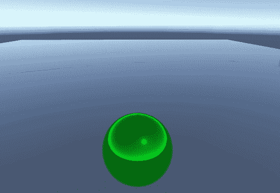

每次单击退格键时都会抖动

对于我的例子，我在球体上设置了第三人称虚拟摄像机。

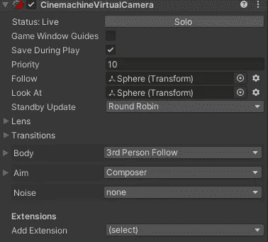

首先，我需要进入我的扩展并添加**脉冲监听扩展**。

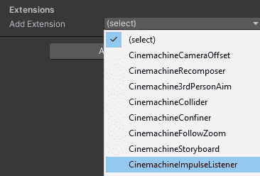

**脉冲** **监听器**只监听信号源。我们还需要一些东西来引发震动。我将创建一个空的游戏对象，命名为**脉冲**并添加**脉冲源脚本**。

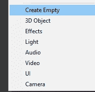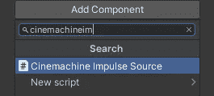

**脉冲源**正在寻找一个信号源资产，我们将需要在我们的项目选项卡中制作。

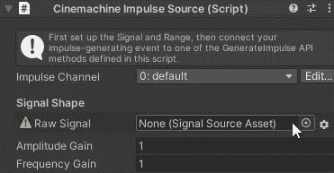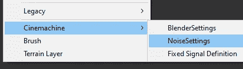

在这个例子中，我将使用噪波设置

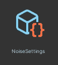

然后将其分配到**脉冲源**中。

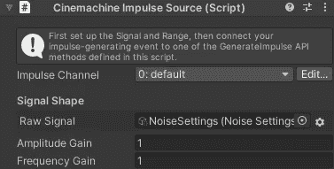

在 **NoiseSettings** 资产中，设置可能看起来很吓人。请记住，它几乎只是调整噪音的强度或强度，以及噪音的工作方式。噪音导致震动，所以你现在可以用震动来代替噪音这个词来帮助理解。

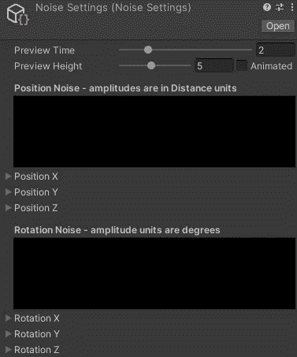

你可以调整这些不同的效果，例如一个更长的轻微震动的地球嘎嘎声或一个快速微妙的爆炸的枪射击。我不会在这里深入讨论，因为这将是一整篇文章本身，但请记住，这是这些设置的目的。你至少需要在噪波设置中设置一个大于 0 的数字。这是我的，你可以测试一下。

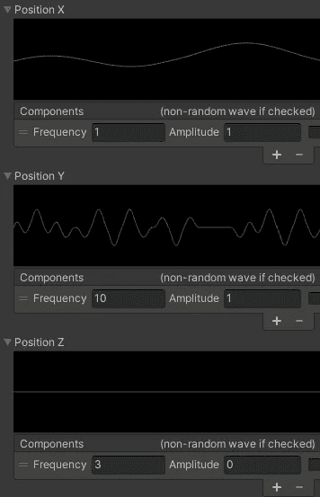

你也可以从脉冲源本身调整几乎相同的设置，而不是在**噪声设置**中。但是这些使用噪声设置值。因此，如果你没有接触噪声设置，那么你将乘以 0。意味着什么都不会发生。

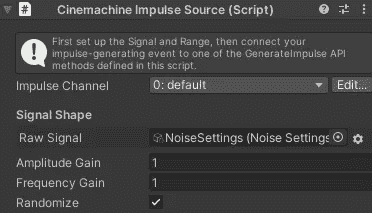

如果您选中**随机化**框，那么每次播放噪音/震动时，它都会在您设置的范围内被随机化。

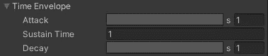

这些设置也非常有用。如果你想增加抖动的强度，可以使用 A **ttack 变量**。这意味着它开始的速度较慢，并根据您设置的时间逐渐增加。**持续时间**是峰值强度，**衰减**是攻击的反义词，强度下降。

因此，在本例中，抖动将以较低的强度开始，并在 1 秒内上升到峰值强度。然后它将在峰值强度停止 1 秒钟。最后衰减到 1 秒钟没有震动。

你也可以点击**攻击**或**衰减**并调整摇动的曲线以达到不同的效果。

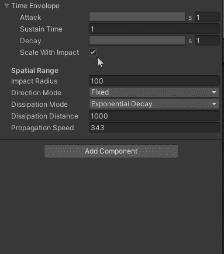

现在我们有了一个**脉冲监听器**和一个**脉冲源**，我们需要通过代码调用这个 shake。

对于这个例子，我将创建一个名为 **CameraShake** 的新的 **C#脚本**。

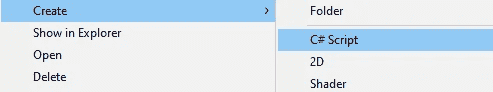

在脚本中，我们需要确保我们有 **Cinemachine** 名称空间。

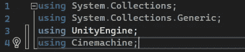

然后我们需要参考我们创建的**脉冲源**。我将它设置为一个**序列化字段**并在检查器中分配它，并确保脚本附加到我之前的 Impulse 空游戏对象。

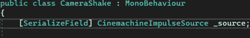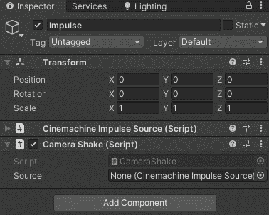

现在我有了源代码，我可以访问其中的方法，包括我需要调用的 impulse/shake。所以我要创造我自己的方法来开始摇动。

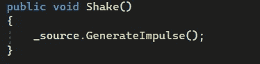

然后对于这个例子，每当我按下空格键时，我将调用我从 **Update** 中创建的新方法。

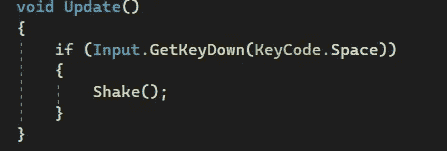

到最后，整个脚本应该是这样的。

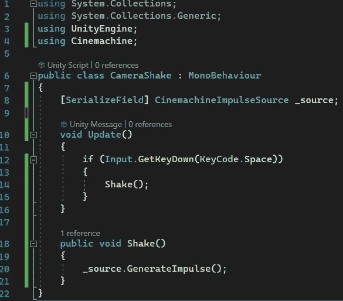

这差不多就是所有的设置，当然适用于你的情况可能会略有不同。

从那里你可以调整设置，以获得正确的感觉。

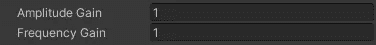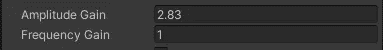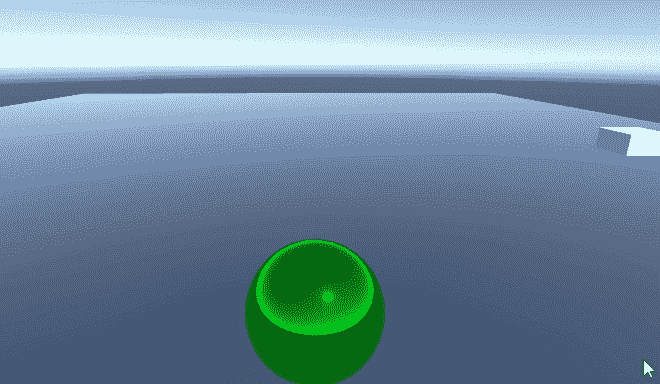

***如有任何问题或想法可免费评论。让我们做一些很棒的游戏吧！***