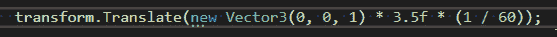
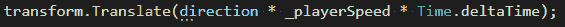
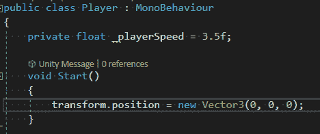
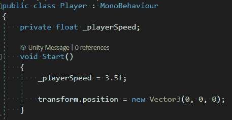

# 游戏开发的第 7 天:变量，编程的基石！

> 原文：<https://blog.devgenius.io/day-7-of-game-dev-variables-the-building-block-of-programming-e96ccb6ddff3?source=collection_archive---------10----------------------->

**目标:**了解什么是**变量**以及如何使用它们。

对于那些不知道的人来说，**变量**是大多数编程语言的关键部分。

要理解 C# 你肯定需要理解什么是**变量**。不要担心，因为我会向你解释它们，并给出几个例子。

**变量**是一段其值变化的数据。它基本上是价值的占位符。换句话说，你标记了一个值。这使得代码更容易阅读 100 倍。想象一下，在这样一个脚本中试图找到一个玩家的速度是在哪里计算的:

老实说，它看起来几乎像是胡言乱语，除非你是刚刚编写代码的人，并且知道哪个数字代表哪个东西。如果你回头或者其他开发者看到了，会有很多混乱。如果它看起来像这样呢？

在脚本的其他地方，每个单独的值被保存为“方向”、“playerSpeed”和“Time.deltaTime”。

例如，我们现在很容易知道哪个数字是玩家速度的“=”，因为它的名字叫“玩家速度”！它让人们更容易阅读。

**变量**可以声明为**类宽**或**方法宽**。例如下面的 _playerSpeed 是在**类范围内**定义的(在任何方法之外)。这样它就可以在**级**的任何地方使用。例如，如果它是在 **Start()方法**中创建/初始化的，那么您只能从 **Start()方法**中访问它。

**C#** 中**变量**的基本结构从左至右为:

1.  **变量**的**访问级别**(私有、公共、受保护等。)
2.  **的**类型**变量** (float、int、string 等。)
3.  **自定义变量名**(本例中为 _playerSpeed)
4.  你给那个**变量**的**可选值**。(在本例中为 3.5f)该值实际上可以在以后赋予变量**变量**，使其成为可选选项。如果你愿意，你可以简单地初始化这个变量，并让它没有值，直到以后。像这样:

还有许多其他方法来操作一个**变量**，只要记住它们只是一个值的引用，使得代码更容易阅读和操作。