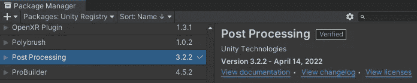
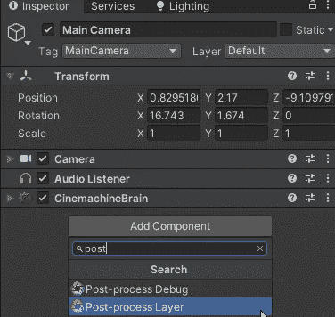
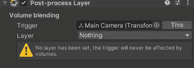
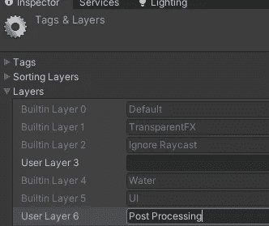
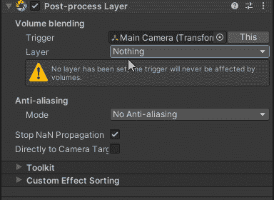
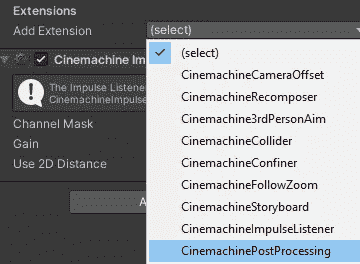
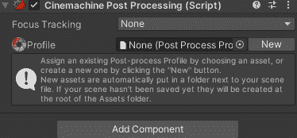
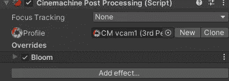
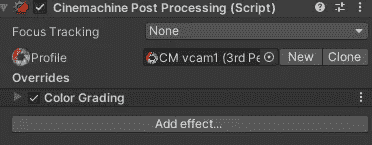
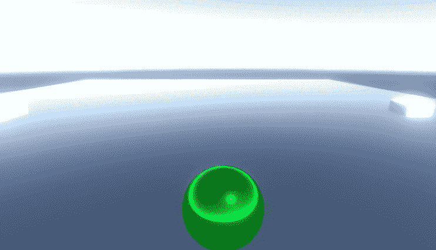

# 游戏开发的第 70 天:如何在 Unity 中为单个摄像机添加自定义后期处理配置文件！

> 原文：<https://blog.devgenius.io/day-70-of-game-dev-how-to-add-custom-post-processing-profiles-to-individual-cameras-in-unity-c1bedb2cbd9d?source=collection_archive---------15----------------------->

**目的:**使用 **Cinemachine** 为不同的虚拟摄像机添加自定义**后处理轮廓**。

首先确保 **Post** **Processing** 安装在您的项目中。

在主相机上，你需要添加一个**后处理层**。

在组件中，您会注意到需要设置图层，并且您可能还没有一个专用于**后处理**的图层。所以我们需要创建一个并分配它。

我想展示我们如何在两个不同的摄像机之间切换，并对它们进行两种不同的**后处理**效果。

我需要给两台相机添加 **Cinemachine Post** **处理扩展**，并给两台相机添加一个新的配置文件。

我在一台相机上添加了一点蓝色，在另一台相机上添加了高光，以使区别更加明显。

现在，当我在我使用的相机之间切换时，每个相机都有自己的自定义效果！

***如有任何问题或想法欢迎评论。让我们做一些很棒的游戏吧！***