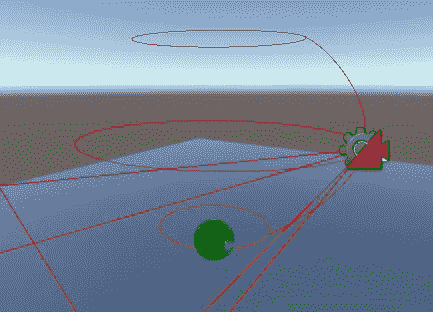

# 游戏开发的第 71 天:Cinemachines Free Look 相机太棒了！

> 原文：<https://blog.devgenius.io/day-71-of-game-dev-cinemachines-free-look-camera-is-awesome-d39baf80703?source=collection_archive---------19----------------------->

**目的**:简单炫耀一下 **free look 相机** **Cinemachine** 优惠！

太酷了。老实说，让我对 **free look 相机**如此兴奋的部分原因是因为它给了我寓言 3 的感觉，怀旧之情油然而生。

来自 deluxe 345[https://www.youtube.com/watch?v=uO9LEGvdzvI](https://www.youtube.com/watch?v=uO9LEGvdzvI)的寓言 3 游戏

从自由视角相机的基本“版本”开始是**轨道相机**。**轨道摄像机**允许摄像机使用鼠标在指定对象周围移动。

**自由视角** **摄像机**允许你上下移动，并调整你允许移动的距离和允许移动的高度。如果这听起来很奇怪，让我给你看看。

我将添加一个**自由视角相机**到我的场景中。

然后我把我的球指定为 L **看着**，F **跟着**。

在场景里看，让我之前说的更好理解。如你所见，有三个不同的环环绕，有一个**脊椎**将它们连接起来。

圆环更像是末端区域。当你上下移动时，你的相机不仅仅可以捕捉到每一个，相反，你可以从任何地方这样走来走去。

除了一些其他设置，你可以调整每个环的 H **八个**和 R **四个**。

在我看来，free look 相机非常酷，非常有用。不仅仅是因为我们不需要编写任何代码来使用它们，而且作为一个机械师，许多玩家喜欢它们。

***如有任何问题或想法，欢迎评论。让我们做一些很棒的游戏吧！***