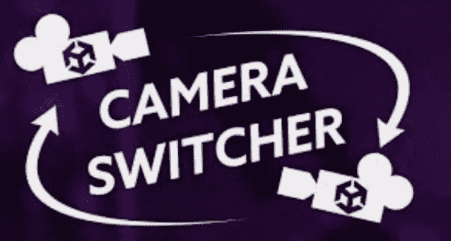
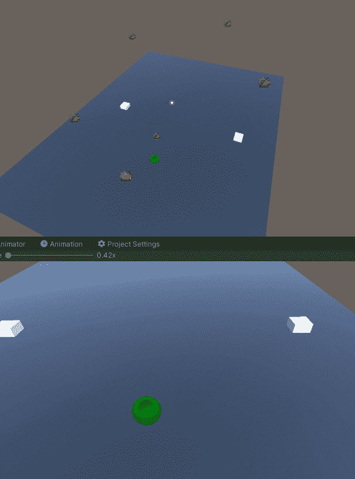
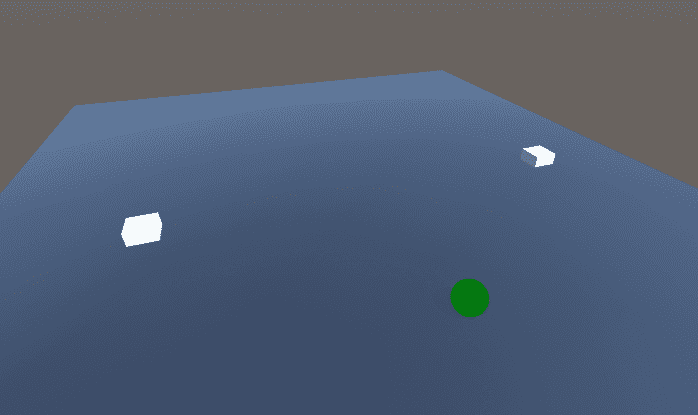
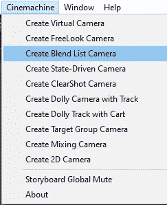
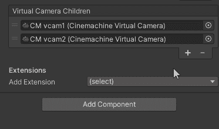
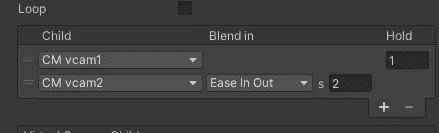
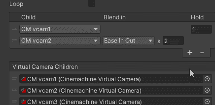
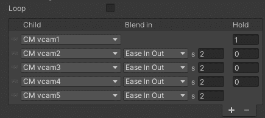
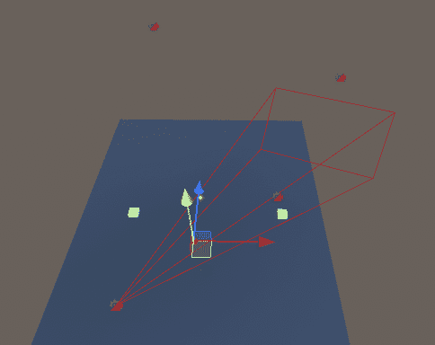

# 游戏开发的第 72 天:在 Cinemachine 中使用混合列表相机的自动动画！

> 原文：<https://blog.devgenius.io/day-72-of-game-dev-automatic-animations-using-blended-list-cameras-in-cinemachine-4a747133e41c?source=collection_archive---------11----------------------->

**目的:**展示什么是**混合列表相机**以及它的一些优点。我还将带您完成一个设置。

图片来自:Dan Pos——游戏开发教程！【https://www.youtube.com/watch?v=ZVrfNivw7PY 

一个**混合列表相机**允许你在多个不同的相机之间非常容易地转换，不需要任何代码。

这里有一个例子:

有许多实际的事情你可能需要这个。例如，如果您安装了 2 台摄像机，并在它们之间进行切换，您将得到一台安全摄像机。

让我们开始自己实施吧！

所以假设你的项目中已经有了 **Cinemachine** ，我们将开始添加一个**混合列表相机**到我们的场景中。

默认情况下，这里已经有两个摄像头。在这个例子中，我将总共添加 5 个。

您可能还会注意到相机列表正上方的列表。

您可以在这里设置相机相互融合的顺序和速度。对于这个例子，我将保持简单，通过数字，我将每个相机混合到下一个。所以凸轮 1 到凸轮 2，然后 3，然后 4，然后 5。

**保持**值表示在融合到下一个摄像机之前，摄像机将在该指定摄像机停留多长时间，而 **s** 变量表示摄像机融合需要多长时间。

如果需要，您也可以打开循环。

如果你正在跟随我的步骤，还有一件非常简单的事情我忘了提及。请确保将您的相机展开，并/或将它们放在不同的位置。如果你不这样做，你可能真的很困惑，为什么当你按下播放时它不工作。

你应该都准备好了！

我知道这是一个非常简单的相机类型概述，但如果你有任何问题或想法，请随时发表评论。试着想出一些创造性的方法来使用这台相机，让我知道你想出了什么:)

让我们制作一些令人敬畏的游戏！