# 游戏开发第 73 天:如何使用 Cinemachine 基于动画状态切换摄像机！

> 原文：<https://blog.devgenius.io/day-73-of-game-dev-how-to-switch-cameras-based-on-animation-states-using-cinemachine-d47cb42ce793?source=collection_archive---------5----------------------->

**目的:回顾如何使用 Cinemachine 设置状态驱动摄像机。**

在我开始讲述我们如何在场景中设置它之前，你可能会问自己这样一个摄像机的目的是什么？为什么基于动画状态切换相机会有用？

以下是一些实际例子:

*   第三人称射击，放大应该把相机放在你的肩膀后面，离玩家更近。
*   当跑步以获得更快的移动感觉时
*   或者相反，让相机在减速或被击中时放大

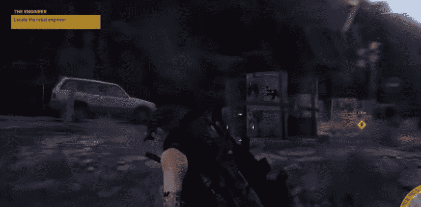

幽灵侦察荒野——游戏来自 [GamingBolt](https://www.youtube.com/watch?v=LC5piNmPuqc)

对于这个例子，我需要一个至少有 2 个**动画状态**的游戏对象。我不会在这里深入探讨如何做到这一点，因为这不是本文的主要目的。

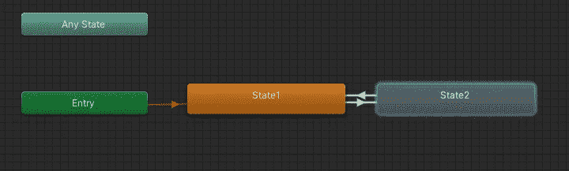

我还需要状态 1 和状态 2 之间的转换。我将创建一个 **bool** 参数，如果为真，状态 1 将转换到状态 2，如果为假，状态 2 将转换回状态 1。

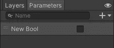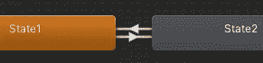

这也可能有助于确保在每次过渡时将**的退出时间**设置为假，以便动画是即时的。

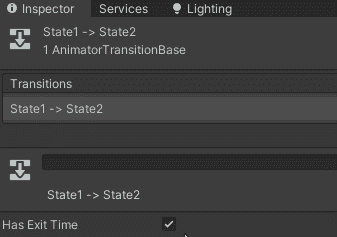

现在让我们添加一个**状态驱动的摄像机**到场景中。

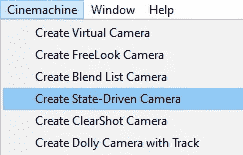

我将使用**第三人称摄像机**作为例子，创建一个放大功能。我将一台摄像机设置为普通的第三人称视角，另一台设置为放大的肩部视角。

要做到这一点，我将添加第二个相机到我的状态驱动相机，并进入每一个，并把它们放在我想要的位置。

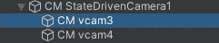

我的第一个 cam 设置为缩小视图，第二个设置为放大视图。(如果你不明白为什么它们被命名为 cam 3 和 cam 4，那是因为我的场景中有其他 cam，它会自动命名它们)

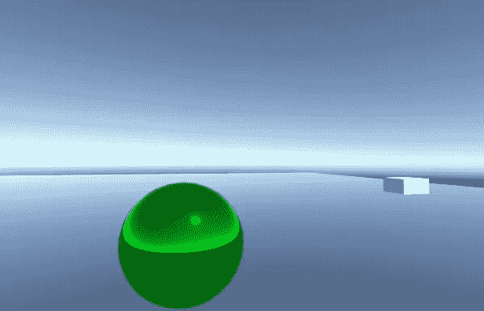

凸轮 1

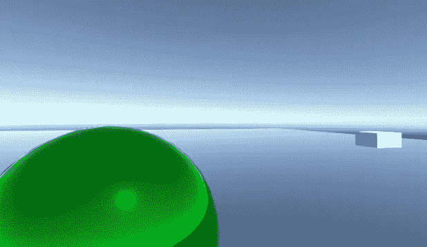

凸轮 2

然后我需要分配我的**动画目标**变量，也就是我的球体。为此，球体动画实际上不需要做任何事情。在这个例子中，我们只需要它们根据我们所处的动画状态来决定切换到哪台摄像机。它不关心动画本身。

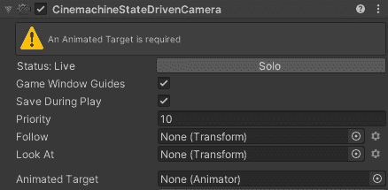

现在我添加了我的**动画目标**，摄像机现在看到目标**动画状态**，我现在可以设置**过渡**。

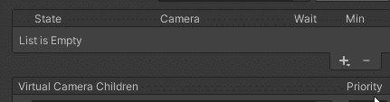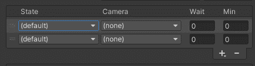

将每个状态分配给特定摄像机后，我现在可以按下播放和测试。如果我选择了我的球体并且打开了**动画师**窗口，我可以将 **bool** 参数更改为 true 或 false，然后在摄像机之间切换！

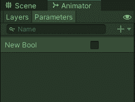

记住你可以通过脚本改变这个 bool，这样当你按住一个按钮的时候它就会放大。

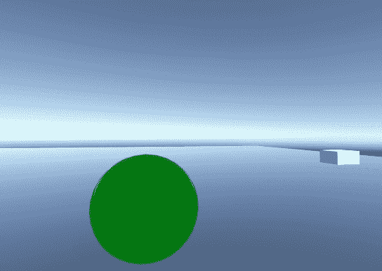

你可以用它做很多不同的事情，所以发挥创造力吧！

***如有任何问题或想法，欢迎评论。让我们做一些很棒的游戏吧！***