# 游戏开发的第 74 天:在 Cinemachine 中使用 Clearshot 摄像机进行智能摄像机切换！

> 原文：<https://blog.devgenius.io/day-74-of-game-dev-intelligent-camera-switching-using-clearshot-cameras-in-cinemachine-c11420f3987d?source=collection_archive---------10----------------------->

**目标:**回顾什么是**清晰拍摄相机**并在我的场景中实现一个。

在 **Cinemachine** 中有一些相机，像**状态驱动相机**基于当前动画状态在相机之间切换，或者**混合列表相机**基于给定的时间帧并以非常特定的顺序在相机之间切换。

但是还有**清晰拍摄摄像机**，它将根据游戏对象的可见性来切换摄像机。

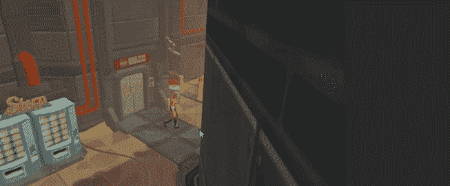

清晰拍摄摄像机上的 [Unity](https://www.youtube.com/watch?v=I9w-agFYZ3I) 的剪辑

对于我的例子，我有一个球体作为主要目标，我想**看看**。我将制作两面墙，这样当球体从一台摄像机移出时，它将切换到另一台摄像机。

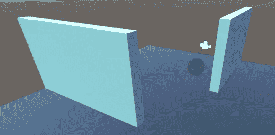

然后我会给我的场景添加一个清晰的摄像机。

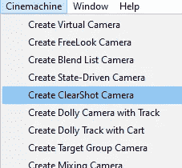

默认情况下，它只有一个摄像头，所以我会添加另一个。

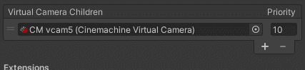

我会将每个摄像机放置在每个摄像机都能看到球体的位置，这取决于摄像机在墙后的位置。

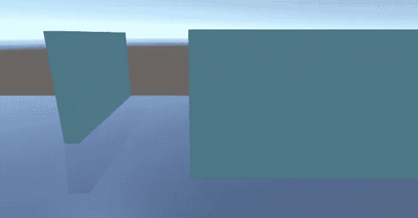

凸轮 1

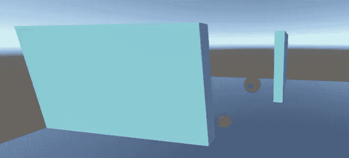

凸轮 2

如果您看到此错误，只需将**主体**类型从**换位**改为**做** **无**。

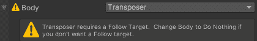

此外，如果您遇到以下错误:

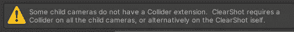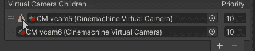

添加 **CinemachineCollider 扩展**到那个摄像机。

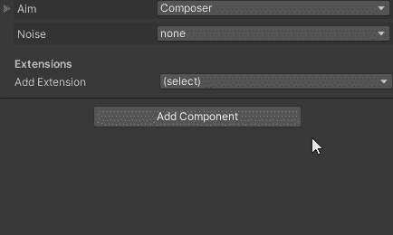

回到它，每个摄像机将需要的游戏对象分配给**看**变量。在这种情况下，它是我的领域。

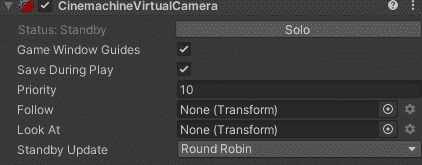

你可能得到的另一个错误是关于**cinemachinecoller 扩展**。如果你没有**避开障碍物**启用转场，也就是这种相机的全部功能，就无法工作。

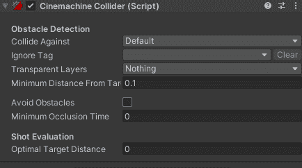

那应该能行！现在，当我按下播放键时，你可以看到基于我的对象的可见性，摄像机将会切换。

您还可以根据需要调整设置，以便在摄像机需要转换时获得正确的感觉和时机。

***这就是我对清晰拍摄相机的简要概述。如果你有任何问题或想法，请随意评论。让我们做一些很棒的游戏吧！***