# 游戏开发的第 75 天:如何在 Unity 中使用 Cinemachine 移动/跟踪摄像机！

> 原文：<https://blog.devgenius.io/day-75-of-game-dev-how-to-dolly-track-a-camera-using-cinemachine-in-unity-d4bb8026943b?source=collection_archive---------7----------------------->

**目的:**用一些例子回顾**多利摄像机 Cinemachine** 提供的两种不同类型。

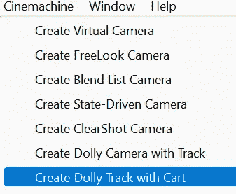

首先，你可能会注意到有两种选择。一个带轨道的**移动摄像机和一个带推车**的**移动轨道。**

有什么区别？

带轨道的**移动摄像机**将摄像机设置在轨道上，摄像机将根据您瞄准的游戏对象的位置移动。但是摄像机将被限制在它的轨道上。

为了给你一个直观的例子，我将从在我的场景中添加一个开始。当你添加一个到你的场景中时，它会添加一个**虚拟摄像机**和一个**轨迹**。

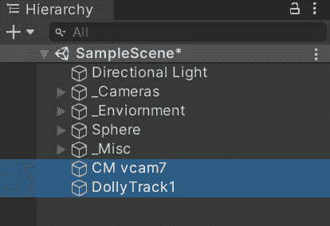

这是默认情况下**轨道**的样子:

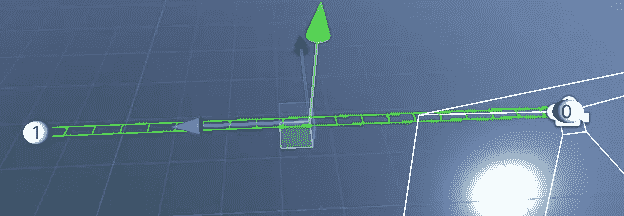

你可以很容易地定制**轨道**，但是我将保留这个例子的默认值。还要记住的是，摄像机会在距离游戏对象最近的地方移动。

回到设置。在**虚拟摄像机**上，确保**机身**类型设置为**履带式小车**。

确保**自动移动按钮**已启用，这样摄像机将实际移动。

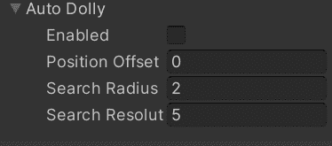

并确保给相机一个目标**跟着**走**看**。

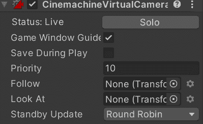

当你将摄像机添加到场景中时，一些设置是自动设置的，但如果没有，你需要指定“**路径**”，这是摄像机需要跟随的**轨迹**的另一个术语。当你添加相机到场景中时，它应该已经为你添加了一个**路径**。所以如果还没有的话，就把它拖放进去。

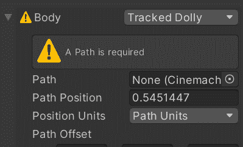

现在基于游戏对象的位置，摄像机将使用其指定的**轨迹**移动。

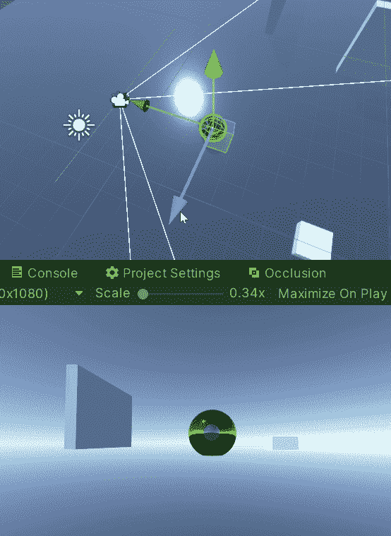

**小车轨道与推车**类似，除了相机不会根据游戏对象的位置移动。就像另一台相机一样，这台相机将在**轨道**上移动，但将只是不断地沿着**轨道**移动(如果你循环的话，还会回来)，不管目标游戏对象在做什么。

我将把相机添加到我的场景中。

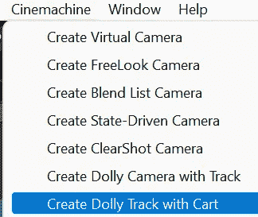

这一个的设置非常相似，但是你可能也需要手动添加一个**虚拟摄像机**。

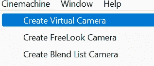

另外**跟随**的目标需要是**玩具车**而不是你想要瞄准的游戏物体。因此，请确保将 **DollyCart** 对象设置为 **follow** 并将游戏对象设置为**look**。

另一个不同之处是，你不需要将虚拟摄像机上的**身体**类型更改为**履带式移动小车**。相反，将其保留为**移位器**。(我吃了苦头才知道)

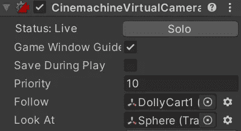

默认情况下**速度**为 0，因此请确保增加速度，以便推车移动。

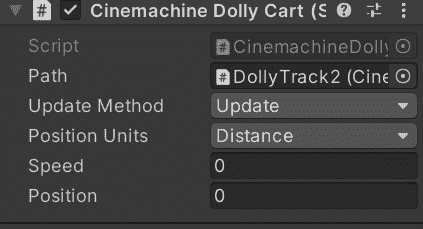

另外，如果你想让相机继续**循环**而不是简单地停在终点，确保检查**路径**上的**循环变量**。

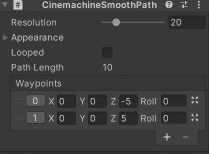

这应该是最终结果:

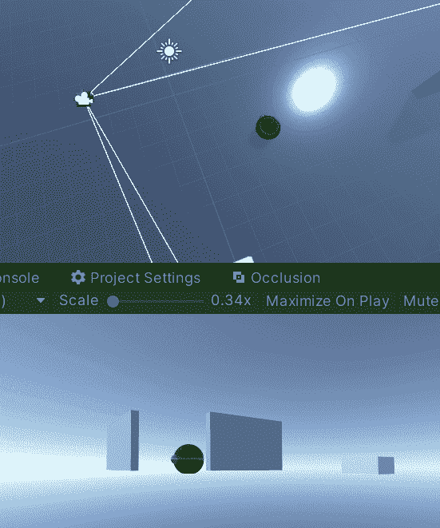

我知道，与其他相机相比，这可能感觉像是很多设置，但请记住，我们只是在没有编码的情况下做了所有这些，当你分解它时，你只需要学习几个步骤。

***这就是我对 Cinemachine 中两种不同的移动摄像机的简要概述。如果你有任何问题或想法，请随意评论。让我们做一些很棒的游戏吧！***