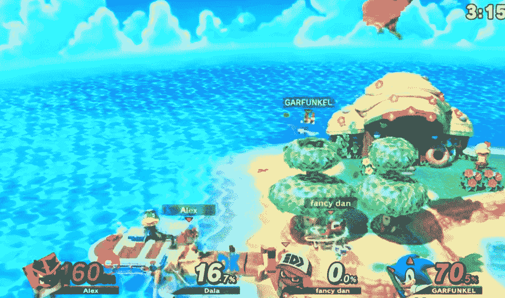
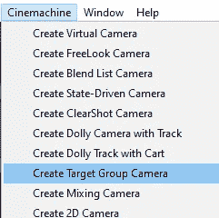
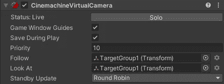
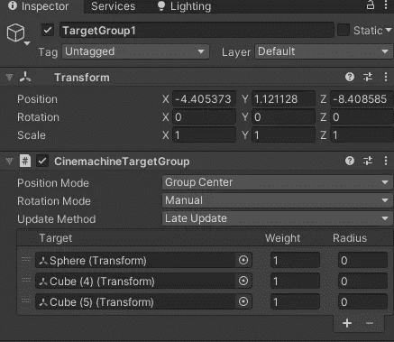
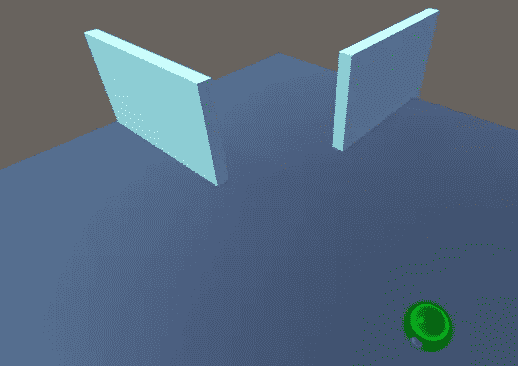
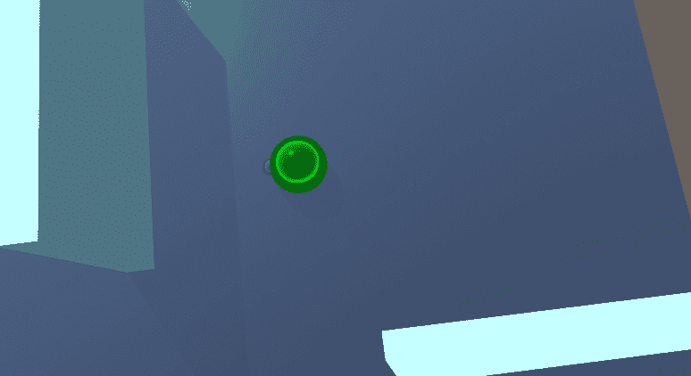
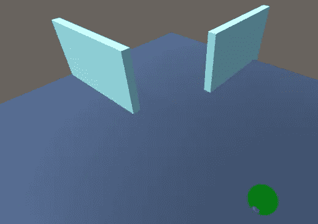
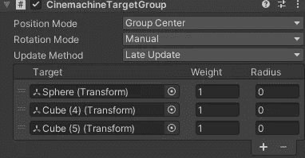

# 游戏开发的第 76 天:如何用 Cinemachine 同时保持多个对象在视图中！

> 原文：<https://blog.devgenius.io/day-76-of-game-dev-how-to-keep-multiple-objects-in-view-at-the-same-time-w-cinemachine-ac04280b4cc1?source=collection_archive---------7----------------------->

**目的:**举例复习如何在**影院**中使用**目标群摄像机**。

当你需要多个物体始终对焦时，这款相机非常有用。像**超级粉碎兄弟**。所有的运动员必须时刻保持焦点对准。

来自[VG247.com](https://www.youtube.com/watch?v=jhmsv0ISfto)的游戏

**Cinemachine** 提供快速(无需编码)解决方案。我们来设置一下。

我将从给我的场景添加一个**目标组摄像机**开始。

这应该给你一个**虚拟摄像机**和一个**目标组**。

**虚拟摄像机**应该已经设置为**跟随**和**看**你的**目标** **组**。

要指定您希望**跟随**的对象，您将进入**目标组**本身。

在我的例子中，我添加了一个绿色球体和两堵蓝色墙壁作为我的目标组。

正如你所看到的，当我移动球体时，相机仍然试图保持墙壁在视野中，而不是单纯地聚焦在球体上。

还有一些设置需要调整。如**权重**，用于计算不同目标之间的平均距离。还有用于计算不可见边界框的**半径**。

在你的项目中随意摆弄这些设置来获得你想要的感觉！这就是我对**目标群相机**的简要概述。

如果您有任何问题或想法，请随时发表评论。让我们做一些很棒的游戏吧！