# 游戏开发的第 77 天:用 Cinemachine 轻松设置 2D 摄像机！

> 原文：<https://blog.devgenius.io/day-77-of-game-dev-easy-2d-camera-setup-with-cinemachine-dcf36e40c611?source=collection_archive---------5----------------------->

**目的:**用我 **Unity** 项目中的一个例子，用 **Cinemachine** 设置一个 **2D 摄像机**。

我喜欢电影院有如此多的选择！它非常容易使用，包括在需要时通过代码访问它。

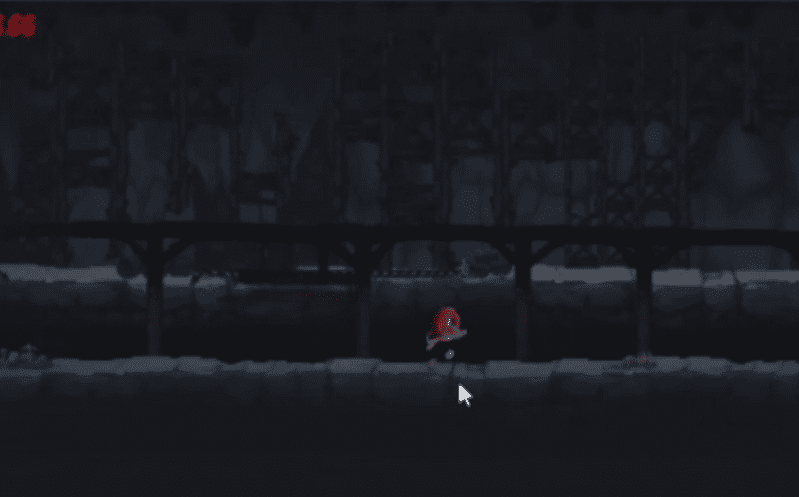

游戏从"[不要回头](https://murkes.itch.io/dont-turn-back) " 2D 平台真正由你的一部分游戏果酱。

首先，我将为我的场景添加一个 **2D 相机**。

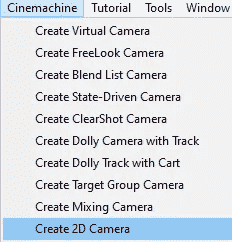

需要注意的一点是，要真正获得 2D 的外观，你需要打开你的**主摄像机**，将投影类型从**透视**更改为**正投影**。

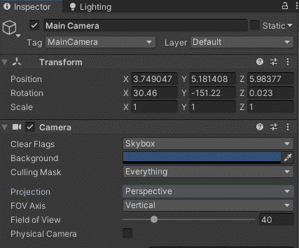

你可能会注意到一些有趣的事情，身体使用了**框架** **换位**。

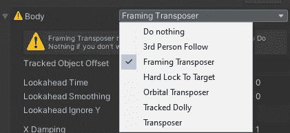

如果你使用 cinema Chine**做很多不同的事情，而不仅仅是一台 2D 相机，你需要记住这一点。**

它会给你一个警告信息，告诉你需要分配一个**跟随目标**。

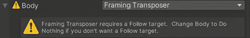

在这个例子中，我使用了我的球体。

您可能还需要重置相机位置，以确保它以正确的 2D 格式查看您的场景。

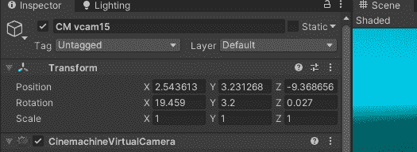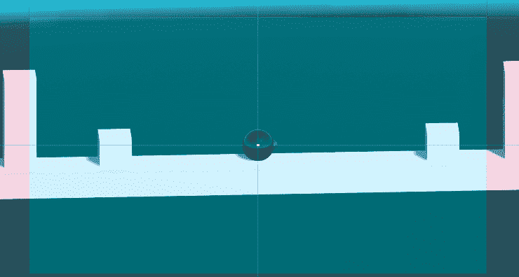

现在，如果您单击“play ”,您应该会看到类似这样的结果。

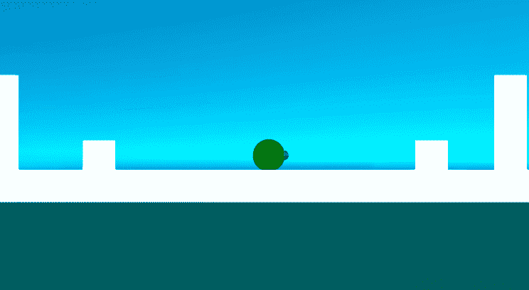

我们的 **2D 相机**好用了！虽然有很多可选设置可以调整。例如，你可能已经注意到相机似乎有点“滞后”于它所跟随的物体。这是因为默认情况下**阻尼**设置在 **2D 虚拟摄像机**上。如果你想达到很好的效果，如果你不想，我们有一些其他的选择。

如果我们关闭**阻尼**，那么摄像机将一直保持在目标上。

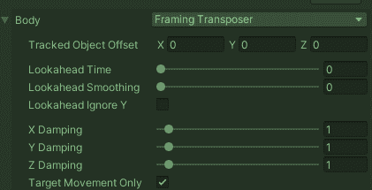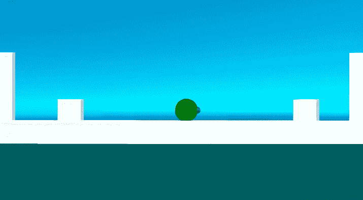

然后是与**阻尼**相反的**前瞻**设置。摄像机不是落在移动目标的后面，而是向前看。

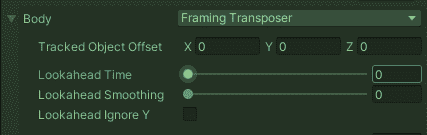

如果你在增加**前瞻**时间后得到这个效果:

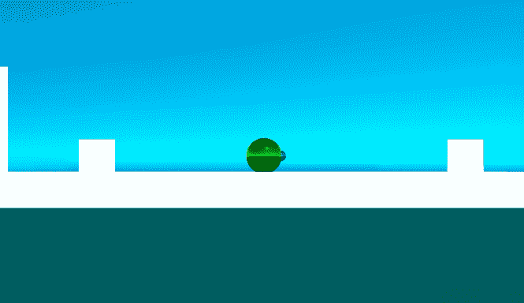

这是因为你还需要调整**前瞻平滑**设置。

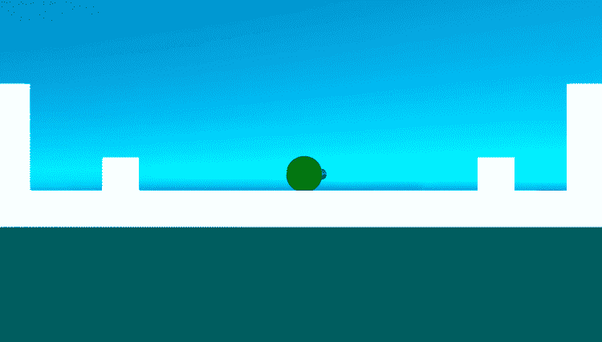

还有很多其他的设置可以使用，如果你想让我在另一篇文章中介绍它们，请随时评论并告诉我。

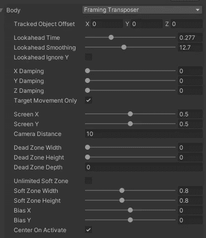

还要记住，有一些东西，比如**约束器**，可以防止相机越过某些点，比如地图的尽头。如果您希望我在以后的文章中也涉及到这一点，请告诉我！

***如果您有任何问题或想法，请随时发表评论。让我们做一些很棒的游戏吧！***