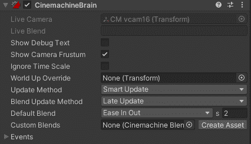

# 游戏开发的第 78 天:什么是 Cinemachine 大脑？

> 原文：<https://blog.devgenius.io/day-78-of-game-dev-what-is-the-cinemachine-brain-a20f72626912?source=collection_archive---------16----------------------->

**目的:**回顾一下什么是 **Cinemachine Brain** 并使用它的一些特性。

图片鸣谢:[团结学习](https://learn.unity.com/tutorial/the-cinemachine-brain)

根据 **Cinemachine Brain** 上的官方 [**Unity API** :](https://docs.unity3d.com/Packages/com.unity.cinemachine@2.6/manual/CinemachineBrainProperties.html)

根据 API,**大脑**可以在虚拟摄像机之间切换时控制剪切或混合。

默认情况下，**大脑**，将**混合类型**设置为**缓入缓出**。

但这意味着什么呢？让我展示给你看。我的场景中有 3 个不同的虚拟相机。一个比一个缩小得更远。让我们看看当我转换到每一个时会发生什么。

如你所见，它们平滑地相互过渡。这就是**缓进缓出**的意思。但是，如果我们只是想让一些相机放松，或者我们想让它们放松得更快，或者我们想让它们瞬间抓拍，那该怎么办？在那里我们可以设置我们自己的定制混合。

为此，在**大脑**上有一个**自定义混合**功能，您需要点击**创建资产**。

它会问你在你的项目中你想把它保存在哪里，然后你就可以开始定制了。

在我的例子中，我有 3 个摄像头，所以我会添加 2 个插槽。这样我可以从 1 号摄像机过渡到 2 号摄像机，然后从 2 号摄像机过渡到 3 号摄像机。

然后我需要选择我想要的相机。(如果你想知道为什么我有很多，这是因为我一直在测试不同类型的相机)

接下来，我需要选择我想让这些相机过渡到哪个相机。

在那里，我可以使用**缓入缓出**、**线性**、**切割**或许多其他方式来更改是否希望它们过渡。根据我的选择，我可以选择我希望这种转变持续多长时间。

在这个例子中，我将选择几个不同的选项向您展示，让我们看看会发生什么。

正如你所看到的，从凸轮 1 到凸轮 2 现在立即削减，从凸轮 2 到凸轮 3 需要比以前长得多的时间。

这只是电影大脑的一个有用的特性。虽然我不会在本文中涉及它们，但是相信我，它包含了很多非常有用的特性。我建议查看本文开头链接的 **API** ，以获得所有 **CinemachineBrain** 能做什么的完整概述。

***如有任何想法或问题，欢迎评论。让我们做一些很棒的游戏吧！***