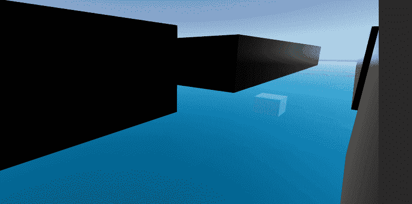
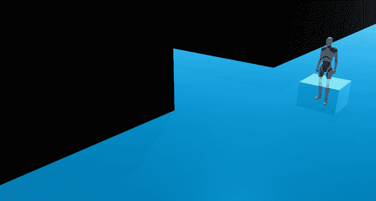
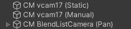

# 游戏开发的第 79 天:如何用 Cinemachine 建立一个交互式安全摄像机系统第 1 部分！

> 原文：<https://blog.devgenius.io/day-79-of-game-dev-how-to-build-an-interactive-security-camera-system-with-cinemachine-part-1-fc9cece94315?source=collection_archive---------15----------------------->

**目的:**使用 **Cinemachine** 创建一个交互式安全摄像系统。

*   **在三个不同的走廊里创建三个不同的摄像机。**
*   **1 摄像机将是静止的，意味着它不会移动。**
*   下一个将由玩家控制环顾四周，但它将受到限制，因此它不能看得太远或看自己身后的墙。
*   **最终摄像机将自动左右平移。**
*   每当我按下 c 键时，我都想在这些摄像机之间循环。
*   我只想能够在我处于触发状态时循环切换相机，当我不处于触发状态时，我回到我的第三人称角色控制器相机。

**第 1 部分**包括前 4 个步骤，制作摄像机。

我们开始吧！

我已经有了我的场景设置，这是 4 个走廊和中间的一个立方体，这将是我切换相机的触发器。

我还有我的 [**第三人** **角色控制器**](https://assetstore.unity.com/packages/essentials/starter-assets-third-person-character-controller-196526#description) 已经从 **Unity** **资产商店**导入到我的场景中。

我更喜欢从添加和设置我的相机开始。然后我将编写代码在它们之间切换，设置触发器，等等。

为了制作我的静态相机，我首先给我的场景添加一个虚拟相机。

我不需要设置**跟随**或**查看**目标，因为我根本不需要它移动。我会像这样把它指向走廊的中心。

并且我会将**身体**和**瞄准**设置为**不做任何事情**。

静态凸轮完成。

现在是手动相机。这是我希望玩家能够控制的，但我也想确保他们不能看得太远，包括看他们身后的一堵墙。

这将是结果。

我再给场景加一个**虚拟相机**。

我不需要设置一个**跟随**，因为我不希望相机移动它的位置，只是它的旋转。但是我也不需要**查看**，因为我可以在**目标**设置中使用**视点**类型，这不需要**查看**。**主体**可以设置为**什么都不做**因为我不需要一个**跟随目标**。

**视点**选项让你几乎可以到处看。

我们需要限制允许的活动。你可以在**目标**设置中完成。在**垂直**和**水平**轴上，都有一个**值范围**选项，允许您调整相机允许旋转的距离。我把设置弄得乱七八糟，直到我找到我想要的，相机都准备好了。

**垂直**和**水平**轴都有一个环绕选项。这是打开“换行”时发生的情况。

这是它关闭了。

请记住这一点，这样你就不会弄不清为什么你的相机似乎出了故障。

现在平移摄像机将从左向右平移。

我将开始添加一个**混合列表相机**到我的场景中。

我不需要设置一个**跟随**或**查看**目标，因为我根本不需要它使用一个特定的目标移动。相反，摄像机将通过在两个摄像机之间切换来“移动”。

当创建一个新的**混合列表相机**时，默认情况下它已经有 2 个相机了。记住所有这些电影摄影机本身不是摄影机。它们是供您的主摄像机使用的预设(设置)。所以对于这个相机，当我说我们在两个相机之间切换时，我的意思是，主相机将使用两个不同的设置，并从一个融合到另一个。也就是说，如果我设置一个虚拟摄像机向右看，另一个向左看，并让主摄像机在它们之间平滑切换，那么这些摄像机看起来就像是从左向右移动。这将是最终的结果。

我们来设置一下。将**混合列表摄像机**视为控制器，将附属于它的**虚拟摄像机**视为实际的摄像机设置。

我将设置 1 个**虚拟摄像机**向右看，另一个向左看。

确保**主体**和**目标**在两个虚拟摄像机上都设置为**什么都不做**以避免将来出现任何问题。同样在**混合列表相机**本身上。

这里是我们对**混合列表相机**的设置。

我们可以添加更多的摄像头，如果我们想，但不需要为我们的目的在这里。

顶部的设置允许你选择相机应该**混合**和**混合模式**的顺序。你可以从任何一个开始，但我更喜欢从面向球员开始，所以我选择面向右边的相机作为第一个。然后我想让它**渐强渐弱**。我会推荐弄乱这些不同的选项，但是**放松出**是我在这里需要的，因为它提供了一个平滑的过渡。然后，我设置我希望过渡需要多长时间。接下来，我设置在转换到下一个相机之前，我希望相机保持在那里多长时间。哦，顺便说一下，如果你想让相机继续来回移动，你需要检查**循环**框。

这些是我用来获得我想要的感觉的设置。bb

现在我的 3 个摄像机都设置好了！

如果您感兴趣，第 2 部分将涵盖本文开头提到的最后两个步骤。

***如有任何问题或想法，欢迎评论。让我们做一些很棒的游戏吧！***