# 游戏开发的第 82 天:在同一个游戏对象上创建多个时间轴动画！

> 原文：<https://blog.devgenius.io/day-82-of-game-dev-creating-multiple-timeline-animations-on-the-same-game-object-665a6d4b6b0?source=collection_archive---------9----------------------->

**目标:**在同一个物体上制作多个**时间轴动画**教你一些我学到的很酷的小技巧。哦，还有，在最后，回顾一下**真正**酷的时间线功能:)

这是一个简单的动画，我将用它作为我的例子。这实际上是时间轴管理(组合)的 3 个独立的动画。

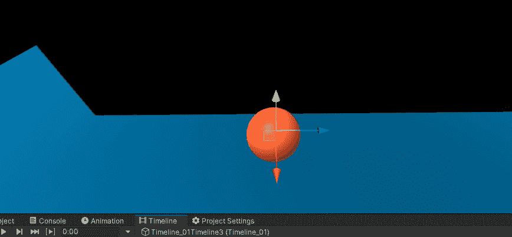

要理解这其中的第一步，你需要知道**时间轴**就像一个集中的动画管理器。你还需要记住，为了让从 **MonoBehavior** 继承的脚本在 **Unity** 中工作，它必须被附加到场景中的一个游戏对象上。还要记住，时间线从技术上来说是一个脚本，就像其他任何东西一样。因此它需要附加到场景中的一个游戏对象上。

**第一步:**创建一个空的游戏对象。(想叫就叫吧)

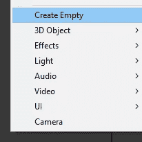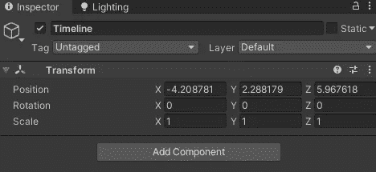

**步骤 2:** 选择游戏对象并打开时间线窗口，创建新时间线。

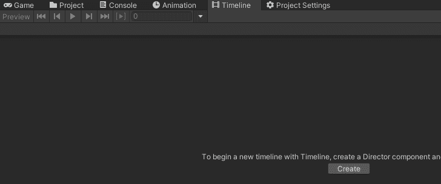

一旦完成，你的游戏对象现在将有一个**可玩的导演组件**在上面。把它想象成游戏对象上的一个动画师组件，除了它就像是他们的控制器。(“他们”是指包含在此特定时间线中的动画)

**第三步:**将你想要制作动画的游戏对象拖到你的新时间线上，选择**添加动画轨迹**。

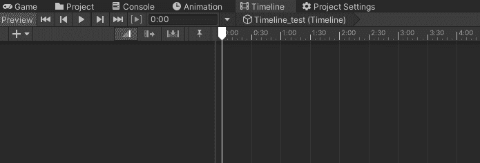

**第四步:**开始录制，像平常一样使用**动画**窗口开始创建动画。

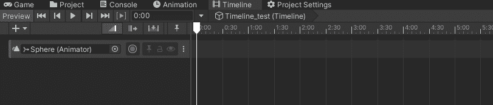

下一步将会有一些你想要关注的非常重要的信息。我花了几个小时才意识到为什么我不能让一个简单的动画工作。我很不高兴…但是我现在有了答案，希望它能帮你减轻一些痛苦:')

**第五步:**为你想要**动画化**的游戏对象，在你的**时间轴**上添加一个关键点。

因为您现在正在记录，所以您可以转到您想要设置动画的游戏对象(对于我的例子来说是一个球体),并在 Transform 组件中右键单击，这将为您提供添加关键点的选项。

谨记！你点击**转换**组件的哪个位置**有关系吗？如果你已经聚焦并且不期望它，这有点微妙。在我的例子中，我想改变游戏对象的位置。因此，我需要右键单击该位置(或关闭/围绕它),然后单击添加关键点。**

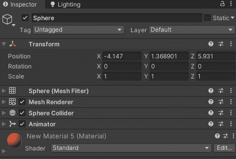

你可以说你做对了，因为它用红色突出显示了位置和旋转。为什么它也会自动旋转。我不知道。

不要在标尺上点击鼠标右键，否则它会添加一个关键点，以为你想激活标尺。然后，当你去动画它，什么也没有发生，你会非常沮丧几个小时…

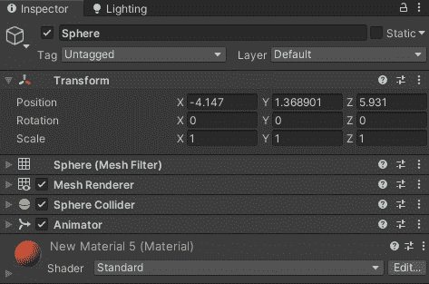

第六步:现在你应该有了你的第一把钥匙。

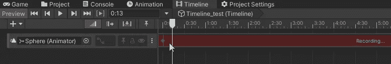

向下移动几秒钟或几帧(无论你设置了什么模式)并添加另一个关键点。

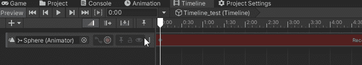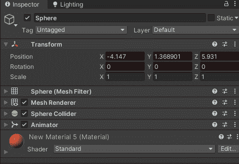

**确保你点击了正确的区域！**

现在我有了两个位置相同的关键点，我将只去它们之间的中间点并向左移动球体。这意味着动画的开始和结束在同一位置，中间在 Z 轴上更靠左。这将导致球体向左移动并回到相同的位置。

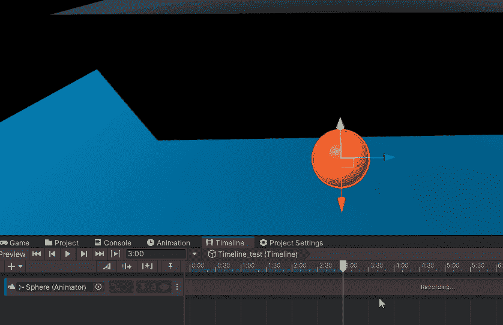

您可以滑动白色条来查看动画的不同部分！如果你只是想从头到尾实时观看，点击播放也可以。

**第七步:**右键点击你的新动画，点击转换为剪辑轨迹。现在你可以很容易地从时间轴编辑这个“完成”的动画。你也可以双击它，它会带你进入动画标签，以进一步编辑它。

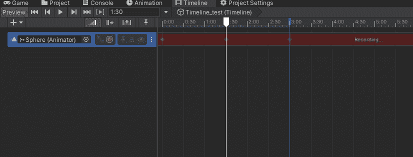

步骤 8: 让我们按照同样的过程添加另外两个动画。从在第一个动画之外添加一个新的关键点开始。

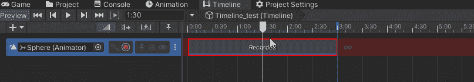

然后在末尾加上第二个键。

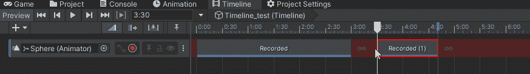

不要在最后添加键，否则它会认为你想开始一个新的动画。

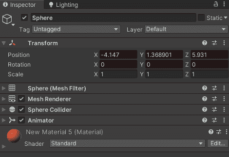

我希望这个动画长一点，所以我会增加完成动画的时间。

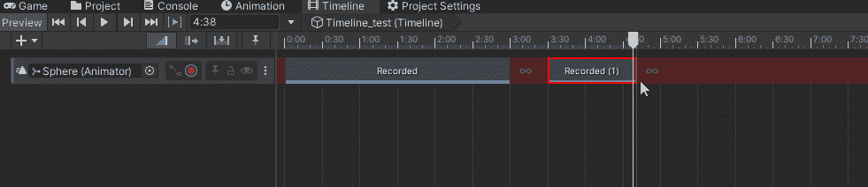

然后到中点，向上移动球体。

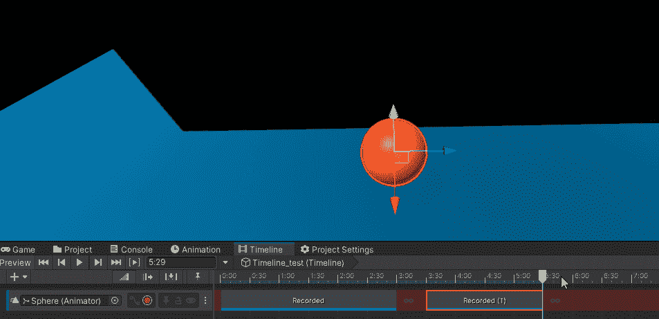

我将最后一次移动球体。

现在，我们有 3 个不同的动画都是由时间轴管理的，如果我双击其中任何一个，我可以进一步编辑它们。

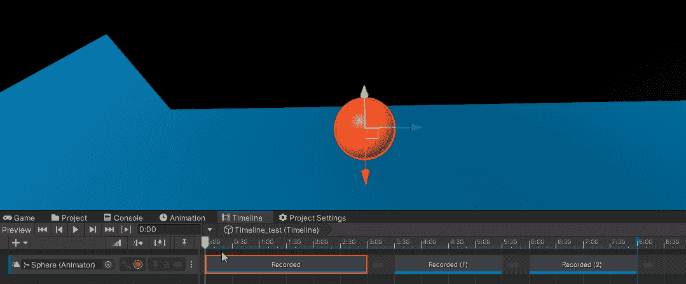

**你准备好欣赏一部非常棒的时间线电影了吗！**

首先，你可以很容易地切换动画！

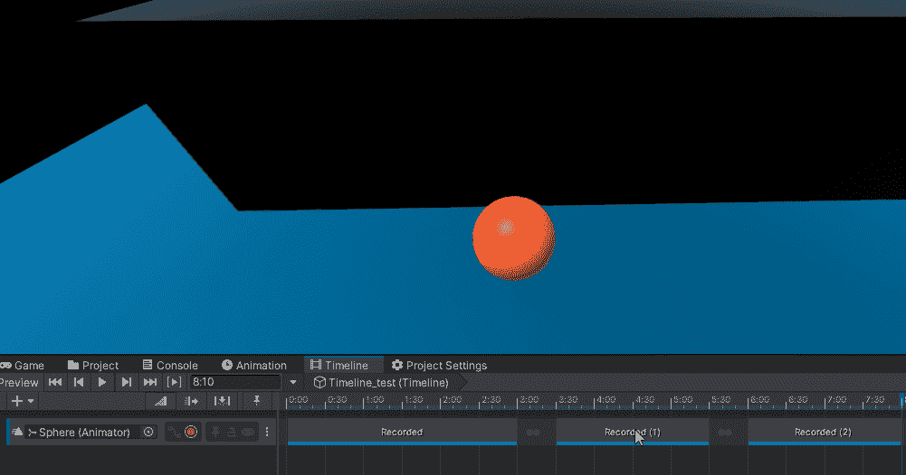

你也可以把它们结合起来，这样它们就可以互相过渡了！

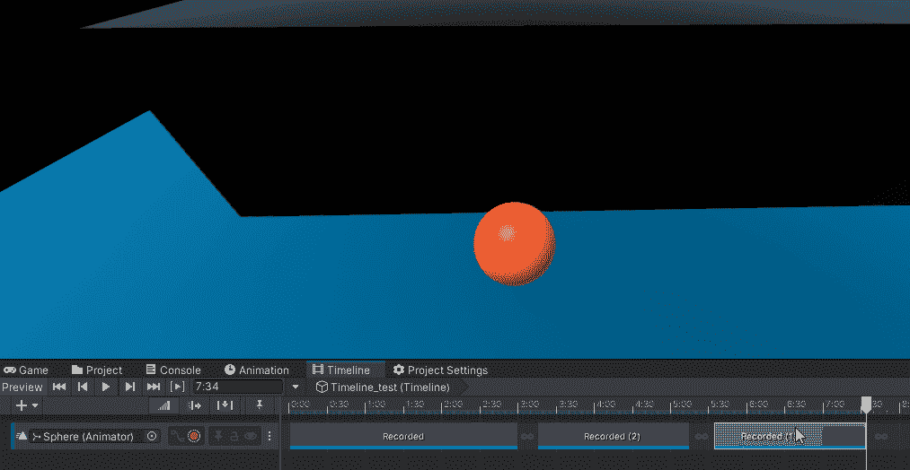

多酷啊！

***希望这篇文章对你有帮助。如果您有任何问题或想法，请随时发表评论。让我们做一些很棒的游戏吧！***