# 游戏开发的第 83 天:在 Unity 中使用时间轴的 9 个快速提示！

> 原文：<https://blog.devgenius.io/day-83-of-game-dev-9-quick-tips-for-using-timeline-in-unity-da472df1f6d9?source=collection_archive---------8----------------------->

**目标:**回顾一下时间线的一些特性，这些特性有望让你的工作流程变得更加愉快和高效！

我将从最基本的技巧开始，一步步往下。

**提示 1:** 我肯定你已经知道播放按钮是什么，但是它旁边还有几个其他的按钮。这两个按钮将带您直接到达时间线的终点或起点。(时间线越长越给力:)

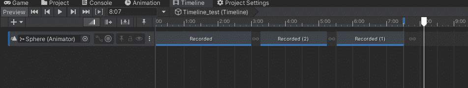

**提示 2:** 这些按钮允许你在时间轴上上下移动一帧。

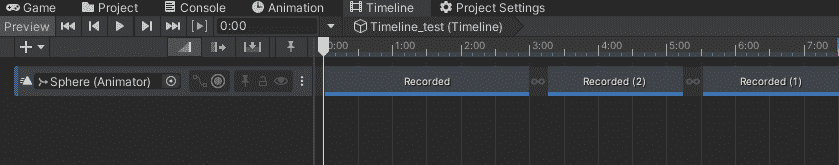

**提示 3:** 使用这个下拉菜单，您可以轻松切换您所在的时间线，而无需在您的项目中搜索它。

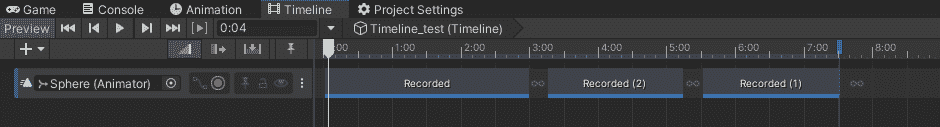

**提示 4:** 如果你放大了一个特定的动画，并想返回查看你的整个时间线，只需点击 A，它会将整个时间线带入画面。

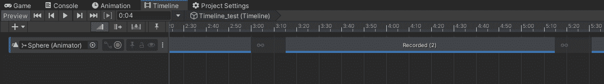

**提示 5:** 你可以按住 Alt 和左键来移动，而不是用底部的滚动条来滚动(滚动条已经过时了)。

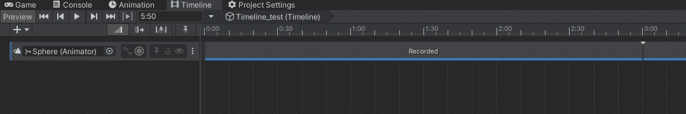

**提示 6:** 您也可以通过选择特定的剪辑并按下 f 键来将其放入帧中。

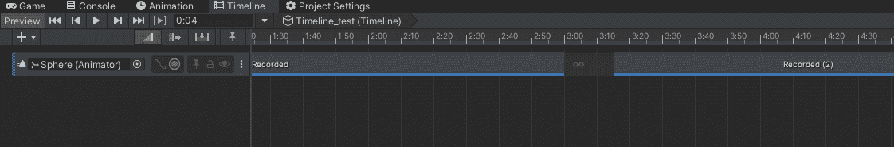

**提示 7:** 您可以切换您所在的模式。有 3 种不同的模式。默认为**混合模式**。然后是**纹波模式**和**替换模式**。

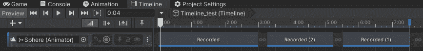

**混合模式**大部分时间都在使用，它将允许你移动动画并混合它们，等等。

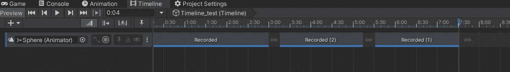

**波纹模式**允许你编辑一个动画，同时影响当前编辑的动画之后的所有动画(波纹效果)。

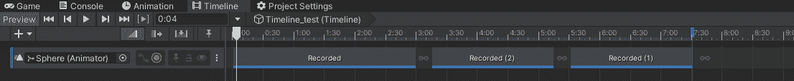

**替换模式**允许您引入动画来替换部分或全部动画。

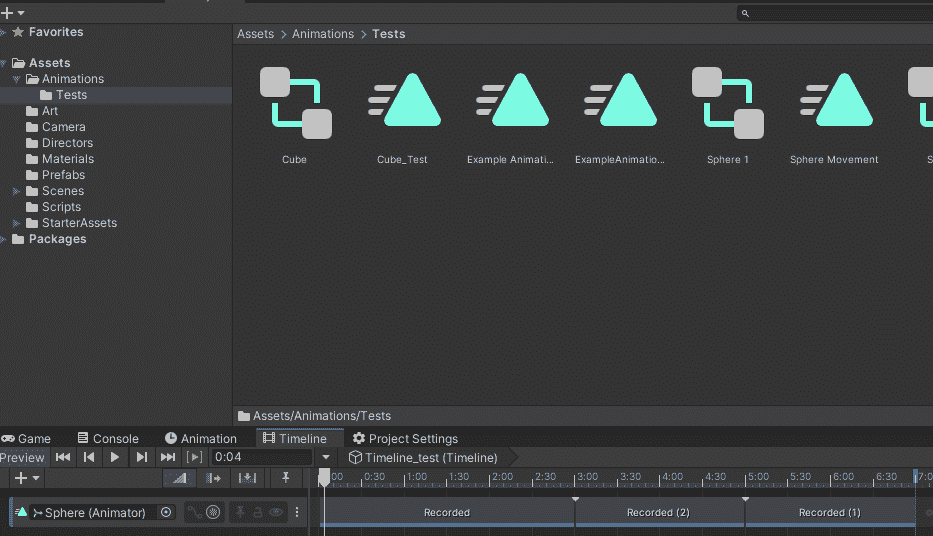

**技巧八:**还有这个小偷偷摸摸的特点。如果你想分割一个动画，你可以把你的(试着想一下技术描述)白条指针移到你想分割的地方，选择动画，然后按 s。

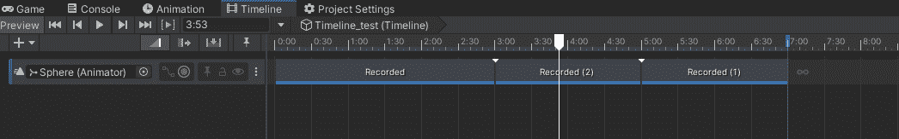

**提示 9:** 你可以查看动画曲线，也可以在那里进行调整。

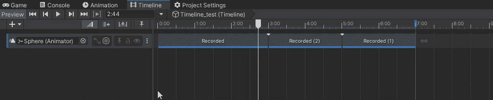

***如有任何问题、想法或更多提示，欢迎评论。让我们做一些很棒的游戏吧！***