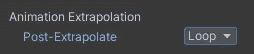
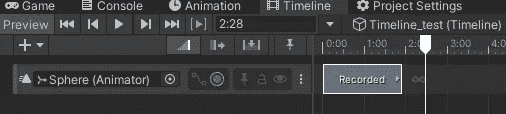

# 游戏开发的第 84 天:在时间线中使用前后外推！

> 原文：<https://blog.devgenius.io/day-84-of-game-dev-using-pre-and-post-extrapolation-in-timeline-cf3a72dc7485?source=collection_archive---------15----------------------->

**目的:**回顾什么是**外推**以及它与**时间线**相关的用途。我也希望通过展示一些你可能会在外推法中遇到的障碍来节省你的时间。

演职员表:[统一](https://blog.unity.com/entertainment/adam-timeline)

首先什么是**动画外推**？根据[官方 Unity API](https://docs.unity3d.com/Packages/com.unity.timeline@1.2/manual/clp_gap_extrap.html) :

如果这令人困惑，没问题，我们将在这里讨论它。

当在时间轴中选择一个剪辑时，您应该会看到**后外推**变量。是的，有一个**预先推断**，但是我们会在一会儿到达，如果你有困难找出为什么某个动画剪辑没有它，我们也会报道。

基本上 **Unity API** 所说的是，这些设置允许你在动画前后添加不同的行为(前(before)，后(after))。

在**后外推**变量中，我们可以看到**默认**将其设置为**保持**，但是我们有一些其他选项。

让我们逐一看一下。

注意:这是我为这个例子准备的动画。

**保持:**当动画完成时，游戏对象保持其当前位置。这就是上面发生的事情。

**循环:**动画会一直循环，直到下一个动画开始。

乒乓球:这个简单的动画有点难讲，但是当动画结束时，它会反转动画。

**继续:**每当你将一个剪辑缩小到小于整个动画时，通常动画也会在你剪辑的地方停止。但是，如果你有继续设置，那么它仍然会完成动画，不管剪辑的大小。

没有选择继续

选择继续后

现在可以对**进行预推断**！它具有与**后期外推**相同的设置，但是你可能会注意到并不是所有的剪辑都有这个选项。通读 **API** 给了我答案，我会尽力解释。

对于这个例子，我在第一个剪辑中没有看到**预推断**。

那是因为在剪辑播放之前，我的剪辑没有时间。它被设置为当时间线开始没有任何余地时直接播放。

一旦我将剪辑向上移动一点，我就得到**预外推**。

我的其他剪辑呢？其他两个剪辑我只有**后推**。

那是因为他们不需要。他们正在使用前一个剪辑的**后推**中的设置。这意味着剪辑 1 上的**后外推**将合并动画，而不需要剪辑 2 上的**前外推**。但是有些情况下，你可能更愿意在当前动画上使用**预外推**，而不是在前一个动画上使用**后外推**。

为此，转到前一个动画，并将**后外推**设置为无。

在你当前的动画中，你现在应该有**预外推**选项。

***希望这对你有帮助。如果你有任何问题或想法，请随意评论。让我们做一些很棒的游戏吧！***