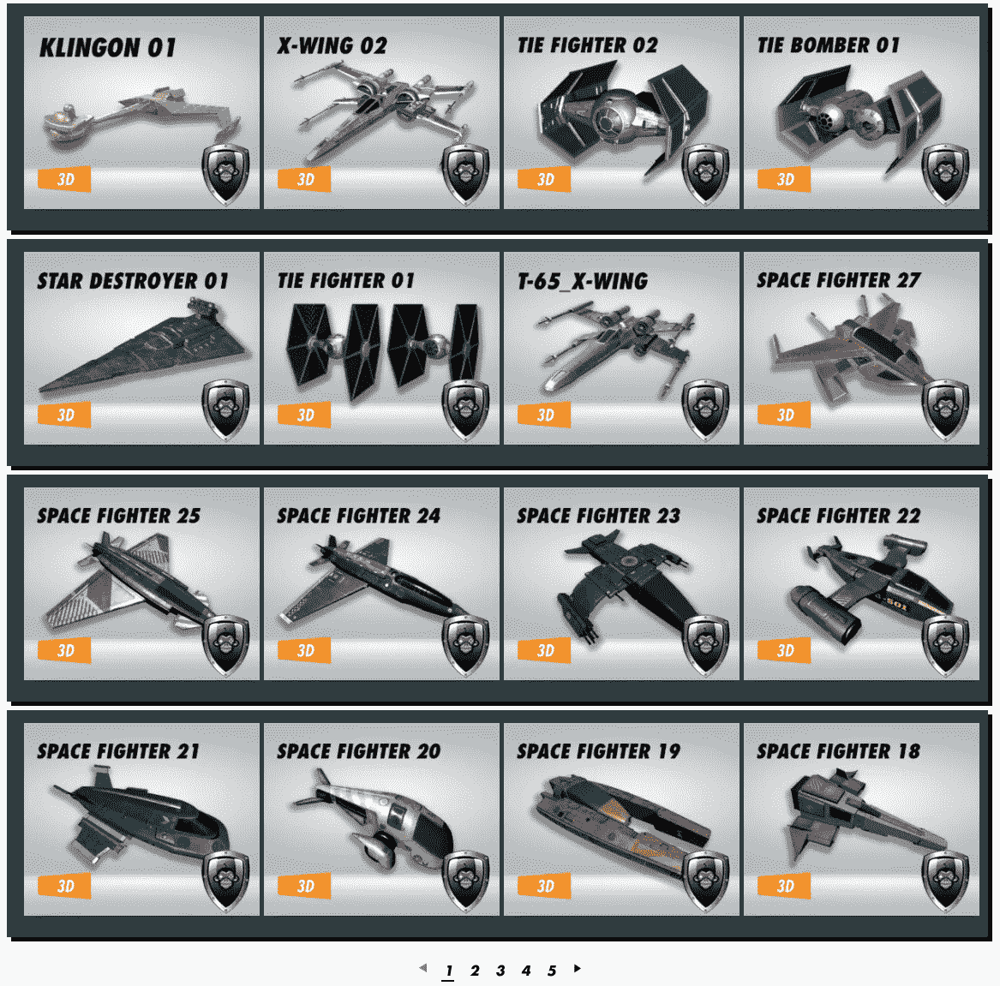
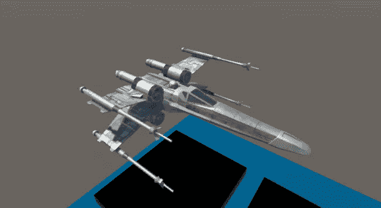
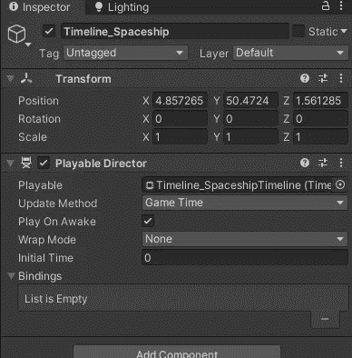
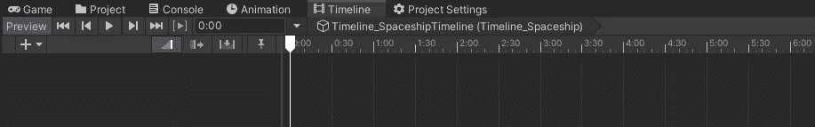
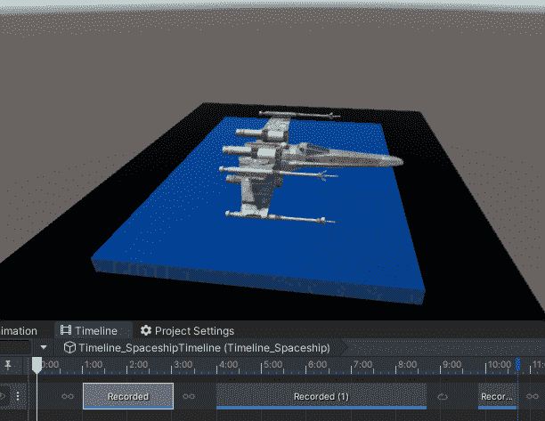
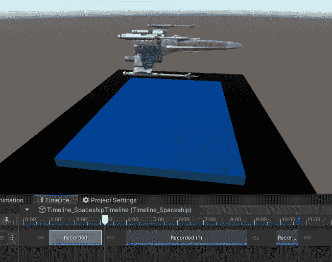
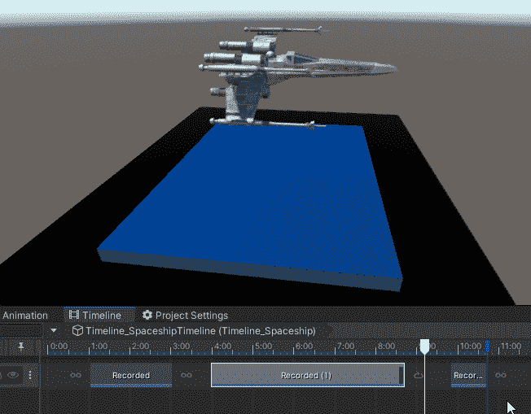
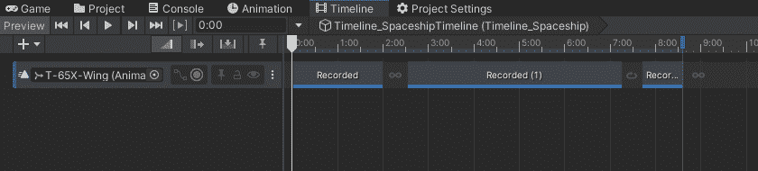
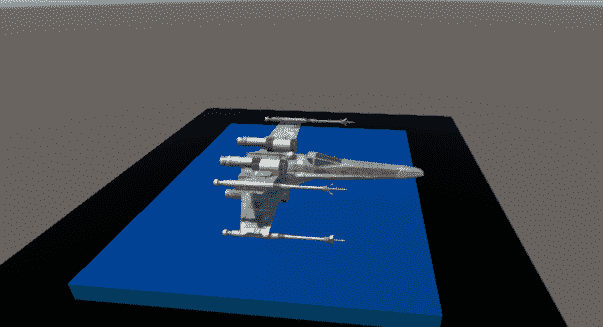

# 游戏开发的第 85 天:将一些时间线知识用于飞船动画序列！

> 原文：<https://blog.devgenius.io/day-85-of-game-dev-putting-some-timeline-knowledge-to-use-with-a-spaceship-animation-sequence-29d84b92f1d7?source=collection_archive---------15----------------------->

**目标:**在我的场景中加入一艘飞船。从**时间线**为它创建 3 个独立的动画。确保动画融合在一起。然后让整个事情循环。

如果你好奇的话，最终结果在文章的最后:)

我将利用我在上周学到的时间线来创建这个。如果你好奇，我以前的文章很可能会有一切，然后一些当谈到我用来创建这个。

**第一步:**在我的场景中添加一艘飞船。

我将从[**Filebase**](https://filebase.gamedevhq.com/)**(一个很棒的艺术插件)开始给我的场景添加一个飞船。**

****

**这么多选择！:D**

**我选了一首经典的:)**

****

****步骤 2 和 3:** 从**时间线**为其创建 3 个独立的动画。确保动画融合在一起。**

**我需要一个新的时间线来开始这些动画。**

********

**然后，我将创建第一个动画，使船向上移动。**

****

**第二个让船看起来像漂浮/飞行(有点) :)**

****

**第三步是让船回到原来的位置。**

****

**接下来，我将混合每个剪辑在一起。**

****

****第四步:**将时间线设置为**循环**然后嘣！**

****

**按播放，我们开始:)**

****

****时间线**牛逼！当创建这些动画系统时，它是如此的有帮助。我知道这个例子是一个简单的动画，但我希望它展示了时间线的潜力。**

**如果您有任何问题或想法，请随时发表评论。让我们做一些很棒的游戏吧！**