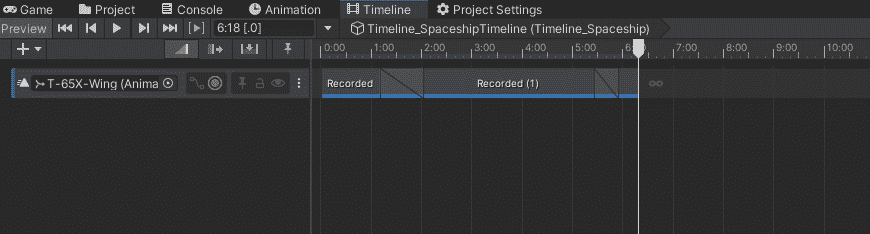
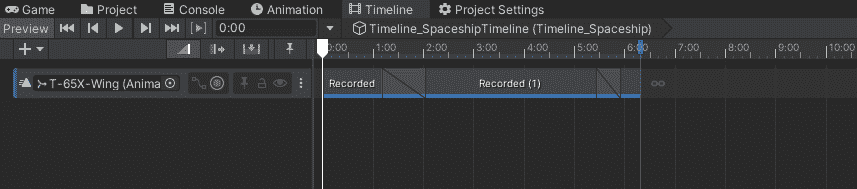
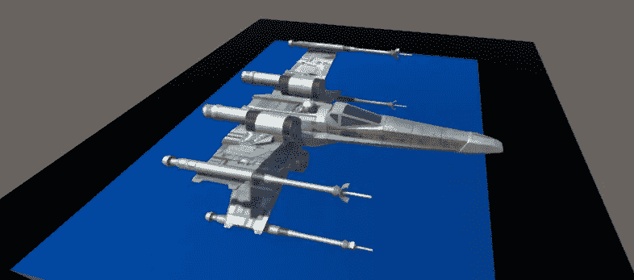
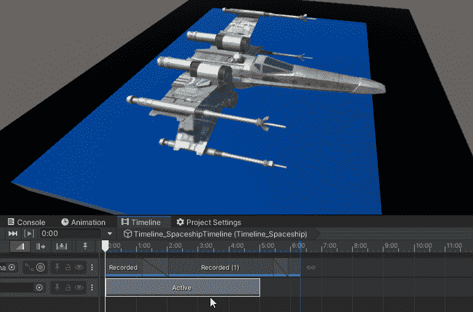
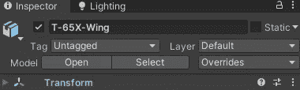
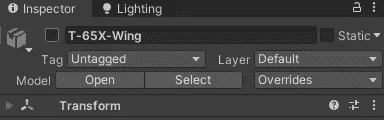
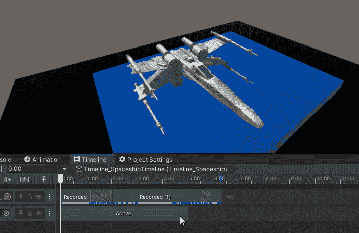

# 游戏开发的第 86 天:时间线-激活轨道是一个游戏改变者！

> 原文：<https://blog.devgenius.io/day-86-of-game-dev-timeline-activation-tracks-are-a-game-changer-71f0fecc2033?source=collection_archive---------9----------------------->

**目标:**回顾什么是**激活轨道**，并将其实现到我的测试场景中。

当你添加一个游戏对象到时间线时，你有几个选项来决定你想添加什么样的轨迹。

在本文中，我们将介绍**激活轨迹**。是什么让这些不仅有用，而且超级牛逼？好吧，我会告诉你，但总的想法是，你不必编码某些事件，可以很容易地从时间线设置它们。这意味着，你不必联系软件工程师来为你编写脚本和代码。从商业角度来看，这是一个游戏改变者。

**激活轨迹**有什么用途？

它用于激活或停用游戏对象。让我告诉你我的意思。

我将开始为我的太空船添加一个**激活** **轨道**。

只有当对象在**激活轨迹**内时，该对象才会被启用。否则它会被禁用。

使能够

有缺陷的

你可以用它在你的场景中添加和删除游戏对象，而不需要代码！说真的，即使你是个优秀的程序员，这也能节省大量的时间和代码，尤其是游戏越大。

您可以将多个对象添加到时间线上，并为每个对象设置**激活轨迹**。

同样，当时间线结束时，如果游戏对象被禁用或启用，它将保持不变！因此，如果你想在走进一个房间时发出闪烁的光，然后灯一直亮着或关着，你不必创建一个脚本，然后编写程序。只要设定一个时间表，它就会完成任务。

***希望这篇文章对你有用。如果你有任何问题或想法，请随意评论。让我们做一些很棒的游戏吧！***