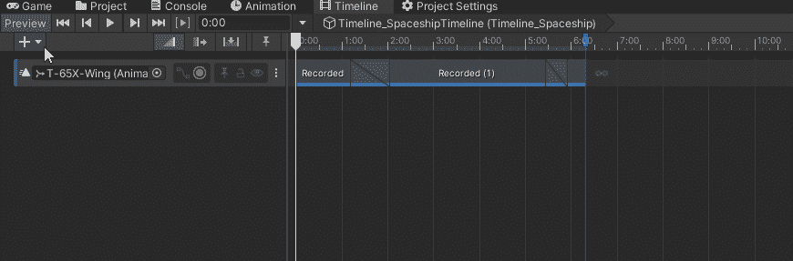
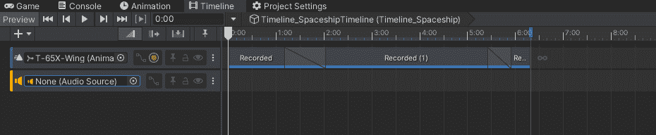
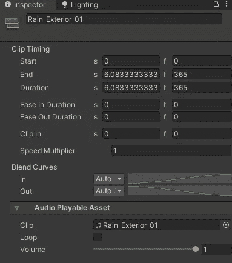
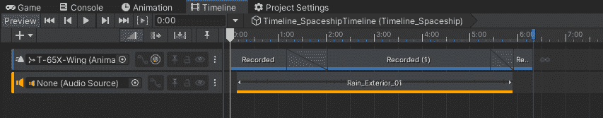
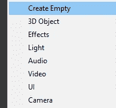
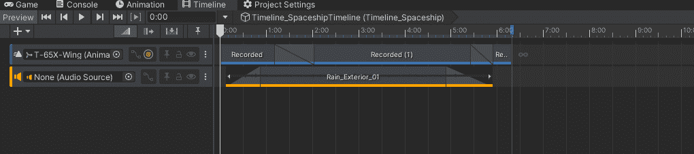
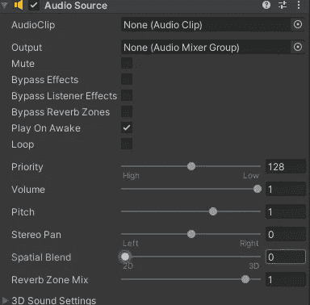
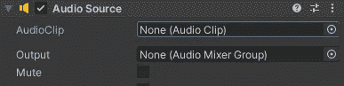
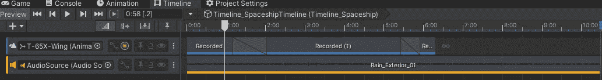

# 游戏开发的第 87 天:时间线——什么是音轨？

> 原文：<https://blog.devgenius.io/day-87-of-game-dev-timeline-what-are-audio-tracks-1196b6c6a236?source=collection_archive---------10----------------------->

**目标:**回顾一下什么是**音轨**，并在我的测试场景中实现。

图片来源:[极客闪耀](https://geekflare.com/audio-manager-for-windows-11/)

**音频轨道**允许您将**音频**添加到您的**时间线**中，您可以使用它来设置您的电影镜头、动画等。让我们回顾一下设置和我们有的一些选项。

我将从给我的时间线添加一个**音轨**开始。

理论上，我可以根据自己的需要分配任意多的音频剪辑。但是我会为这个例子添加一个。

如果您选择了音轨，并且在检查器中，您应该能够看到我们的一些设置。

如果你想让**循环**、**音量**等，你可以用**倍速器**调节**音源**的播放速度。

您还可以在**音频轨道**中**缓入**和**缓出**，以提供更多渐隐的感觉。

你们中的一些人可能会想，“我看不到设置**空间声音**的选项，这样声音会根据你离它的远近而变大或变小！”。有一种方法可以解决这个问题。

你只需要一个带有**音频源组件**的游戏对象，你可以从那里调整它，而不是时间线。

对于这个例子，我将创建一个空的游戏对象。

然后我会把它拖到**时间线**里，添加为音轨。它会自动给我的空游戏对象添加一个**音源**。从那里我可以调整空间混合。

你需要将**音频剪辑**添加到时间轴上，而不是像平常那样添加音频源本身，否则时间轴不会播放它。您根本不需要将音频剪辑添加到音频源中，时间线会处理好这件事。

你只需要**音源组件**再调整几个设置。

希望这篇文章对你有帮助。如果你有任何问题或想法，请随意评论。让我们制作一些令人敬畏的游戏！