# 游戏开发的第 89 天:使用信号发射器访问 C#脚本和时间线！

> 原文：<https://blog.devgenius.io/day-89-of-game-dev-using-signal-emitters-to-access-c-scripts-w-timeline-87bde364fa0a?source=collection_archive---------17----------------------->

**目的:**回顾**信号发射器**的好处，并在测试场景中设置一些。

使用**信号发射器**，我们可以通过**时间线**访问 **C#脚本**..但是为什么呢？想象一下，你正在创建你的时间线，你有两个角色在打架。假设你需要触发一个事件，让你解锁一个角色，获得一个新的过场动画，添加分数，检查一个 bool，几乎所有的事情都是通过脚本来完成的。我将向您展示如何设置它，只需几个步骤！

现在我有两艘来自一个小而不知名的特许公司的宇宙飞船；)并且他们正在使用时间轴制作动画。

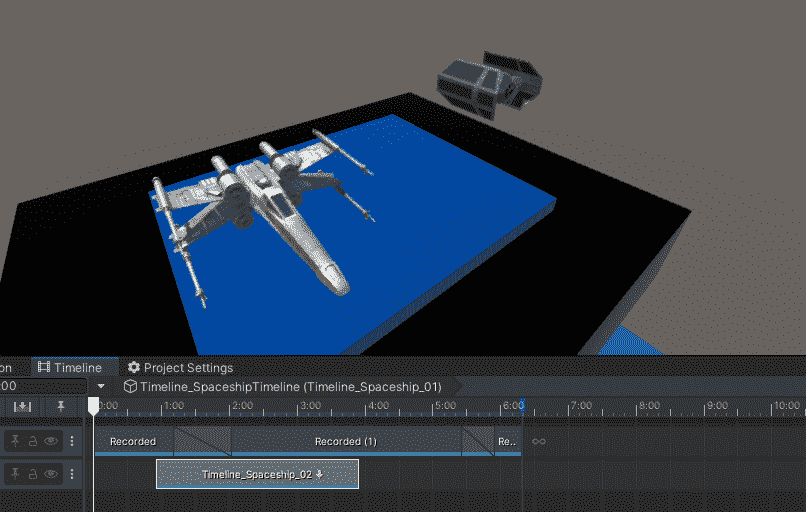

我想要两个方法来“解锁”每艘飞船，我想在每艘飞船开始移动时从时间线调用它。对于本例，它不会真正“解锁”它们，但将是测试**信号发射器**的示例方法。

我创建了一个测试脚本和两个示例方法。(注意:要使用**信号发射器**从**时间线**调用方法，这些方法需要是公共的)。

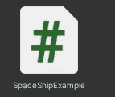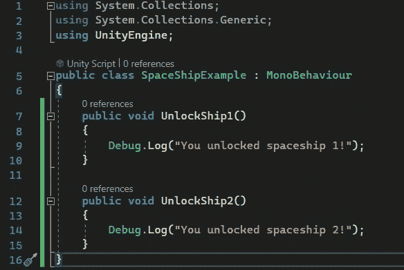

现在在时间线内，我需要添加一个**信号发射器**。单击大头针将打开标记选项卡。从那里我可以添加一个**信号发射器**。

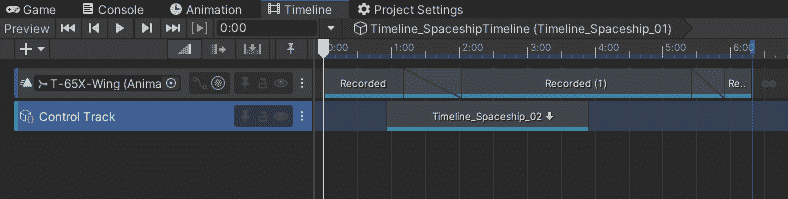

我会确保选择**信号**。

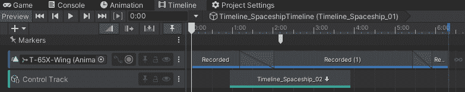

我应该在**检查员**中看到这一点。

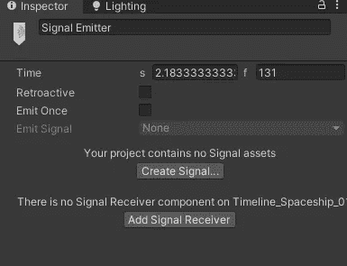

我需要创建一个**信号**并添加一个**信号接收器**。

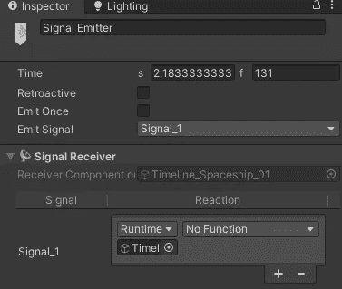

如果您仍然选择了**发射器**，您应该会看到**信号接收器** **组件**。当您点击保存您的时间轴的对象时，您也将能够看到**信号接收器组件**。

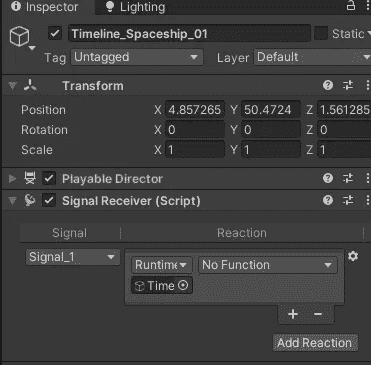

现在我只需要拖放保存我的脚本的游戏对象，并调用我想要的方法。默认情况下，它填充了您在上创建的**信号发射器的原始时间线。**

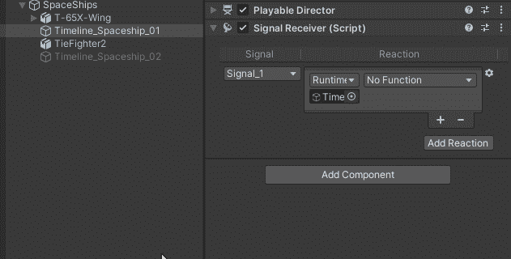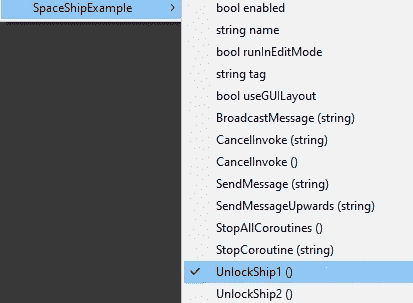

在我的时间线中，我将把**发射器**移到飞船 1 动画的开头。(注意:这不是一个要求。在我的脑海中，我只是希望飞船在动画开始时被解锁(这并不重要)。

我也想为太空船 2 号调用方法。所以我要回顾一下这个过程。创建一个信号发射器，新的信号，应该已经有一个信号接收器，添加脚本，调用方法，移动到飞船 2 的动画开始。

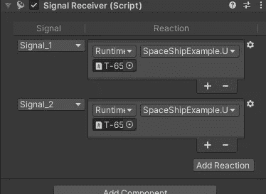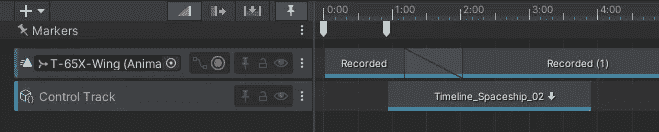

现在当我进入**播放模式**时，在我想要的精确时间使用**信号发射器**从**时间线**内的脚本中调用每个方法！

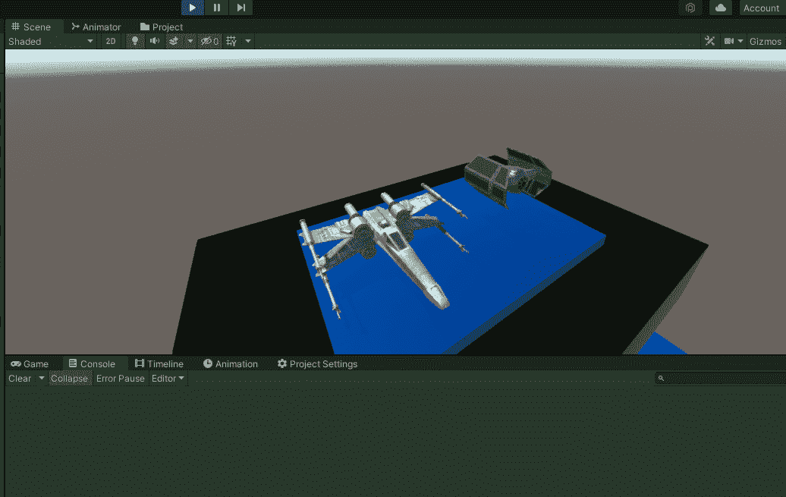

这可以用在很多不同的方面，所以我很高兴它现在成为了**时间线**的一个功能，因为它并不总是可能的。我不打算在这里深入讨论，但是请记住，您可以从这些**信号发射器**中访问或调用几乎任何您想要的公共方法。

***如有任何问题或想法，欢迎评论。让我们做一些很棒的游戏吧！***