# 游戏开发的第 9 天:如何在 Unity 中繁殖并摧毁一个游戏对象！

> 原文：<https://blog.devgenius.io/day-9-of-game-dev-how-to-spawn-and-destroy-a-game-object-in-unity-c5b0c3f60d90?source=collection_archive---------4----------------------->

**目标:** **产卵**和**摧毁 **Unity** 中的**一个游戏对象通过代码为我的 2D 银河射手风格游戏。

[**的 API 实例化()**](https://docs.unity3d.com/ScriptReference/Object.Instantiate.html)

[**销毁的 API()**](https://docs.unity3d.com/ScriptReference/Object.Destroy.html)

为了给这个目标提供一些背景，产生和摧毁一个**游戏物体**的**将会在一个 2D 银河射击游戏风格的背景下进行。当然，您也可以将这些信息应用到您的项目中。**

首先为了让**产生**一个**游戏对象**，我们需要这个**对象**存在。在我的项目中，我想从我的播放器中发射一束激光，在屏幕上向上移动。目前，激光将由一个胶囊来代表。在场景中创建了我的胶囊，调整了比例并添加了颜色后，我很满意它作为激光的替身。

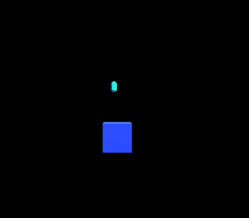

这些**游戏对象**将从玩家位置产生，并且只有当玩家使用某个输入时才会产生，所以这段代码应该从**玩家**脚本中编写。

想想看，每当玩家按下**空格键**时，我就会想让**生出**这个胶囊。我将设置“ **if** ”语句来检查玩家是否点击了**空格**，如果他们点击了，那么我希望**对象**是从玩家位置**衍生的**。实际生成对象所需的所有代码都在一个名为 **ShootLaser()** 的方法中，这是为了清理代码，而不是将所有代码都放在 **Update()** 中。这使得阅读、调试等更加容易。

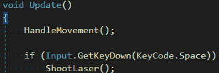

在" **if** "语句设置之后，生成代码将在我的 **ShootLaser()** 方法中设置。从那里我们需要调用**[**Instantiate()**](https://docs.unity3d.com/ScriptReference/Object.Instantiate.html)方法。**在这个上下文中实例化**意味着创建一个**对象**的**实例**。此方法有多个重载，您将希望使用最适合您需要的重载。不要让所有的选择让你不知所措。选项不错，阅读上面链接的 **API** 和/或尝试不同的选项。**

**无论您选择哪个选项，[**Instantiate()**](https://docs.unity3d.com/ScriptReference/Object.Instantiate.html)方法所需的第一个参数是一个**游戏对象**到**实例化**。让我们创建一个类型为 **GameObject** 的变量，我将把我的变量命名为 **laserPrefab** 。**

**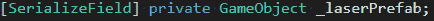**

**使**游戏对象**成为**预置**！ **Prefab** 是预制资产(基本上是副本)的简称。你可以用**预置**做很多事情，但那是以后的事了。首先在你的 **Unity** 项目中创建一个新文件夹，并将其命名为 **Prefabs** 。然后将你想要**实例化**的**对象**移动到**预置**文件夹中，拖放样式，你就有了一个**预置**。**

**回到我们在代码中的位置，我们已经有了代表游戏对象的变量。确保它是一个**【serialized field】**，这样你就可以从检查器中看到它。将**预设**拖放到检查器中的该字段。**

**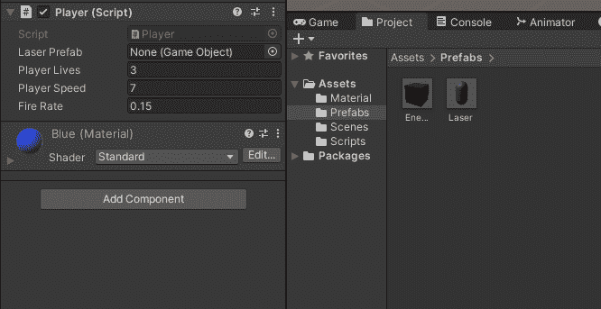**

**[**实例化()**](https://docs.unity3d.com/ScriptReference/Object.Instantiate.html) 方法的**第一个**参数就是我们要**实例化**的**游戏对象**。第二个**是我们想要在什么位置产卵。因为我们希望它从玩家那里产生，所以我们将它设置为 **transform.position** ，因为这意味着这个脚本所附加的游戏对象的当前 **transform.position** 。在这种情况下，它附属于播放器。**第三个**参数是我们希望游戏对象产生的旋转，在我们的例子中这并不重要，所以将其设置为**四元数。身份**将使用**预设**默认旋转，因为我们没有指定它应该旋转的角度。****

**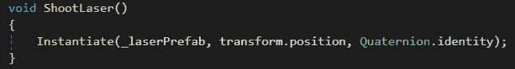**

**我们现在已经告诉计算机，当点击**空格键**时，我们希望**从什么位置以什么旋转来实例化**什么**游戏对象**。**

**现在点击“播放”，你应该可以在每次点击**空格键**的时候**实例化**一个不同的**实例**。但是这些不太像激光。**

**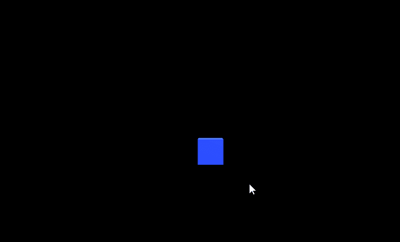**

**我们需要通过代码向上移动激光器，这意味着我们需要为激光器编写一个脚本，我称之为“**激光器**”添加这行代码应该可以做到。**

**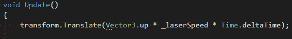**

**确保将**激光脚本**添加到你的预设中。我将离开那里，继续讨论**摧毁**一个**游戏物体**，因为这是本文的目标。**

**因为它是我们想要**摧毁**的激光，我们也可以从激光脚本中调用代码**摧毁**激光。在不同的情况下，您可能希望从不同的脚本中调用 **destroy** 代码，但在这种情况下并不需要。**

**回到这个话题，如果我们继续实例化越来越多的对象**对象**，它们将很快填满场景，即使不再需要它们，也会有性能问题。如果我们**在不需要**游戏物体**的时候销毁它们**(在这种情况下是在摄像机的视野之外)，那么我们就解决了这个问题。**

**为此，我们首先需要找到**游戏对象**应该是被**摧毁的**的位置。在场景中放置一个胶囊，并将其移动到您想要**游戏对象**被**摧毁**的地点。在这种情况下，我只需要 y 值，因为需要销毁**的**对象**只在 y 轴上向上移动。****

**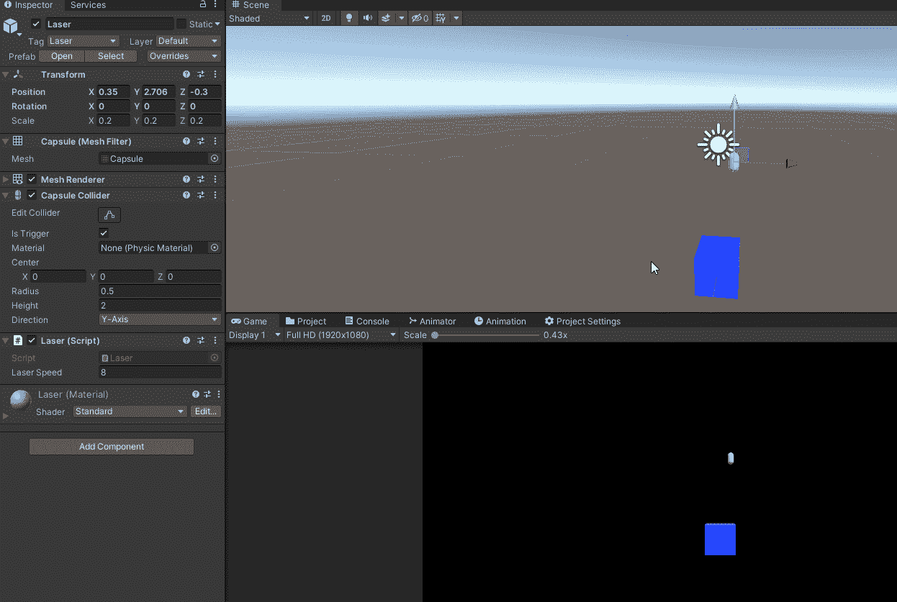**

**现在我已经有了这些信息，我可以从场景中删除那个游戏对象**了，在代码中我会放入这个" **if** "语句，它将检查**游戏对象**是否击中了 y 轴上的那个点。如果有那么我称之为**【毁灭()】的方法。******

****在这种情况下，唯一与我们有关的争论是我想**销毁哪个项目**。通过将**游戏对象**作为第一个参数，这相当于说“我想**摧毁**这个**游戏对象**”(这是脚本附加到的游戏对象，在本例中是激光)。****

****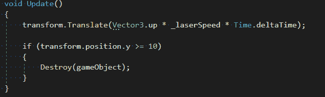****

****如果你读起来更容易，你可以写上“这个”前面的**游戏对象** like so，但是可选，意思是一样的。****

****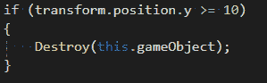****

****看那个！现在**的物体从你的玩家那里产生**并且**在出界时摧毁**！****

****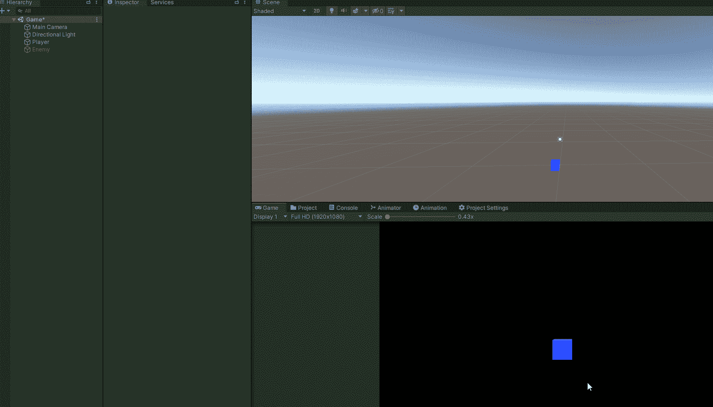****

****好了，你现在知道如何使用[**Instantiate()**](https://docs.unity3d.com/ScriptReference/Object.Instantiate.html)**和[**Destroy()**](https://docs.unity3d.com/ScriptReference/Object.Destroy.html)**方法来**产卵**和**摧毁 **Unity** 中的游戏对象**！这些都是非常有价值的方法，你会经常遇到。我希望这对你有所帮助，如果你有任何问题，请随时提问。********

****不断学习，不断成长，拥有美好的一天！****