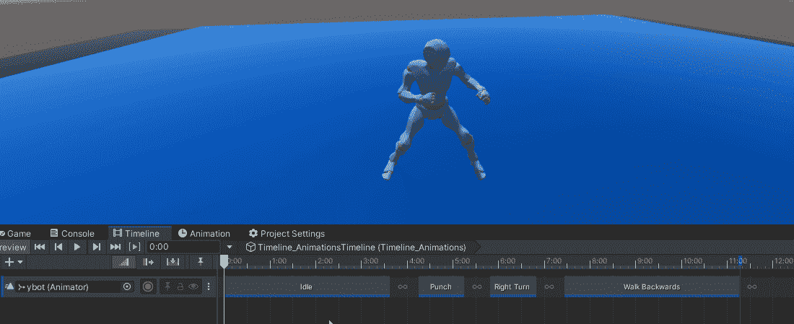
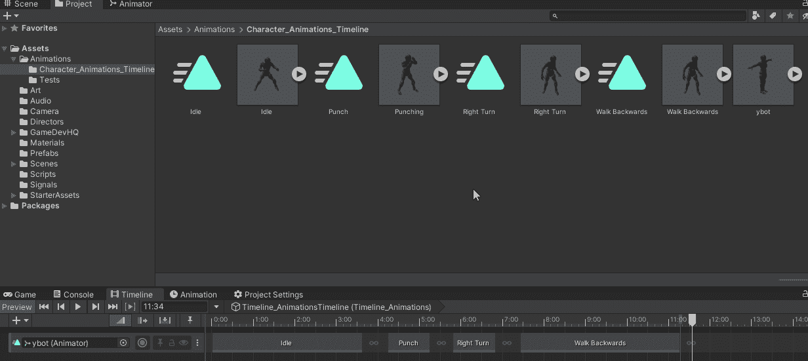
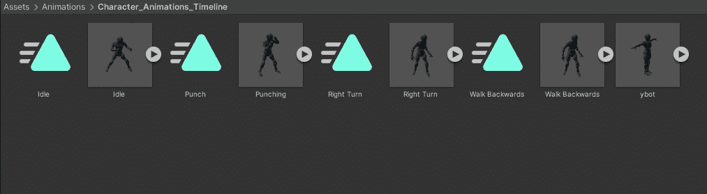
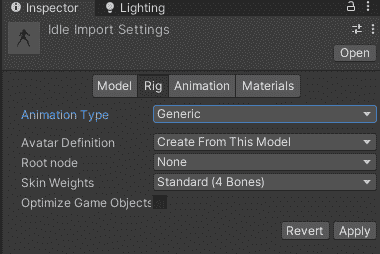
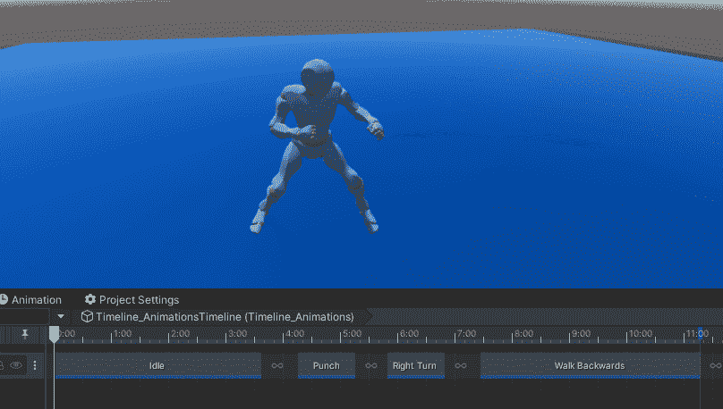
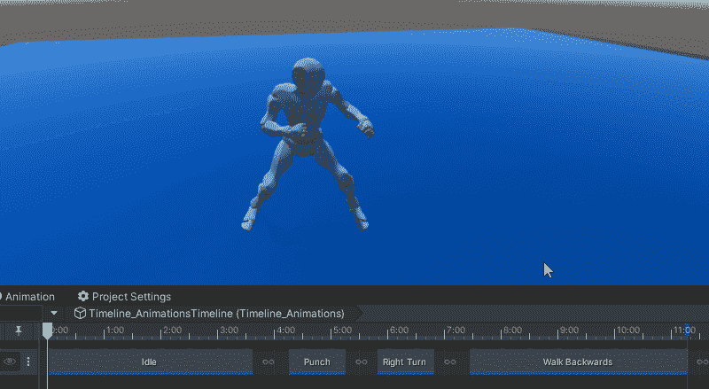
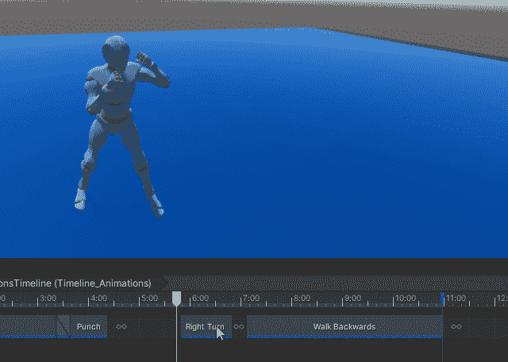
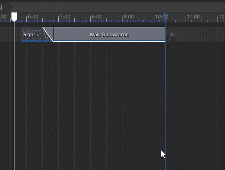
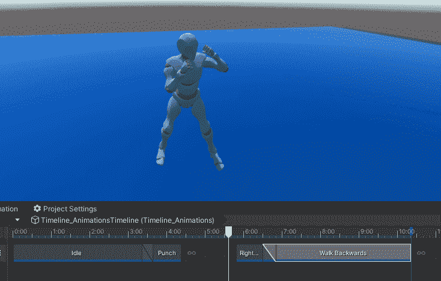

# 游戏开发的第 90 天:解决动画/时间线的 3 个常见问题！

> 原文：<https://blog.devgenius.io/day-90-of-game-dev-resolving-3-common-issues-with-animations-timeline-d7af45f3f293?source=collection_archive---------13----------------------->

**目标:**使用时间轴设置一个动画角色，并回顾一些你可能会遇到的问题。

对于我的例子，我有一些来自 mixamo.com 的免费动画测试字符

我想讨论一些你在使用时间轴创建动画序列时可能会遇到的问题。

**问题 1:** 如果你试图将一个动画添加到你的时间线，但它似乎不起作用。这可能是因为您试图添加整个 animator 组件，而不是特定的动画。

如果需要的话，你可以点击打开动画师并抓取你的特定动画。

**问题 2:** 如果你的动画看起来很奇怪，也许它们在“折叠”或者有一些其他奇怪的行为，你使用了人类类型的角色。确保将动画类型从通用更改为人形。

正如你在这里看到的，从一个动画到另一个动画有一个急剧的跳跃。

要解决这个问题，请将动画相互融合。

**问题 3:** 此处动画将角色向右旋转，但当向后行走动画出现时，它会将角色重置为其原始方向。让它们相互融合并不能解决问题，尽管这确实能让动画看起来更流畅。重点是方向不应该返回，而是角色应该从他们面对的任何地方向后移动。

我可以右键单击第二个动画，然后单击**匹配偏移到前一个剪辑**，修复这个问题。

***希望这篇文章对你有帮助！如果你有任何想法，问题，或者你已经找到解决方案或者仍然需要帮助的问题，请在下面评论。让我们做一些很棒的游戏吧！***