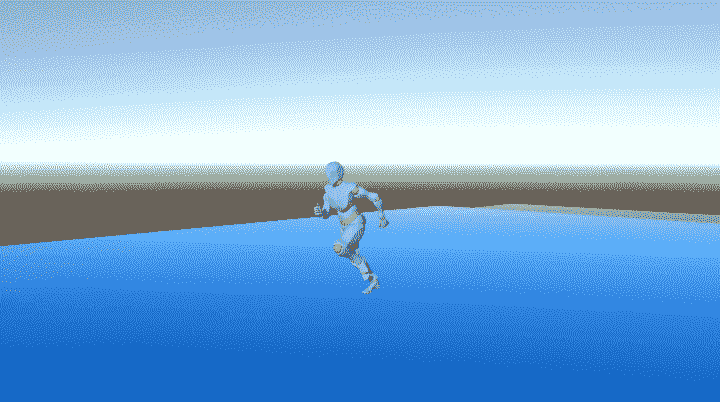
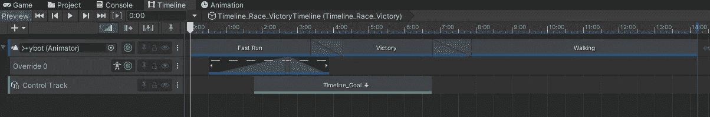
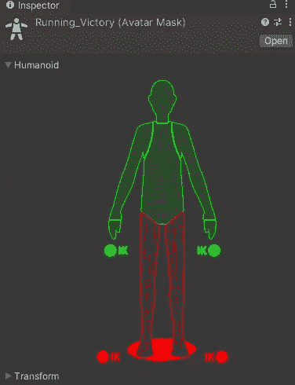
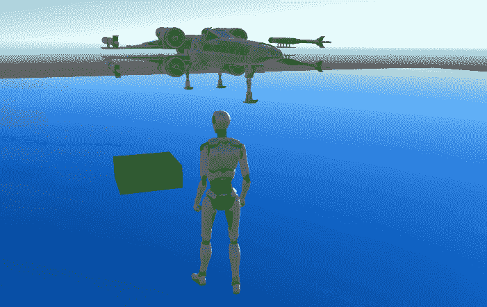
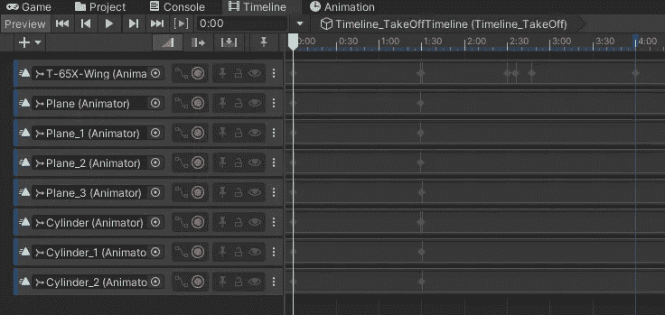
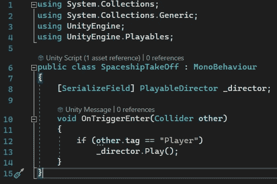
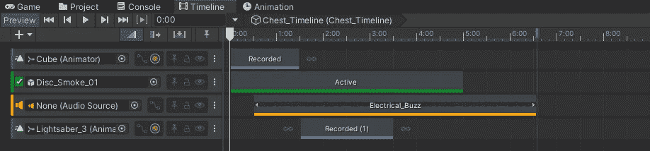

# 游戏开发的第 91 天:在时间轴中制作动画序列！

> 原文：<https://blog.devgenius.io/day-91-of-game-dev-making-animation-sequences-in-timeline-a3dc23413d52?source=collection_archive---------14----------------------->

**目标:**回顾**时间线**可以对 3 个不同的动画序列做什么。

我将简单地使用我制作的时间线的例子来展示时间线的可能性，尽管对于任何更深入的东西，我会查阅我以前的文章。

这更像是一篇“你能实现什么”的文章。我的其他文章中并没有涉及“如何”这个问题。

从第一个时间线开始:它的设置是一个人赢得了比赛并庆祝，即使他们伤害了自己:)

这是时间线。

让我们简单概述一下。顶部轨迹是一个动画轨迹，处理跑步、静止胜利和行走(跛行)动画。这些动画中的每一个都逐渐过渡到另一个中，以实现更平滑的过渡。

第二个轨道是一个**覆盖轨道**，它是为了使用**化身遮罩**而设置的。什么是头像面具？让我用我的例子来解释一下:我有 2 个不同的动画，一个是胜利的，一个是奔跑的，两个都同时使用头像面具。我创建了覆盖轨道，创建了头像遮罩并将其应用于覆盖轨道。在头像遮罩中，我可以禁用我希望动画控制的身体部位。也就是说，如果我禁用腿、脚和位置，让跑步动画保持下半部分的动画，那么我将有一个角色在跑步，而胜利动画同时使用上半部分！

第三个轨迹是控制轨迹，用于启用另一个时间线，该时间线控制当角色越过终点线时射出的粒子。

第二条时间线是当玩家按下扳机时一艘宇宙飞船飞走。

这个时间线有更多的手动动画要做。

顶部的动画轨迹控制着飞船的位置和旋转。接下来的 4 个名为“飞机”的是当宇宙飞船开始起飞时张开的翅膀。最后三个控制着飞船起飞时向上移动的腿。时间线让我从一个地方管理所有这一切。认真牛逼！

当玩家按下扳机时，时间线也会播放。

第三条时间线是一个战利品盒动画以及粒子效果和 sfx。当然你听不到音效，但你可能也不想听，因为我刚刚放了些东西进去测试:)

顶部动画轨迹控制胸部的顶部，打开它。第二个轨迹是激活粒子效果的激活轨迹。所以在时间线之外，我让它们去激活，当时间线开始时，它们被激活。然后是非常简单的音轨。最后最后一个轨迹是控制光剑向上移动。

老实说，我花了一点时间来适应时间线，我仍然在学习它，并一直遇到问题。但是，这是完全值得的，我现在可以更快地制作这些动画了。我的意思是这个单子上的第二和第三项花了我 1 个小时。这包括弄清楚我想做什么，弄乱东西，下载东西等等。最后，时间轴真的很棒，我希望这篇文章能向你展示它的一些潜力。

***如果您有任何问题或想法，请随时发表评论。让我们做一些很棒的游戏吧！***