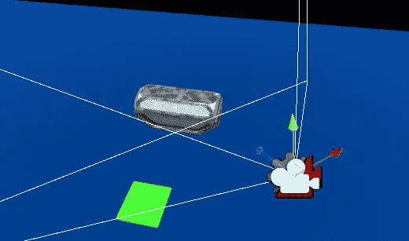

# 游戏开发的第 92 天:结合 Cinemachine 和 Timeline 实现终极控制！

> 原文：<https://blog.devgenius.io/day-92-of-game-dev-combining-cinemachine-and-timeline-for-ultimate-control-5d59df9c91ef?source=collection_archive---------9----------------------->

**目标:**使用 **Cinemachine** 配合**时间轴**创建一个战利品盒子序列！

这里是我用 **Timeline** 和 **Cinemachine** 一起做的几个例子，这样你就可以知道用它们能做什么。

对话序列

汽车序列

对于这篇文章的主要例子，我将打开这个战利品箱，并带你通过实现 **Cinemachine** 相机到里面。

我已经有了一个时间线设置，如果我的玩家走进一个触发器，如果玩家将打开前面的战利品箱。

正如你所看到的，动画和粒子激活了，但我也想让相机更多地关注战利品箱，让它看起来更有趣和重要。

要做到这一点实际上非常简单。

首先，我将添加一个新的虚拟摄像机到我的场景中。

这个摄像机将会是静态的，因为除了改变主摄像机的位置外，它实际上什么也不做。所以我会将**身体**和**瞄准**设置为**不做任何事情**。

我会把相机放在我想放的地方。

这就是相机上的一切。(当然，你可能会在一点测试后调整它，以获得正确的感觉。)

然后，我会在我的时间线中添加一个 **Cinemachine** 轨道。

分配装有**cinema machine brain**的摄像机。(应该是你的**主**相机**由**默认**)。**

接下来，我将把我之前设置的虚拟摄像机拖放到时间轴中。

这就对了。当时间线播放时，只要您愿意，该摄像机将成为使用过的摄像机。在我的情况下，我希望它是整个时间轴序列的旧相机，我不希望相机立即捕捉到彼此，所以我将**缓和过渡的进出**。

如果你问我，我会觉得很甜蜜！没有任何编码(除了绿色立方体上的触发器之外),我们有一个完整的战利品盒序列，可以处理动画、粒子、相机等等。全部来自一条时间线！

如果您有任何问题或想法，请随时发表评论。让我们做一些很棒的游戏吧！