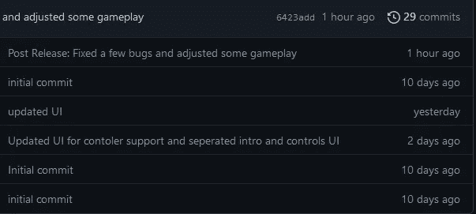
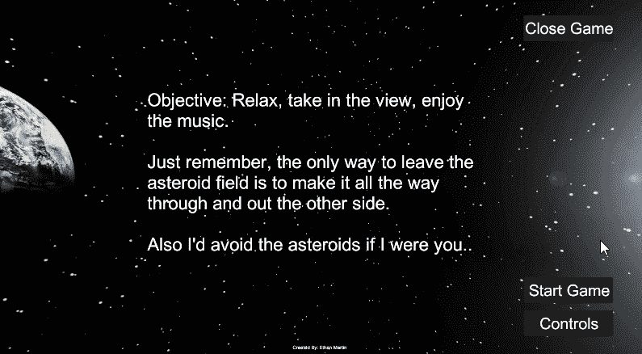
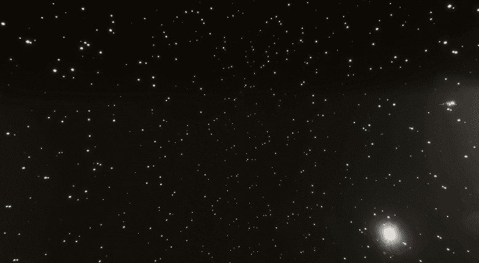
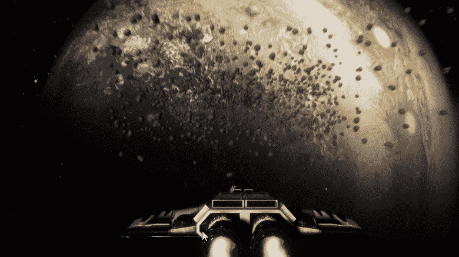
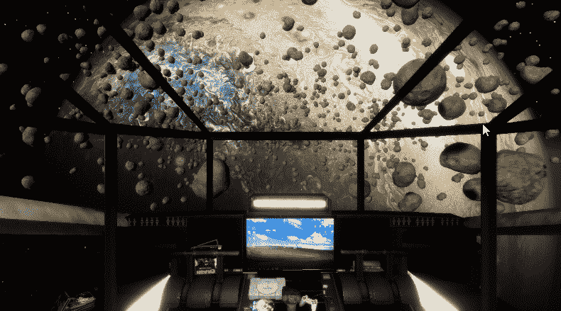
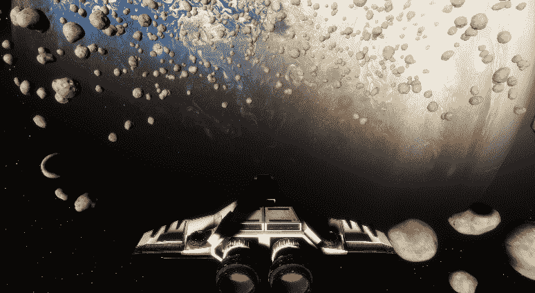
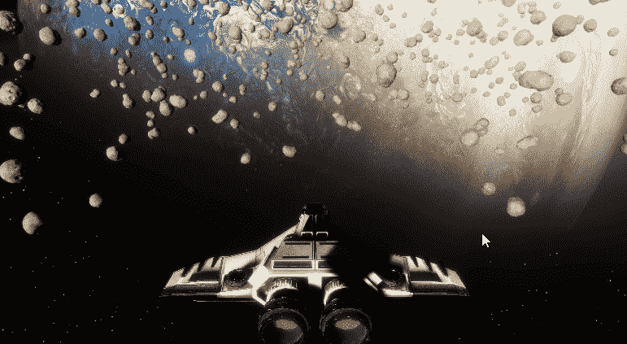
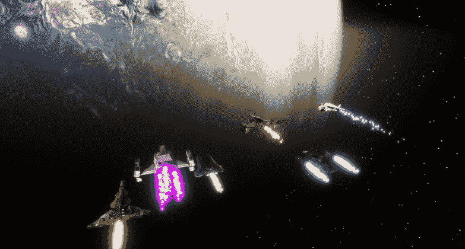
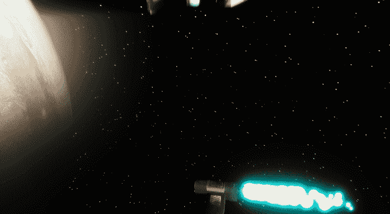
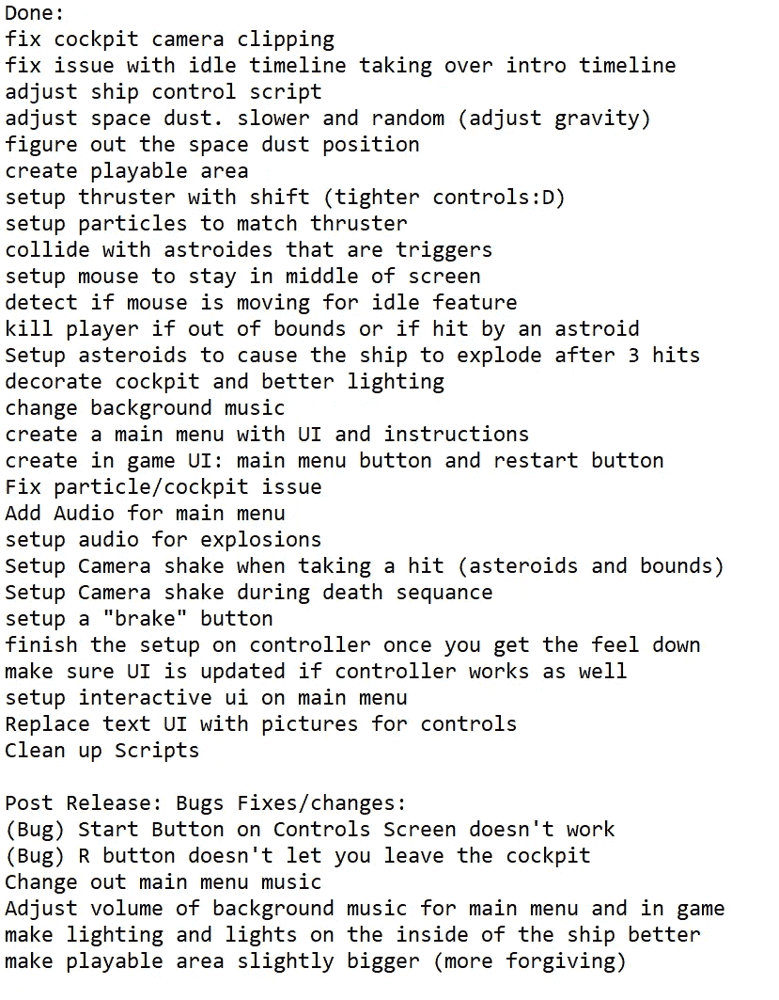

# 游戏开发的第 93 天:在 10 天内创建一个太空模拟器！

> 原文：<https://blog.devgenius.io/day-93-of-game-dev-creating-a-space-simulator-in-10-days-f323a6f52161?source=collection_archive---------7----------------------->

**目标:**利用我在过去 2 -3 周内获得的**时间线**和 **Cinemachine** 的知识，创建一个真实的项目。

如果你感兴趣，这里有 [**下载**](https://murkes.itch.io/space-simulator-demo) 。

这篇文章将关注我的项目的最终结果，而不是我是如何做的。制作这个模拟器的大部分主题可能在我以前的文章中有所涉及，如果你有任何问题可以自由评论。

29 次提交之后就完成了:)

这是一个非常有趣的练习，看到我在这么短的时间内走了这么远真是太疯狂了！我不敢相信我只用了 10 天就做好了这个！这不是吹牛，而是我在这方面的真正胜利。

我想用我的时间线/cinemachine 技能的一个方法是一个比我之前做的更有趣的主菜单。我以前的主菜单会有主场景，当你点击控制按钮时，它会加载另一个带有指令的场景。这是我在这个项目中所做的。

我知道这很简单，但在我看来，它给游戏带来了更多的生命。(对不起，如果我过度炒作:)我只是超级兴奋！)

如果你点击开始游戏，你会看到一个介绍过场动画:

然后你就可以自由自在地在这个小行星地里飞行了。控制器通过推进器和刹车功能提供了更快和更慢的游戏。

在游戏中，你也可以从第三人称视角切换到第一人称视角。

不介意飞船在 windows 7 上运行；)

有一个非常酷的空闲摄像头功能，我很自豪自己发现了这个功能:)

5 秒钟没有输入或鼠标移动=空闲

关卡进行到一半时，你可以触发一个游戏时间线事件，其他船只从你身边飞过

然后是 outro，如果你能穿越整个小行星带。它有点长，所以这里是一个味道。

这一切都伴随着美妙的音乐，适合这个模拟的放松主题。说真的，在我看来，音乐将整个体验很好地联系在一起。

我开始被想法和要做的事情淹没，所以我把其中一些写了下来。有些我只是做了，没有写下来。但这是我最后的清单。

这在我的游戏开发之旅中是如此坚实的经历。进入下一个项目！

:)