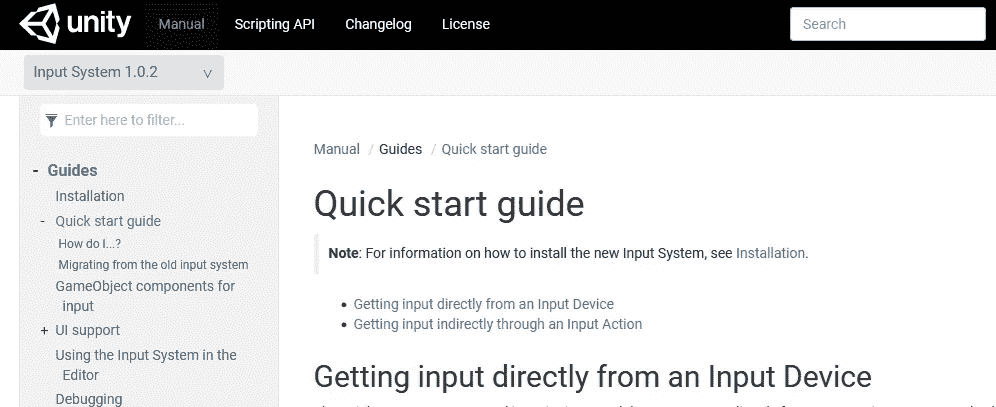
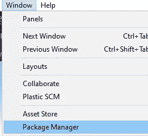
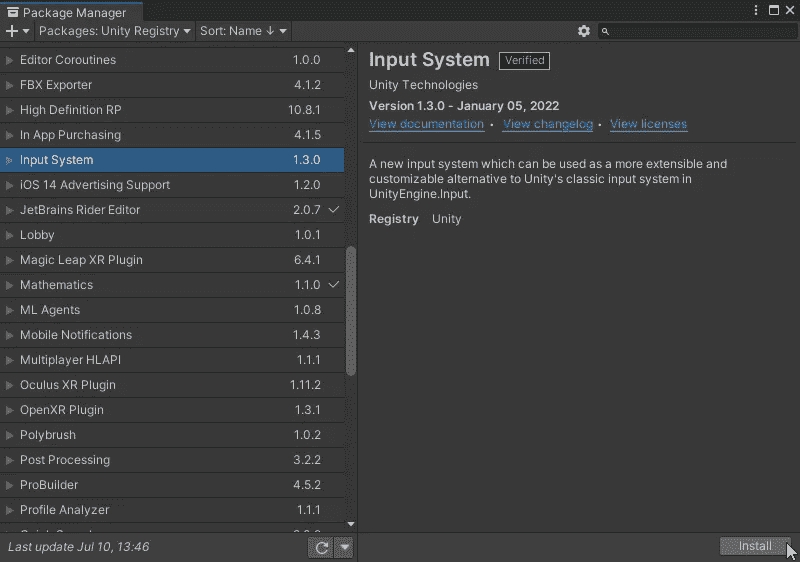
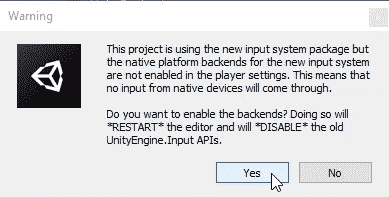
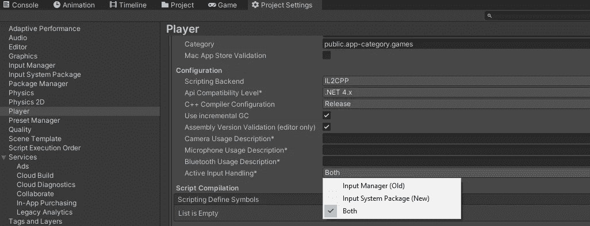
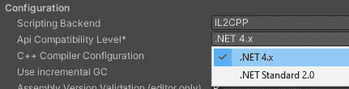
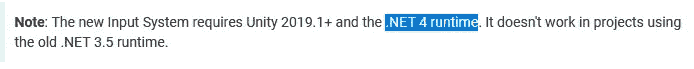

# 游戏开发第 95 天:如何设置新的 Unity 输入系统！

> 原文：<https://blog.devgenius.io/day-95-of-game-dev-how-to-setup-the-new-unity-input-system-72a13f061679?source=collection_archive---------3----------------------->

**目的:**在我的 **Unity** 项目中设置**新输入系统**。

对于任何想开始使用**新输入系统**的人来说，如果你真的想了解正在发生的事情以及如何让它工作，我建议你在安装的时候查看一下官方的 [**文档**](https://docs.unity3d.com/Packages/com.unity.inputsystem@1.0/manual/QuickStartGuide.html) 。

以上链接将带您进入此页面:

在使用**新输入系统**之前，我们需要了解一件事，就是为什么要使用**新输入系统**？旧的有什么问题？

旧系统非常适合快速原型制作和针对 1 种控制器设置控制。如键盘、鼠标或 xbox 控制器等。但是，如果您曾经尝试过为 **Unity** 项目设置多控制器支持，我相信您已经注意到在您的脚本中需要完成多少工作。剧本有时会变得更混乱、更难阅读。对于大多数个人项目来说，这并不可怕，但是对于更大或更专业的项目来说，新的输入系统**让事情变得更干净。**

我接下来的文章将更深入地介绍如何使用新系统，但本文的其余部分将介绍如何将它安装到您的项目中，以及您可能需要了解的一些事情，这些也在开始时链接的文档中。

**步骤 1:** 通过包管理器安装新的输入系统。

**第 2 步:** **Unity** 会询问您是否要停用**旧的输入系统**，以便您可以使用**新的输入系统**。要启用新的和禁用旧的单击是。您**编辑器**将重启。

**第 3 步:**(可选)如果你想在你的项目中使用新的和旧的系统，这是完全可以的，你可以回到设置并打开两者。

此外，请记住，如果您没有看到**主动输入处理**作为选择要使用的系统的选项，您可能已经有了**。启用 NET Standard 2.0** 代替**。NET 4.x** 。

根据文档，新的输入系统只对**有效。NET 4.x**

我期待在接下来的几天里在**新输入系统**上发布更多的内容，我希望你会发现这些文章很有帮助。

***如有任何问题或想法，欢迎评论。让我们制作一些令人敬畏的游戏！***