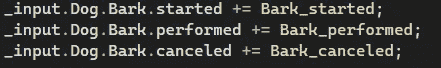

# 游戏开发的第 99 天:Unity 新输入系统-脚本动作！

> 原文：<https://blog.devgenius.io/day-99-of-game-dev-unity-new-input-system-scripting-actions-f5744d7d7c12?source=collection_archive---------9----------------------->

**目标:**创建一个脚本并设置我的**动作**以便在游戏中使用。

首先，当我试图向你们展示如何通过脚本设置输入动作时，你们中的许多人可能会变得非常困惑。没关系，因为我还是没有 100%明白。事情是这样的，为了做到这一点，我们将与**代表**在**事件驱动系统**中工作，新的输入系统就是用这个系统设置的。

但是，不要害怕。当我们已经知道输入如何在旧系统中统一工作时，还有什么更好的方法来学习**委托**是如何工作的呢？你不需要成为**代表**方面的专家，因为如果你已经在谷歌上搜索过这个概念，我敢肯定有些人是专家。你是否想先学习什么是**委托**或者如何编写新的输入系统取决于你。我事先对它们做了一些研究，这确实有帮助，尽管我没有深入研究，也没有设置任何测试。所以我的建议是做几个谷歌搜索，也许找个视频，弄清楚什么是**委托**以及他们如何在 **C#** 领域工作，然后学习新的输入系统。

如果你感兴趣，我的下一篇文章将简要介绍代表们(T21)。

在我以前的文章中，我们设置了一个名为 Dog 的示例动作图。我们需要通过脚本开始使用动作地图上的动作。到目前为止，它们只是设置，我们需要通过脚本设置它们才能使用它们。

我将首先带您完成设置，然后在最后给出一个概述。

确保检查您的动作映射是否设置为自动生成 C#类。

我们将使用这个类来引用和编写我们的动作。我将首先制作一个名为 **PlayerInputs** 的新脚本。确保新脚本与您刚刚自动生成的脚本在同一个文件夹中，否则他们将看不到彼此。

为了使用任何与新输入系统相关的东西，我们需要 UnityEngine。输入系统名称空间。

然后我们需要一个对之前自动生成的类的引用。我将创建一个类型为(自动生成类) **PlayerInputActions** 的变量。

将其设置为该类的新实例。

在我使用动作地图中的任何动作之前，我需要启用**动作地图**。

_input 是该类的新实例。狗是行动地图。我正在实现它。

在这里，我将进入我刚刚启用的狗动作图，访问我想要的动作(吠叫)，检查它是否已被执行，然后在键入+=后按 tab 键自动创建一个方法。+=正在添加自动创建/添加到**事件/委托**的方法。

这是自动创建的方法。我要改变一些事情。我将重命名**输入操作。从 obj 到 Context 的 CallbackContext** 。这是偏好，你不必如此。我将用发送到控制台的消息替换被调用的代码，该消息还打印上下文变量信息。

回到游戏中，我将确保我的 **PlayerInput** 脚本在一个游戏对象上，并按下空格，这是我为吠叫动作设置的绑定。

每当我按下空格键，我的调试。日志，它打印上下文变量保存的信息。这是为了测试的目的，你可以调用任何你想要的代码。

需要指出的其他几件事:

这里我们检查树皮是否被执行。您还可以检查树皮是开始还是取消。这与旧的输入系统相同，但用词不同。

GetKeyDown =已开始

GetKey =已执行

GetKeyUp =已取消

因此，您可以检查该键是否被按下、按住或释放。如果你愿意，你也可以检查这三项。

同样，回到您的操作上，您可以很容易地换出一个绑定，并且您的所有代码应该仍然工作。因此，如果我想将树皮从空间更改为 B，然后保存我的更改，现在 B 将执行树皮，我的代码仍然有效。但是一定要保存它！

这是一个开始。我知道与旧的输入系统相比，这感觉起来工作量很大。但是这个新系统更适合添加多控制器设置，同时保持你的代码更加整洁。这个系统最适合这种环境。

如果你是一个新的开发者，不要强调这一点。现在坚持使用旧的，接触编程的基础，因为它仍然是一个好的输入系统。不要让老吓到你。两者都有其用途。

***如有任何问题或想法，欢迎评论。让我们制作一些令人敬畏的游戏！***