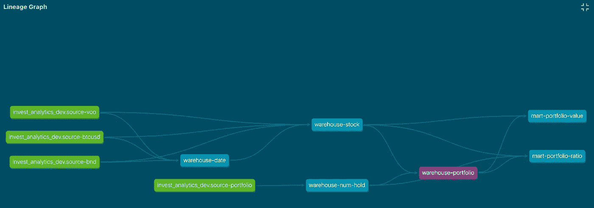

# 实践中的 dbt 和 BigQuery 转换股票数据的用例

> 原文：<https://blog.devgenius.io/dbt-and-bigquery-in-practice-transform-stock-data-1771e2393319?source=collection_archive---------4----------------------->

更新于 2022 年 7 月 22 日:更新数据管道如下:

*   创建一个额外的仓库来存储计算的投资组合价值
    - >，以隔离每个数据集市，避免受到每个集市中的变化的影响

更新于 2022/6/11:将源代码推送到 GitHub:[https://github.com/koyaaarr/invest-analytics-model](https://github.com/koyaaarr/invest-analytics-model)

# 介绍

本文解释了如何使用 dbt 和 BigQuery 来转换实际数据。

您可以使用 dbt 轻松创建数据湖、数据仓库和数据集市。它还使我们能够测试我们的数据质量。我将把 BigQuery 和 dbt 结合起来，将实际的股票数据转换成我的仪表板使用的数据集市。

这篇文章与下一篇有关，所以如果你有时间，请阅读它。

[https://koyaaarr . medium . com/a-practical-use-case-of-cloud-native-and-secured-dashboard-with-Google-cloud-and-python-streamlit-a 66 e 60d 62 ca 8](https://koyaaarr.medium.com/a-practical-use-case-of-cloud-native-and-secured-dashboard-with-google-cloud-and-python-streamlit-a66e60d62ca8)

那么，我们开始吧。

# **造型**

在开始转换之前，我们需要定义每个表的数据模式。

这是我们需要的表格的图像。


数据管道

在数据集市方面，我希望看到我的投资组合的整体表现，每个股票比率都由它组成。因此，需要为这些目的创建两个数据集市。

另一方面，每只股票数据(VOO、BTC-美元、BND)都存储在谷歌云存储中。它们的格式是 CSV，包含日期和值，如收盘价。


源股票数据

因此，我需要将这些数据源聚集到数据仓库中，并将它们转换到每个数据集市中。

每个数据模式将在下一节中描述。

# **介绍 dbt 和 BigQuery**

以下是这个用例的先决条件。我将使用 dbt CLI 并使用 Python 安装。

```
Python: 3.9.11
dbt-core: 1.1.0
dbt-bigquery: 1.1.0
```

首先，可以通过下面的命令初始化 dbt。

```
dbt init
```

这个命令创建了许多文件和目录。

这个命令创建了许多文件和目录。

然后就可以在“dbt_project.yml”的同一个目录下制作“profiles.yml”了。该文件在“~/中生成。dbt ”,但是我建议您将它放在工作目录中，由 git 来控制。

在开始的时候，你会编辑“models/”、“dbt_project.yml”和“profiles.yml”。

让我们看一下每个文件。

“dbt_project.yml”定义了项目的配置。您将编辑该文件的底部。有我们创建的表，您可以指定每个表的物化类型。

```
name: 'invest_analytics'
version: '1.0.0'
config-version: 2~~~models:
  invest_analytics:
    invest_analytics_dev:
    +materialized: view
      warehouse-date:
      warehouse-stock:
      warehouse-num-hold:
      warehouse-portfolio:
      mart-portfolio-value:
        +materialized: table
      mart-portfolio-ratio:
        +materialized: table
```

“profiles.yml”定义系统配置，包括与 BigQuery 的连接。如果您使用服务帐户进行身份验证，则需要指定密钥文件。

```
invest_analytics:outputs:dev:
  dataset: invest_analytics_dev
  job_execution_timeout_seconds: 300
  job_retries: 1
  keyfile: ../service_account.json
  location: asia-northeast1
  method: service-account
  priority: interactive
  project: invest-analytics-347211
  threads: 1
  type: bigquery
  target: dev
```

“模型”目录包含 SQL 和“schema.yaml”。


可以用 dbt 编写标准 SQL，唯一不同的是它的源表。

您需要像这样用 dbt 的格式定义被引用的表，而不是顺序格式。

```
select
    Date
  , cast(close_voo as integer) as close_voo
  , cast(close_btcusd as integer) as close_btcusd
  , cast(close_bnd as integer) as close_bnd
  , cast(close_total as integer) as close_total
from
  {{ ref('warehouse-stock') }} as st
  left outer join {{ ref('warehouse-portfolio') }} as pf 
    on st.Date = pf.Date
order by
  Date
```

如果您的表是由 CSV 这样的源数据生成的，您可以像这样定义源数据。

```
select
    max(case ticker when 'VOO' then num_of_hold else null end) as num_voo
  , max(case ticker when 'BTC-USD' then num_of_hold else null end) as num_btcusd
  , max(case ticker when 'BND' then num_of_hold else null end) as num_bnd
from
  {{ source('invest_analytics_dev', 'source-portfolio') }}
```

最后，您需要像这样定义“schema.yaml”中的数据模式。

```
version: 2
sources:
  - name: invest_analytics_dev
    tables:
      - name: source-voo
      - name: source-btcusd
      - name: source-bnd
      - name: source-portfoliomodels:
  - name: mart-portfolio-ratio
    description: ''
    columns:
      - name: ticker
        description: ''
        tests:
          - unique
          - not_null
          - accepted_values:
            values: ['voo', 'btcusd', 'bnd']
      - name: close_percent
        description: ''
        tests:
          - unique
          - not_null
```

如果您有从 CSV 文件导入的数据源，您可以将它们写在“sources”部分。

然后可以添加表的数据模式。此外，您可以为每列定义测试。此示例包含“唯一性测试”、“非空测试”和“可接受值测试”。

定义完每个文件后，让我们用这个命令生成表格。

```
dbt run — full-refresh — profiles-dir .
```

然后你得到这样的结果。

```
12:11:02  Running with dbt=1.1.0
12:11:02  Unable to do partial parsing because a project config has changed
12:11:03  Found 5 models, 17 tests, 0 snapshots, 0 analyses, 191 macros, 0 operations, 0 seed files, 4 sources, 0 exposures, 0 metrics
12:11:04  Concurrency: 1 threads (target='dev')
12:11:04  1 of 5 START view model invest_analytics_dev.warehouse-date .................... [RUN]
12:11:06  1 of 5 OK created view model invest_analytics_dev.warehouse-date ............... [OK in 1.61s]~~~12:11:11  5 of 5 START table model invest_analytics_dev.mart-portfolio-ratio ............. [RUN]
12:11:14  5 of 5 OK created table model invest_analytics_dev.mart-portfolio-ratio ........ [CREATE TABLE (3.0 rows, 62.7 KB processed) in 3.27s]
12:11:14  Finished running 3 view models, 2 table models in 11.36s.
12:11:14  Completed successfully
12:11:14  Done. PASS=5 WARN=0 ERROR=0 SKIP=0 TOTAL=5
```

你可以看到每个表都是在谷歌云控制台中创建的。


BigQuery 控制台

如果您想检查数据的质量，请运行以下命令。

```
dbt test — profiles-dir .
```

然后，你得到这样的结果。

```
10:04:03  Running with dbt=1.1.0
10:04:03  Found 5 models, 17 tests, 0 snapshots, 0 analyses, 191 macros, 0 operations, 0 seed files, 4 sources, 0 exposures, 0 metrics
10:04:04  Concurrency: 1 threads (target='dev')
10:04:04  1 of 17 START test accepted_values_mart-portfolio-ratio_ticker__voo__btcusd__bnd  [RUN]
10:04:06  1 of 17 PASS accepted_values_mart-portfolio-ratio_ticker__voo__btcusd__bnd ..... [[32mPASS[0m in 2.16s]~~~10:04:31  17 of 17 START test unique_warehouse-stock_Date ................................ [RUN]
10:04:32  17 of 17 PASS unique_warehouse-stock_Date ...................................... [[32mPASS[0m in 1.33s]
10:04:32  Finished running 17 tests in 28.88s.
10:04:32  Completed successfully
10:04:32  Done. PASS=17 WARN=0 ERROR=0 SKIP=0 TOTAL=17
```

最后，让我们通过下面的命令生成表的文档。

```
dbt docs generate — profiles-dir .
dbt docs serve — profiles-dir .
```

然后您可以看到表定义和沿袭。


表格定义



谱系图

# **结论**

希望这篇文章能对你有所帮助。我用股票数据解释了 dbt 和 BigQuery 的实际用例。您可以根据依赖关系创建表，测试数据质量，甚至生成定义文档。