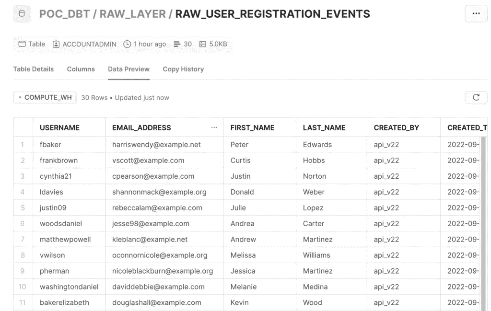
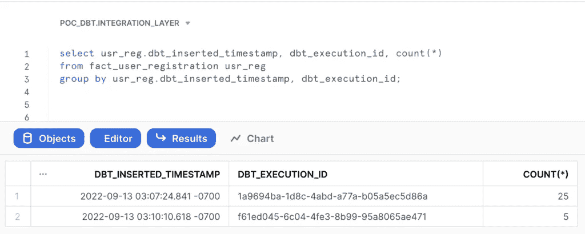
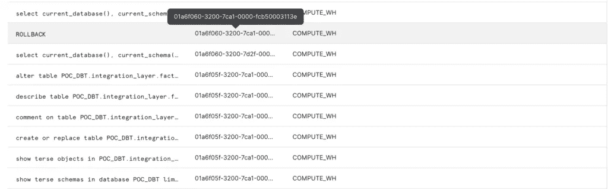
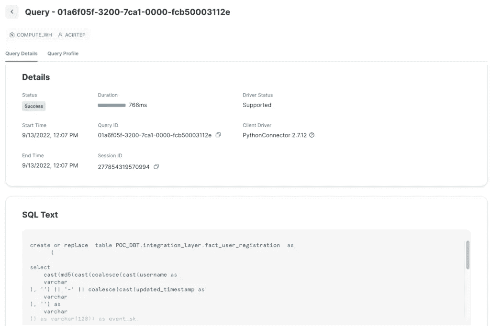
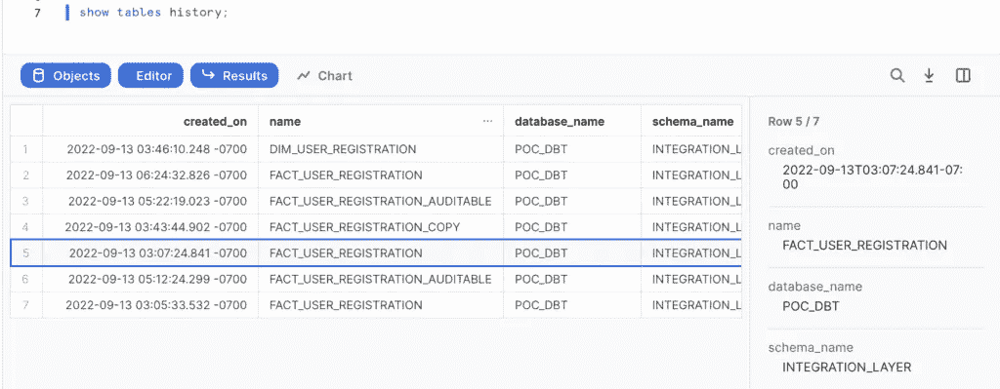
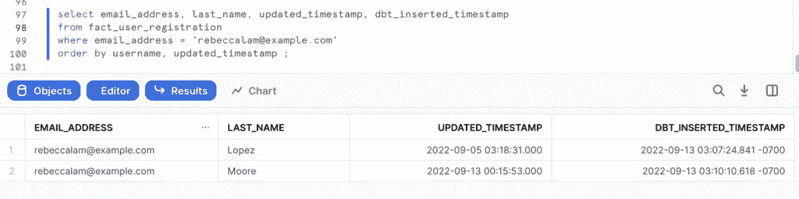
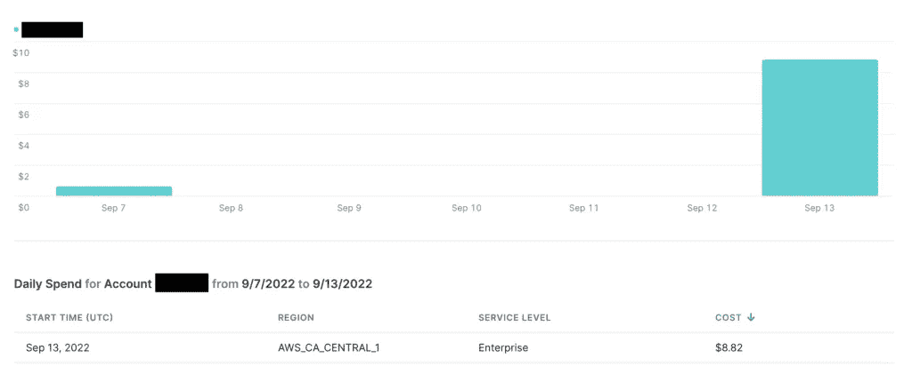

# dbt，雪花和时间旅行

> 原文：<https://blog.devgenius.io/dbt-snowflake-and-time-traveling-4253fb703f44?source=collection_archive---------2----------------------->

由于一位前同事对我关于[可审计性](https://ownyourdata.ai/wp/a-way-to-ensure-auditability-in-data-processing/)和 dbt 的文章的[反应](https://www.linkedin.com/posts/pleuca_a-way-to-ensure-auditability-in-data-processing-activity-6966418906068443136-Qc-E?utm_source=share&utm_medium=member_desktop)，我决定在我的试用账户上使用 dbt 和雪花。在我的上一篇文章中，我注意到日志中 dbt 的一些奇怪行为(关于 Postgres ),我从多个渠道听说它应该只与 Postgres 相关。接受挑战！

# 设置

我已经有了一个雪花的试用账户，你可以通过关注他们的官方文件[在这里](https://signup.snowflake.com/)随意设置一个。在对雪花执行 dbt 之前，我需要对原始数据进行相同的初始加载。我想遵循和 Postgres 一样的设置，用 faker，pandas 和 sqlalchemy，幸运的是，已经有一个这样的库:snowflake-sqlalchemy。我 pip 安装并运行:

```
from sqlalchemy import create_engine
from snowflake.sqlalchemy import URLdef get_snowflake_conn(): 
    conn_string = URL(
        account = SNOWFLAKE_ACCOUNT,
        user = SNOWFLAKE_USER,
        password = SNOWFLAKE_PWD,
        database = 'POC_DBT',
        schema = 'RAW_LAYER',
        warehouse = 'COMPUTE_WH'
    )
    engine = create_engine(conn_string)
    return engine.connect()def load_to_snowflake():
    initial_user_data_df = get_initial_user_df()
    snowflake_conn = get_snowflake_conn()
    initial_user_data_df.to_sql(
        name='raw_user_registration_events',
        schema='raw_layer',
        con=snowflake_conn,
        if_exists='replace',
        index=False
    )
    snowflake_conn.close()def load_updated_to_snowflake():
    snowflake_conn = get_snowflake_conn()
    user_data_df = pandas.read_sql(
        'select username, email_address, first_name, created_by, created_timestamp \
        from raw_layer.raw_user_registration_events limit 5;', snowflake_conn)
    user_data_df = add_updated_attributes(user_data_df)
    user_data_df['load_timestamp'] = datetime.now()

    user_data_df.to_sql(
        name='raw_user_registration_events',
        schema='raw_layer',
        con=snowflake_conn,
        if_exists='append',
        index=False
    )
    snowflake_conn.close()
```

提示:雪花帐户由您的 account_id、云提供商和部署它的地区组成。



DBT 怎么样？只需几步:

# 配置新目标

在 dbt 概要文件配置文件中，我添加了一个雪花目标，这样我就可以对它执行 dbt:

```
outputs:
    snowflake:
      type: snowflake
      account: "{{ env_var('SNOWFLAKE_ACCOUNT') }}"
      user: "{{ env_var('SNOWFLAKE_USER') }}"
      password: "{{ env_var('SNOWFLAKE_PWD') }}"
      database: "POC_DBT"
      warehouse: "COMPUTE_WH"
      schema: integration_layer
```

# 添加雪花模型配置

默认情况下，在 Snowflake 上，DBT 创建的所有表都是临时的。临时表是一种临时表，但是可以从创建它们的会话之外访问它们。因此，请仔细阅读文档，以便知道应该将哪个表设置为永久表。

```
{{ 
    config(
        materialized = 'incremental',
        transient=false
        ) 
}} select
    cast({{ dbt_utils.surrogate_key(['username', 'updated_timestamp']) }} as varchar(128)) as event_sk,
    cast(username as varchar(30)) username,
    cast(email_address as varchar(320)) email_address,
    cast(first_name as varchar(100)) first_name,
    cast(last_name as varchar(100)) last_name,
    cast(created_by as varchar(10)) created_by,
    cast(created_timestamp as timestamp) created_timestamp,
    cast(updated_by as varchar(10)) updated_by,
    cast(updated_timestamp as timestamp) updated_timestamp,
    {{ get_audit_columns() }}
from {{ source ('raw_layer', 'raw_user_registration_events') }} where cast(load_timestamp as date) = cast(current_date as date)
```

# 怎么跑

```
dbt run --full-refresh --model fact_user_registration --target snowflake
```

只需在 CLI 命令中添加目标选项，转换步骤就会将数据保存在雪花文件中:



我们在日志中看到了什么？

# 执行 id 1a 9694 ba-1d8c-4 Abd-a77a-b 05 a5 EC 5d 86 a，完全刷新

```
[0m10:07:16.937397 [debug] [MainThread]: Acquiring new snowflake connection "master"
[0m10:07:16.944823 [debug] [ThreadPool]: Acquiring new snowflake connection "list_POC_DBT"
[0m10:07:17.045152 [debug] [ThreadPool]: Using snowflake connection "list_POC_DBT"
[0m10:07:17.048762 [debug] [ThreadPool]: On list_POC_DBT: /* {"app": "dbt", "dbt_version": "1.2.0", "profile_name": "data_management_exercises", "target_name": "snowflake", "connection_name": "list_POC_DBT"} */
show terse schemas in database POC_DBT
    limit 10000
[0m10:07:17.052355 [debug] [ThreadPool]: Opening a new connection, currently in state init
[0m10:07:19.806404 [debug] [ThreadPool]: SQL status: SUCCESS 4 in 2.75 seconds
[0m10:07:19.832376 [debug] [ThreadPool]: On list_POC_DBT: Close
[0m10:07:20.188326 [debug] [ThreadPool]: Acquiring new snowflake connection "list_POC_DBT_integration_layer"
[0m10:07:20.257201 [debug] [ThreadPool]: Using snowflake connection "list_POC_DBT_integration_layer"
[0m10:07:20.260731 [debug] [ThreadPool]: On list_POC_DBT_integration_layer: /* {"app": "dbt", "dbt_version": "1.2.0", "profile_name": "data_management_exercises", "target_name": "snowflake", "connection_name": "list_POC_DBT_integration_layer"} */
show terse objects in POC_DBT.integration_layer
[0m10:07:20.263757 [debug] [ThreadPool]: Opening a new connection, currently in state init
[0m10:07:22.322859 [debug] [ThreadPool]: SQL status: SUCCESS 1 in 2.06 seconds
[0m10:07:22.351181 [debug] [ThreadPool]: On list_POC_DBT_integration_layer: Close
[0m10:07:22.701212 [debug] [MainThread]: Sending event: {'category': 'dbt', 'action': 'runnable_timing', 'label': '1a9694ba-1d8c-4abd-a77a-b05a5ec5d86a', 'context': [<snowplow_tracker.self_describing_json.SelfDescribingJson object at 0x402326ca00>]}
[0m10:07:22.712533 [info ] [MainThread]: Concurrency: 1 threads (target='snowflake')
[0m10:07:22.719842 [info ] [MainThread]: 
[0m10:07:22.743834 [debug] [Thread-1  ]: Began running node model.data_management_exercises.fact_user_registration
[0m10:07:22.748662 [info ] [Thread-1  ]: 1 of 1 START incremental model integration_layer.fact_user_registration ........ [RUN]
[0m10:07:22.754662 [debug] [Thread-1  ]: Acquiring new snowflake connection "model.data_management_exercises.fact_user_registration"
[0m10:07:22.758113 [debug] [Thread-1  ]: Began compiling node model.data_management_exercises.fact_user_registration
[0m10:07:22.762218 [debug] [Thread-1  ]: Compiling model.data_management_exercises.fact_user_registration
[0m10:07:22.817393 [debug] [Thread-1  ]: Writing injected SQL for node "model.data_management_exercises.fact_user_registration"
[0m10:07:22.826123 [debug] [Thread-1  ]: finished collecting timing info
[0m10:07:22.830767 [debug] [Thread-1  ]: Began executing node model.data_management_exercises.fact_user_registration
[0m10:07:23.150581 [debug] [Thread-1  ]: Writing runtime SQL for node "model.data_management_exercises.fact_user_registration"
[0m10:07:23.167795 [debug] [Thread-1  ]: Using snowflake connection "model.data_management_exercises.fact_user_registration"
[0m10:07:23.170902 [debug] [Thread-1  ]: On model.data_management_exercises.fact_user_registration: /* {"app": "dbt", "dbt_version": "1.2.0", "profile_name": "data_management_exercises", "target_name": "snowflake", "node_id": "model.data_management_exercises.fact_user_registration"} */
create or replace  table POC_DBT.integration_layer.fact_user_registration  as
      ( select
    cast(md5(cast(coalesce(cast(username as 
    varchar
), '') || '-' || coalesce(cast(updated_timestamp as 
    varchar
), '') as 
    varchar
)) as varchar(128)) as event_sk,
    cast(username as varchar(30)) username,
    cast(email_address as varchar(320)) email_address,
    cast(first_name as varchar(100)) first_name,
    cast(last_name as varchar(100)) last_name,
    cast(created_by as varchar(10)) created_by,
    cast(created_timestamp as timestamp) created_timestamp,
    cast(updated_by as varchar(10)) updated_by,
    cast(updated_timestamp as timestamp) updated_timestamp,

current_timestamp as dbt_inserted_timestamp,
cast('1a9694ba-1d8c-4abd-a77a-b05a5ec5d86a' as varchar(128)) as dbt_execution_idfrom poc_dbt.raw_layer.raw_user_registration_events
 );
[0m10:07:23.174112 [debug] [Thread-1  ]: Opening a new connection, currently in state closed
[0m10:07:25.834559 [debug] [Thread-1  ]: SQL status: SUCCESS 1 in 2.66 seconds
[0m10:07:26.033241 [debug] [Thread-1  ]: Using snowflake connection "model.data_management_exercises.fact_user_registration"
[0m10:07:26.036974 [debug] [Thread-1  ]: On model.data_management_exercises.fact_user_registration: /* {"app": "dbt", "dbt_version": "1.2.0", "profile_name": "data_management_exercises", "target_name": "snowflake", "node_id": "model.data_management_exercises.fact_user_registration"} */
comment on table POC_DBT.integration_layer.fact_user_registration IS $$Table having the user sign-up events$$;
[0m10:07:26.215671 [debug] [Thread-1  ]: SQL status: SUCCESS 1 in 0.18 seconds
[0m10:07:26.334913 [debug] [Thread-1  ]: Using snowflake connection "model.data_management_exercises.fact_user_registration"
[0m10:07:26.338564 [debug] [Thread-1  ]: On model.data_management_exercises.fact_user_registration: /* {"app": "dbt", "dbt_version": "1.2.0", "profile_name": "data_management_exercises", "target_name": "snowflake", "node_id": "model.data_management_exercises.fact_user_registration"} */
describe table POC_DBT.integration_layer.fact_user_registration
[0m10:07:26.506595 [debug] [Thread-1  ]: SQL status: SUCCESS 11 in 0.16 seconds
[0m10:07:26.677770 [debug] [Thread-1  ]: Using snowflake connection "model.data_management_exercises.fact_user_registration"
[0m10:07:26.680280 [debug] [Thread-1  ]: On model.data_management_exercises.fact_user_registration: /* {"app": "dbt", "dbt_version": "1.2.0", "profile_name": "data_management_exercises", "target_name": "snowflake", "node_id": "model.data_management_exercises.fact_user_registration"} */
alter table POC_DBT.integration_layer.fact_user_registration alter

        "EVENT_SK" COMMENT $$User registration event surrogate key$$,

        "USERNAME" COMMENT $$Username$$,

        "EMAIL_ADDRESS" COMMENT $$Email address used in the registration form$$,

        "FIRST_NAME" COMMENT $$The first name of the user$$,

        "LAST_NAME" COMMENT $$The last name of the user$$,

        "CREATED_BY" COMMENT $$User, process or version which created the record$$,

        "CREATED_TIMESTAMP" COMMENT $$User first registration time$$,

        "UPDATED_BY" COMMENT $$User, process or version which updated the record$$,

        "UPDATED_TIMESTAMP" COMMENT $$Update time of the record in the source system$$,

        "DBT_INSERTED_TIMESTAMP" COMMENT $$Insert time of the record in the integration layer$$,

        "DBT_EXECUTION_ID" COMMENT $$DBT invocation id of the run$$;
[0m10:07:26.899200 [debug] [Thread-1  ]: SQL status: SUCCESS 1 in 0.22 seconds
[0m10:07:26.967657 [debug] [Thread-1  ]: finished collecting timing info
[0m10:07:26.971025 [debug] [Thread-1  ]: On model.data_management_exercises.fact_user_registration: Close
[0m10:07:27.298421 [debug] [Thread-1  ]: Sending event: {'category': 'dbt', 'action': 'run_model', 'label': '1a9694ba-1d8c-4abd-a77a-b05a5ec5d86a', 'context': [<snowplow_tracker.self_describing_json.SelfDescribingJson object at 0x402bc93730>]}
[0m10:07:27.308450 [info ] [Thread-1  ]: 1 of 1 OK created incremental model integration_layer.fact_user_registration ... [[32mSUCCESS 1[0m in 4.54s]
[0m10:07:27.318638 [debug] [Thread-1  ]: Finished running node model.data_management_exercises.fact_user_registration
[0m10:07:27.331963 [debug] [MainThread]: Acquiring new snowflake connection "master"
[0m10:07:27.337333 [info ] [MainThread]: 
[0m10:07:27.340926 [info ] [MainThread]: Finished running 1 incremental model in 0 hours 0 minutes and 10.40 seconds (10.40s).
[0m10:07:27.344956 [debug] [MainThread]: Connection 'master' was properly closed.
[0m10:07:27.347776 [debug] [MainThread]: Connection 'list_POC_DBT' was properly closed.
[0m10:07:27.350807 [debug] [MainThread]: Connection 'model.data_management_exercises.fact_user_registration' was properly closed.
```



从日志中，我看到有 3 个雪花连接同时被创建，其中一些连接的实例化花费了 2 秒钟——我最初认为这是因为挂起的仓库，但事实并非如此。

在雪花查询日志中，我观察到 7 个查询，查询 id 以“01a6f05f*”开头，创建表的查询 id 为 01 a6 f 05 f-3200–7ca 1–0000-fcb 50003112 e:



雪花在语句标识符和时间戳上提供了时间旅行的可能性。请注意，dbt create table 语句的 id 不是用于进行时间旅行的 statement_id:

```
select usr_reg.dbt_inserted_timestamp, dbt_execution_id, count(*)
from fact_user_registration before (statement => '01a6f05f-3200-7ca1-0000-fcb50003112e') usr_reg
group by usr_reg.dbt_inserted_timestamp, dbt_execution_id;Statement 01a6f05f-3200-7ca1-0000-fcb50003112e cannot be used to specify time for time travel query.
```

但是我们可以使用 dbt 使用的 statement_id 来标记装载的结束:

```
select usr_reg.dbt_inserted_timestamp, dbt_execution_id, count(*)
from fact_user_registration at (statement => '01a6f060-3200-7d2f-0000-fcb50003212e') usr_reg
group by usr_reg.dbt_inserted_timestamp, dbt_execution_id;DBT_INSERTED_TIMESTAMP	DBT_EXECUTION_ID	COUNT(*)
2022-09-13 03:07:24.841 -0700	1a9694ba-1d8c-4abd-a77a-b05a5ec5d86a	25
```

有趣的是，dbt_inserted_timestamp 审计信息不再 100%可靠，因为在计算值和雪花实际提交其提交日志中的数据之间存在延迟:

```
select usr_reg.dbt_inserted_timestamp, count(*)
from fact_user_registration at (timestamp => '2022-09-13 03:07:24.841 -0700'::timestamp_tz) as usr_reg
group by usr_reg.dbt_inserted_timestamp; Time travel data is not available for table FACT_USER_REGISTRATION. The requested time is either beyond the allowed time travel period or before the object creation time.select usr_reg.dbt_inserted_timestamp, count(*)
from fact_user_registration before (timestamp => '2022-09-13 03:07:25.530 -0700'::timestamp_tz) as usr_reg
group by usr_reg.dbt_inserted_timestamp; DBT_INSERTED_TIMESTAMP	COUNT(*)
2022-09-13 03:07:24.841 -0700	25
```

考虑到 show tables history 命令将在 created_on 字段中显示 dbt 时间戳，这是一个非常意外的行为:



# 执行 id f61ed 045–6c 04–4 Fe 3–8b 99–95a 8065 AE 471，增量加载

我在 Postgres 测试中发现的奇怪现象在雪花测试中也很明显。当我执行增量加载时，我希望有一个简单的 insert into 语句，而在 dbt 上，我们在插入数据之前创建一个临时表:

```
[0m10:10:03.120446 [debug] [MainThread]: Acquiring new snowflake connection "master"
[0m10:10:03.128379 [debug] [ThreadPool]: Acquiring new snowflake connection "list_POC_DBT"
[0m10:10:03.226283 [debug] [ThreadPool]: Using snowflake connection "list_POC_DBT"
[0m10:10:03.229823 [debug] [ThreadPool]: On list_POC_DBT: /* {"app": "dbt", "dbt_version": "1.2.0", "profile_name": "data_management_exercises", "target_name": "snowflake", "connection_name": "list_POC_DBT"} */
show terse schemas in database POC_DBT
    limit 10000
[0m10:10:03.232690 [debug] [ThreadPool]: Opening a new connection, currently in state init
[0m10:10:05.710372 [debug] [ThreadPool]: SQL status: SUCCESS 4 in 2.48 seconds
[0m10:10:05.735401 [debug] [ThreadPool]: On list_POC_DBT: Close
[0m10:10:06.086543 [debug] [ThreadPool]: Acquiring new snowflake connection "list_POC_DBT_integration_layer"
[0m10:10:06.160940 [debug] [ThreadPool]: Using snowflake connection "list_POC_DBT_integration_layer"
[0m10:10:06.164863 [debug] [ThreadPool]: On list_POC_DBT_integration_layer: /* {"app": "dbt", "dbt_version": "1.2.0", "profile_name": "data_management_exercises", "target_name": "snowflake", "connection_name": "list_POC_DBT_integration_layer"} */
show terse objects in POC_DBT.integration_layer
[0m10:10:06.167853 [debug] [ThreadPool]: Opening a new connection, currently in state init
[0m10:10:07.970781 [debug] [ThreadPool]: SQL status: SUCCESS 1 in 1.8 seconds
[0m10:10:07.998210 [debug] [ThreadPool]: On list_POC_DBT_integration_layer: Close
[0m10:10:08.340465 [debug] [MainThread]: Sending event: {'category': 'dbt', 'action': 'runnable_timing', 'label': 'f61ed045-6c04-4fe3-8b99-95a8065ae471', 'context': [<snowplow_tracker.self_describing_json.SelfDescribingJson object at 0x40230ba250>]}
[0m10:10:08.352022 [info ] [MainThread]: Concurrency: 1 threads (target='snowflake')
[0m10:10:08.358940 [info ] [MainThread]: 
[0m10:10:08.384647 [debug] [Thread-1  ]: Began running node model.data_management_exercises.fact_user_registration
[0m10:10:08.388675 [info ] [Thread-1  ]: 1 of 1 START incremental model integration_layer.fact_user_registration ........ [RUN]
[0m10:10:08.394794 [debug] [Thread-1  ]: Acquiring new snowflake connection "model.data_management_exercises.fact_user_registration"
[0m10:10:08.398896 [debug] [Thread-1  ]: Began compiling node model.data_management_exercises.fact_user_registration
[0m10:10:08.402471 [debug] [Thread-1  ]: Compiling model.data_management_exercises.fact_user_registration
[0m10:10:08.604942 [debug] [Thread-1  ]: Writing injected SQL for node "model.data_management_exercises.fact_user_registration"
[0m10:10:08.613531 [debug] [Thread-1  ]: finished collecting timing info
[0m10:10:08.617793 [debug] [Thread-1  ]: Began executing node model.data_management_exercises.fact_user_registration
[0m10:10:08.955001 [debug] [Thread-1  ]: Using snowflake connection "model.data_management_exercises.fact_user_registration"
[0m10:10:08.958027 [debug] [Thread-1  ]: On model.data_management_exercises.fact_user_registration: /* {"app": "dbt", "dbt_version": "1.2.0", "profile_name": "data_management_exercises", "target_name": "snowflake", "node_id": "model.data_management_exercises.fact_user_registration"} */
create or replace temporary table POC_DBT.integration_layer.fact_user_registration__dbt_tmp  as
      ( select
    cast(md5(cast(coalesce(cast(username as 
    varchar
), '') || '-' || coalesce(cast(updated_timestamp as 
    varchar
), '') as 
    varchar
)) as varchar(128)) as event_sk,
    cast(username as varchar(30)) username,
    cast(email_address as varchar(320)) email_address,
    cast(first_name as varchar(100)) first_name,
    cast(last_name as varchar(100)) last_name,
    cast(created_by as varchar(10)) created_by,
    cast(created_timestamp as timestamp) created_timestamp,
    cast(updated_by as varchar(10)) updated_by,
    cast(updated_timestamp as timestamp) updated_timestamp,

current_timestamp as dbt_inserted_timestamp,
cast('f61ed045-6c04-4fe3-8b99-95a8065ae471' as varchar(128)) as dbt_execution_idfrom poc_dbt.raw_layer.raw_user_registration_events where cast(load_timestamp as date) = cast(current_date as date) );
[0m10:10:08.962242 [debug] [Thread-1  ]: Opening a new connection, currently in state closed
[0m10:10:11.355467 [debug] [Thread-1  ]: SQL status: SUCCESS 1 in 2.39 seconds
[0m10:10:11.451957 [debug] [Thread-1  ]: Using snowflake connection "model.data_management_exercises.fact_user_registration"
[0m10:10:11.455627 [debug] [Thread-1  ]: On model.data_management_exercises.fact_user_registration: /* {"app": "dbt", "dbt_version": "1.2.0", "profile_name": "data_management_exercises", "target_name": "snowflake", "node_id": "model.data_management_exercises.fact_user_registration"} */
describe table POC_DBT.integration_layer.fact_user_registration__dbt_tmp
[0m10:10:11.636123 [debug] [Thread-1  ]: SQL status: SUCCESS 11 in 0.18 seconds
[0m10:10:11.683166 [debug] [Thread-1  ]: Using snowflake connection "model.data_management_exercises.fact_user_registration"
[0m10:10:11.686512 [debug] [Thread-1  ]: On model.data_management_exercises.fact_user_registration: /* {"app": "dbt", "dbt_version": "1.2.0", "profile_name": "data_management_exercises", "target_name": "snowflake", "node_id": "model.data_management_exercises.fact_user_registration"} */
describe table POC_DBT.integration_layer.fact_user_registration
[0m10:10:11.856447 [debug] [Thread-1  ]: SQL status: SUCCESS 11 in 0.17 seconds
[0m10:10:11.927621 [debug] [Thread-1  ]: Using snowflake connection "model.data_management_exercises.fact_user_registration"
[0m10:10:11.930836 [debug] [Thread-1  ]: On model.data_management_exercises.fact_user_registration: /* {"app": "dbt", "dbt_version": "1.2.0", "profile_name": "data_management_exercises", "target_name": "snowflake", "node_id": "model.data_management_exercises.fact_user_registration"} */
describe table "POC_DBT"."INTEGRATION_LAYER"."FACT_USER_REGISTRATION"
[0m10:10:12.102555 [debug] [Thread-1  ]: SQL status: SUCCESS 11 in 0.17 seconds
[0m10:10:12.228629 [debug] [Thread-1  ]: Writing runtime SQL for node "model.data_management_exercises.fact_user_registration"
[0m10:10:12.239939 [debug] [Thread-1  ]: Using snowflake connection "model.data_management_exercises.fact_user_registration"
[0m10:10:12.242707 [debug] [Thread-1  ]: On model.data_management_exercises.fact_user_registration: /* {"app": "dbt", "dbt_version": "1.2.0", "profile_name": "data_management_exercises", "target_name": "snowflake", "node_id": "model.data_management_exercises.fact_user_registration"} */
BEGIN
[0m10:10:12.462108 [debug] [Thread-1  ]: SQL status: SUCCESS 1 in 0.22 seconds
[0m10:10:12.472480 [debug] [Thread-1  ]: Using snowflake connection "model.data_management_exercises.fact_user_registration"
[0m10:10:12.477970 [debug] [Thread-1  ]: On model.data_management_exercises.fact_user_registration: /* {"app": "dbt", "dbt_version": "1.2.0", "profile_name": "data_management_exercises", "target_name": "snowflake", "node_id": "model.data_management_exercises.fact_user_registration"} */
insert into POC_DBT.integration_layer.fact_user_registration ("EVENT_SK", "USERNAME", "EMAIL_ADDRESS", "FIRST_NAME", "LAST_NAME", "CREATED_BY", "CREATED_TIMESTAMP", "UPDATED_BY", "UPDATED_TIMESTAMP", "DBT_INSERTED_TIMESTAMP", "DBT_EXECUTION_ID")
        (
            select "EVENT_SK", "USERNAME", "EMAIL_ADDRESS", "FIRST_NAME", "LAST_NAME", "CREATED_BY", "CREATED_TIMESTAMP", "UPDATED_BY", "UPDATED_TIMESTAMP", "DBT_INSERTED_TIMESTAMP", "DBT_EXECUTION_ID"
            from POC_DBT.integration_layer.fact_user_registration__dbt_tmp
        );
[0m10:10:13.167812 [debug] [Thread-1  ]: SQL status: SUCCESS 5 in 0.68 seconds
[0m10:10:13.181383 [debug] [Thread-1  ]: Using snowflake connection "model.data_management_exercises.fact_user_registration"
[0m10:10:13.190353 [debug] [Thread-1  ]: On model.data_management_exercises.fact_user_registration: /* {"app": "dbt", "dbt_version": "1.2.0", "profile_name": "data_management_exercises", "target_name": "snowflake", "node_id": "model.data_management_exercises.fact_user_registration"} */
COMMIT
[0m10:10:13.530601 [debug] [Thread-1  ]: SQL status: SUCCESS 1 in 0.34 seconds
[0m10:10:13.707674 [debug] [Thread-1  ]: Using snowflake connection "model.data_management_exercises.fact_user_registration"
[0m10:10:13.710762 [debug] [Thread-1  ]: On model.data_management_exercises.fact_user_registration: /* {"app": "dbt", "dbt_version": "1.2.0", "profile_name": "data_management_exercises", "target_name": "snowflake", "node_id": "model.data_management_exercises.fact_user_registration"} */
comment on table POC_DBT.integration_layer.fact_user_registration IS $$Table having the user sign-up events$$;
[0m10:10:13.886239 [debug] [Thread-1  ]: SQL status: SUCCESS 1 in 0.17 seconds
[0m10:10:13.961836 [debug] [Thread-1  ]: Using snowflake connection "model.data_management_exercises.fact_user_registration"
[0m10:10:13.964799 [debug] [Thread-1  ]: On model.data_management_exercises.fact_user_registration: /* {"app": "dbt", "dbt_version": "1.2.0", "profile_name": "data_management_exercises", "target_name": "snowflake", "node_id": "model.data_management_exercises.fact_user_registration"} */
describe table POC_DBT.integration_layer.fact_user_registration
[0m10:10:14.132398 [debug] [Thread-1  ]: SQL status: SUCCESS 11 in 0.16 seconds
[0m10:10:14.305833 [debug] [Thread-1  ]: Using snowflake connection "model.data_management_exercises.fact_user_registration"
[0m10:10:14.308849 [debug] [Thread-1  ]: On model.data_management_exercises.fact_user_registration: /* {"app": "dbt", "dbt_version": "1.2.0", "profile_name": "data_management_exercises", "target_name": "snowflake", "node_id": "model.data_management_exercises.fact_user_registration"} */
alter table POC_DBT.integration_layer.fact_user_registration alter

        "EVENT_SK" COMMENT $$User registration event surrogate key$$,

        "USERNAME" COMMENT $$Username$$,

        "EMAIL_ADDRESS" COMMENT $$Email address used in the registration form$$,

        "FIRST_NAME" COMMENT $$The first name of the user$$,

        "LAST_NAME" COMMENT $$The last name of the user$$,

        "CREATED_BY" COMMENT $$User, process or version which created the record$$,

        "CREATED_TIMESTAMP" COMMENT $$User first registration time$$,

        "UPDATED_BY" COMMENT $$User, process or version which updated the record$$,

        "UPDATED_TIMESTAMP" COMMENT $$Update time of the record in the source system$$,

        "DBT_INSERTED_TIMESTAMP" COMMENT $$Insert time of the record in the integration layer$$,

        "DBT_EXECUTION_ID" COMMENT $$DBT invocation id of the run$$;
[0m10:10:14.511401 [debug] [Thread-1  ]: SQL status: SUCCESS 1 in 0.2 seconds
[0m10:10:14.576640 [debug] [Thread-1  ]: finished collecting timing info
[0m10:10:14.580403 [debug] [Thread-1  ]: On model.data_management_exercises.fact_user_registration: Close
[0m10:10:14.915043 [debug] [Thread-1  ]: Sending event: {'category': 'dbt', 'action': 'run_model', 'label': 'f61ed045-6c04-4fe3-8b99-95a8065ae471', 'context': [<snowplow_tracker.self_describing_json.SelfDescribingJson object at 0x402bb76ca0>]}
[0m10:10:14.924988 [info ] [Thread-1  ]: 1 of 1 OK created incremental model integration_layer.fact_user_registration ... [[32mSUCCESS 5[0m in 6.52s]
[0m10:10:14.934044 [debug] [Thread-1  ]: Finished running node model.data_management_exercises.fact_user_registration
[0m10:10:14.945721 [debug] [MainThread]: Acquiring new snowflake connection "master"
[0m10:10:14.951821 [info ] [MainThread]: 
[0m10:10:14.956990 [info ] [MainThread]: Finished running 1 incremental model in 0 hours 0 minutes and 11.83 seconds (11.83s).
[0m10:10:14.961456 [debug] [MainThread]: Connection 'master' was properly closed.
[0m10:10:14.964661 [debug] [MainThread]: Connection 'list_POC_DBT' was properly closed.
[0m10:10:14.969674 [debug] [MainThread]: Connection 'model.data_management_exercises.fact_user_registration' was properly closed.
```

最初，我认为这可能是一个性能技巧或一种重新启动的方式，但这没有任何意义。当您可以轻松地插入到最终表中时，为什么要创建临时表呢？

对时间旅行的观察也代表了增量负载:Snowflake 用来实现时间旅行的语句 id 和时间戳不同于来自 dbt 的审计信息。这也是由插入前创建的临时表驱动的:current_timestamp 对应于临时表的创建，而不是插入的执行。这是什么意思？

# 时间旅行

在一个完全可审计和合规的环境中，上述行为会是一个问题。是的，在我的案例中，由于数据量较低，所以会有几毫秒的时间，但是在 Snowflake 试图将 OLTP 和 OLAP 结合起来，并且可能会处理大数据的世界中，几毫秒可能意味着破坏读取数据的一致性。为了减轻这种情况，我会稍微改变一下我的表的结构:

```
DBT_EXECUTION_TIMESTAMP TIMESTAMP_LTZ(9) COMMENT 'Execution time in DBT',
	DBT_EXECUTION_ID VARCHAR(128) COMMENT 'DBT invocation id of the run',
   ETL_INSERTED_TIMESTAMP TIMESTAMP_LTZ(9) DEFAULT current_timestamp()
```

使用这种方法，我确保在 audit 列中有存储解决方案时间戳，而不是处理解决方案时间戳。不幸的是，在 DBT 没有排除某些负载列的选项。

另一件需要注意的重要事情是，Snowflake 提供的时间旅行是技术性的，因为它基于技术时间戳数据在您的数据仓库中被更改，而不是在您的源系统中。

让我们看看我们的数据:



在数据仓库中，技术有效性区间是基于 ETL 时间戳构建的，而功能有效性是由 updated_timestamp 驱动的，它可以与其他历史事件相关联。想一个发生在 2022 年 10 月 9 日的订单，您会选择哪个姓氏，并基于哪些要求？

# 结论

虽然 dbt 有许多特性，并且很容易设置，但我认为它是一个专用于数据集市(在集成层之后)的工具，而不是用于高度兼容和集成的数据仓库的工具。大量数据实现的时代可能已经过去，我们现在只能追加和重新创建数据，但我认为 dbt 有一些限制，从长远来看可能会造成伤害。我在 Postgres 上的观察也适用于雪花:

*   同时打开的连接太多
*   在增量加载中，在插入数据之前会创建一个临时表
*   每次运行都会改变表中各列的注释
*   基于目标生成单据(击败元数据驱动的单据生成)

这是我(目前)关于雪花(和 dbt)的最后一篇文章。你想知道我在这个 POC 上花了多少钱吗？“才”8.82 美元！



# 证明文件

1.  [雪花化学](https://docs.snowflake.com/en/user-guide/sqlalchemy.html#)
2.  [DBT 雪花简介](https://docs.getdbt.com/reference/warehouse-profiles/snowflake-profile)
3.  [DBT 雪花配置](https://docs.getdbt.com/reference/resource-configs/snowflake-configs)
4.  [雪花瞬态表](https://docs.snowflake.com/en/user-guide/tables-temp-transient.html#transient-tables)
5.  [雪花时间旅行](https://docs.snowflake.com/en/user-guide/data-time-travel.html)
6.  [雪花合并](https://docs.snowflake.com/en/sql-reference/sql/merge.html)
7.  [Github 回购代码](https://github.com/acirtep/data-management-exercises-dbt#how-to-run-with-snowflake)
8.  [数据版本化](https://ownyourdata.ai/wp/what-is-data-versioning-and-3-ways-to-implement-it/)

文章首发@ own your data . ai。