# Julia 和 Python 中的 DCA 交易机器人

> 原文：<https://blog.devgenius.io/dca-trading-bot-in-julia-and-python-3efe9422ccc3?source=collection_archive---------5----------------------->

你可能已经知道，Ycash 是我选择的加密货币。对我来说，最大的困难之一是，“对 YEC 来说，什么价格比较合适？”。在我开采出第一枚硬币的两年里，价格几乎是无处不在。

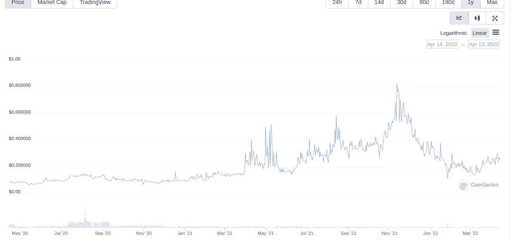

由 CoinGecko 提供

为了应对这样的波动，许多人使用 DCA(美元成本平均)策略，这就是我今天要做的。首先，我需要几样东西:一个交易账户、BTC、python3、pip 和 Julia。我将使用的交换称为[south exchange](https://main.southxchange.com/)，有几个第三方 API 可用于连接，这将使项目更加容易。在运行任何一个机器人之前，确保你在你的账户中添加了一些 BTC，如果余额为空，我们的机器人将会崩溃(我们将在另一篇文章中解决这个问题)。接下来我需要 python3 和 Julia。我不需要最新版本的 python，Ubuntu 的默认版本就可以了。在终端输入“python3”启动 python，告诉我我用的是哪个版本。

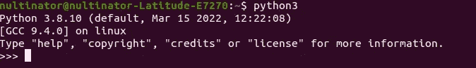

380 万就足够了。接下来，我需要访问 SouthXchange API。Github 用户 alimogh 在 https://github.com/alimogh/Southxchange[为我们提供了这个。这使得从我们的命令行与交换交互变得非常容易。](https://github.com/alimogh/Southxchange)

接下来，我们安装朱莉娅[https://julialang.org/downloads/](https://julialang.org/downloads/)。获取最新的稳定版本，并按照特定操作系统的说明进行操作。

第 1 部分:Python 机器人

首先，我们将在文本编辑器中创建一个名为“bot.py”的文件来启动 python bot，并添加一些代码。没什么，只是我们的基本依赖和我们的 API 交换密钥。您可以通过登录并单击设置嵌齿轮并选择“私有 API 密钥”来生成这些。

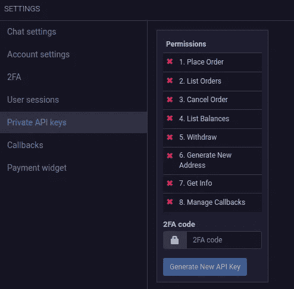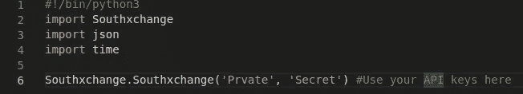

接下来，我们将添加几行。

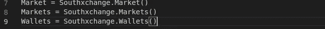

这将节省我们稍后在脚本中输入的时间。现在添加我们的策略。这很简单，买一辆 YEC，等一个小时，再买一辆 YEC。

我们将从测试目前已有的代码开始，以确保它能正常工作。让我们添加另一行来检查我们的余额。

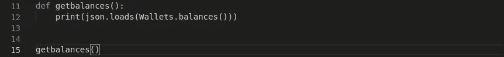

我运行文件，然后…

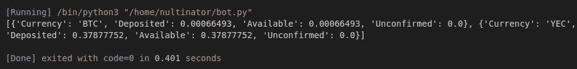

成功！！！

接下来是添加购买代码的时候了。

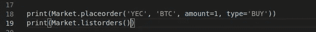

运行代码…

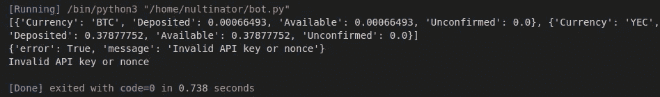

我们得到一个错误。这是因为我们同时提出了太多的要求。让我们告诉我们的机器人要有耐心，在请求之间打个盹。

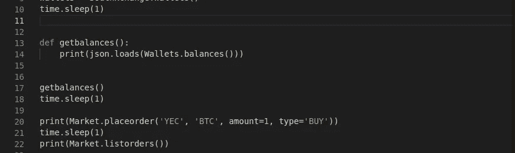

运行它…

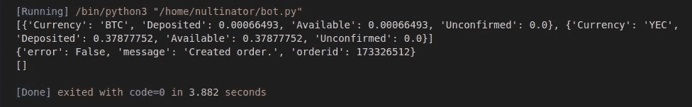

代码运行，但是我们有另一个问题。正如您在第一个 JSON 字符串中看到的，它正在获得我们的平衡，但是如果您看一下底部附近的空括号，我们应该在这里列出订单，但是没有订单。我们需要为我们的订单增加一个价格。为此，我们将对底部的购买代码进行一些更改。

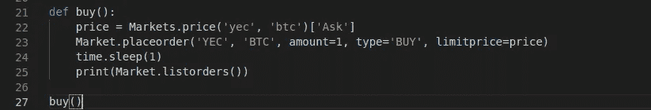

这张图片是经过几次测试后的，但是正如你所看到的，我们的 YEC 天平现在更高了。

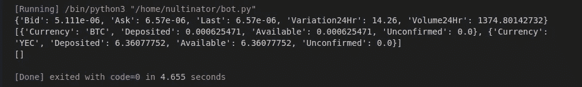

我们的购买功能现在起作用了。现在是时候把这个东西放在一个无限循环上，并且把购买间隔一个小时。让我们将底部的“buy()”替换为…

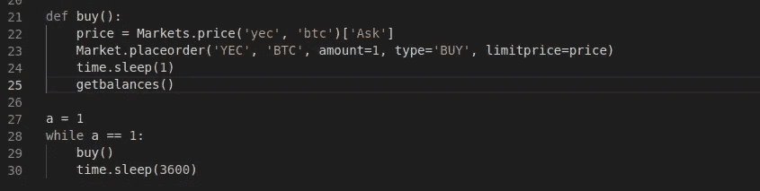

第二部分:朱莉娅机器人

创建新文件的时间到了。我们姑且称这个为“bot.jl”。我们将从几行代码开始…

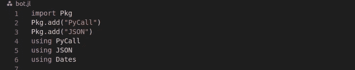

所以在 Julia 中，导入的方式略有不同。首先我们导入包管理器，然后我们使用函数下载依赖项。一旦我们的包被安装，我们可以用关键字“using”来声明它们。接下来因为我们的 API 是用 python 写的，所以需要使用 PyCall。这是一个令人难以置信的漂亮的小工具…嗯，无论如何都不小，但你得到的想法。

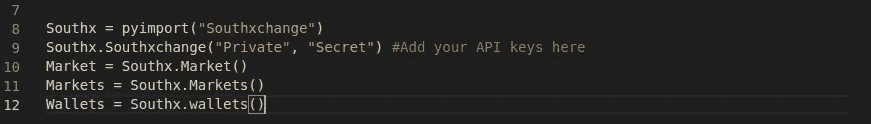

眼熟吗？所以这里有一些小的区别需要注意。首先是使用“pyimport()”函数。您可能已经猜到了，pyimport 允许我们调用 python 函数。你应该注意的下一个区别是双引号的使用。在 Julia 中，所有字符串都用双引号括起来。是时候添加几个函数来显示余额和价格，让我们知道我们的代码正在工作。

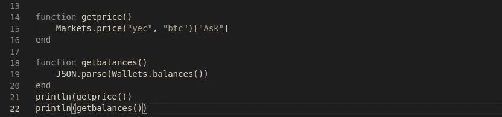

请注意函数声明方式的不同。我们使用关键字“function”来声明它们。我们没有添加“:”，而是简单地开始一个新行来开始函数体。然后我们用关键字“end”关闭函数。

运行它，你应该会得到类似这样的东西

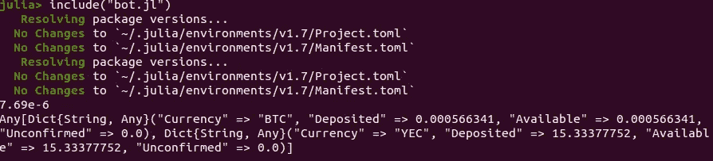

在第一次运行时，您应该注意到启动很慢，这是因为我们的程序在运行脚本时正在编译。

在你第一次跑步之后，这真的不会再需要很长时间了。当脚本运行时，由于这些“Pkg.add()”函数，它将在每次运行脚本时自动更新。将来，这将很方便，因为它将在编译时保持较轻的负载。如果你不想在第一次运行后一直坐着，你可以去掉“Pkg.add()”语句，但我会把它们留在这里。我喜欢自动更新。现在让我们添加购买代码。

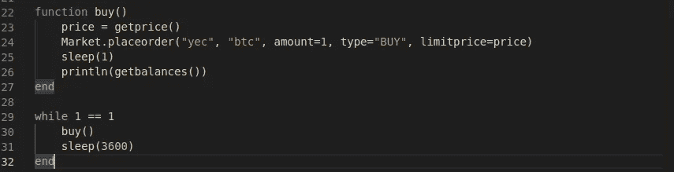

运行它并…

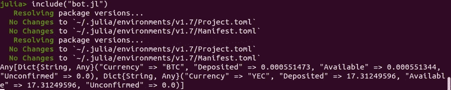

我们的“YEC”存款余额更高。我们现在有了一个功能机器人。今天就到这里，你可以在这里找到我们新机器人[的完整源代码。](https://github.com/nultinator/dca_bot)

接下来，我们将做一些改进。