# DCF77 时间同步:它是如何工作的

> 原文：<https://blog.devgenius.io/dcf77-time-sync-how-does-it-work-d4fb4dbe9941?source=collection_archive---------0----------------------->

大概买了钟或者气象站的人都见过包装上的“电波钟”甚至“原子钟”的标识。自动时间同步非常方便，因为把时钟放在桌子上就够了，过一会儿就会自动调整到准确的时间。

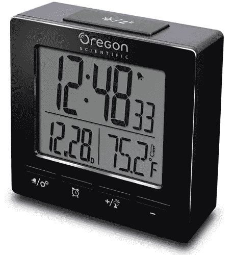

让我们弄清楚它是如何工作的。

有不同的时间同步系统。欧洲最流行的是德国的 [DCF-77](https://en.wikipedia.org/wiki/DCF77) 系统，日本有自己的 [JJY](https://en.wikipedia.org/wiki/JJY) 系统，美国有 [WWVB](https://en.wikipedia.org/wiki/WWVB) 等等。此外，这个故事将是关于 DCF77 的，它与欧洲的接收最相关也最容易。其他地方的居民可能有相反的意见，但是，他们反过来可以接收和分析日本或美国的信号。

让我们开始吧。

# 接收信号

DCF77 是一个长波电台，工作频率为 77.5 千赫，发射调幅信号。该电站功率为 50 千瓦，位于法兰克福 25 公里处。它于 1959 年开始发送时间信号，1973 年增加了日期信息。77 kHz 频率的波长很长，所以天线场的大小也很大(图片来自维基百科):

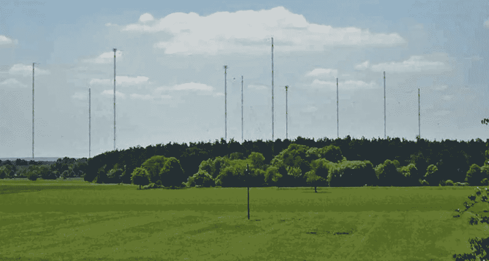

有了这样的天线和发射功率，接收区域几乎覆盖整个欧洲，甚至白俄罗斯、乌克兰和部分俄罗斯和土耳其:

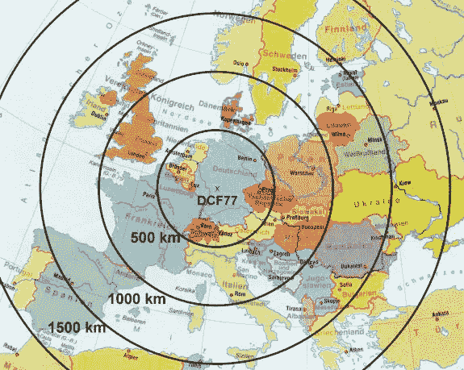

任何人都可以记录信号，即使没有任何特定的硬件。使用位于荷兰的[在线接收器](http://websdr.ewi.utwente.nl:8901/)很容易做到这一点。选择 76.5KHz 频率和 USB 调制。图片应该是这样的:

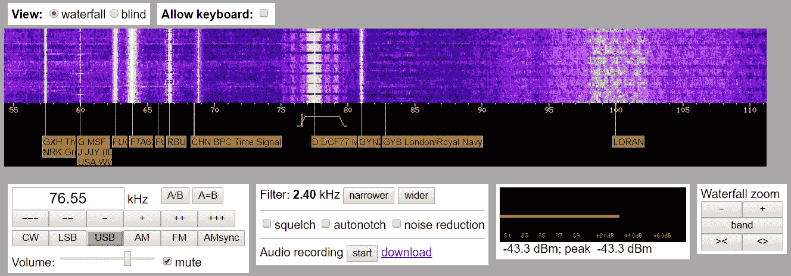

按下“开始”按钮，然后记录和保存几分钟长的片段，WAV 文件应该创建。当然，录音也可以使用真正的接收器，如 Elad SDR 或 SDRPlay。

通过互联网接收无线电信号，我们肯定不会获得真正准确的时间——信号传输有延迟。但是我们的目标仅仅是理解信号结构，这种类型的记录对于这个来说绰绰有余。当我们有了录音，让我们开始分析它。

# 解码

首先，让我们使用 Python 加载文件:

```
from scipy.io import wavfile
from scipy import signal
import matplotlib.pyplot as plt
import numpy as npsample_rate, data = wavfile.read("dcf_76.6kHz.wav")plt.plot(data[:100000])
plt.show()
```

我们看到调幅:

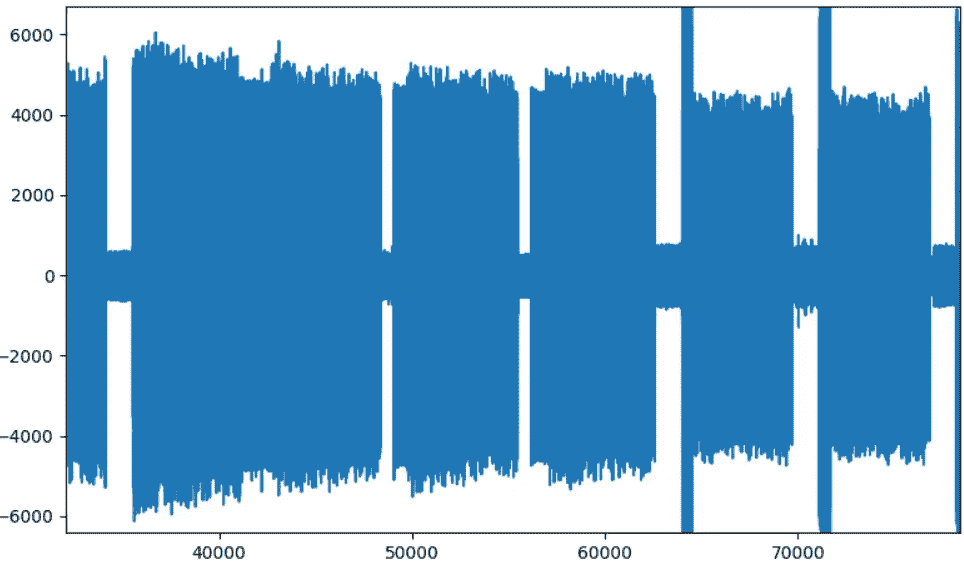

让我们使用[希尔伯特变换](https://docs.scipy.org/doc/scipy/reference/generated/scipy.signal.hilbert.html)得到信号包络:

```
analytic_signal = signal.hilbert(data)
A = np.abs(analytic_signal)
plt.plot(A[:100000])
```

放大后的结果:

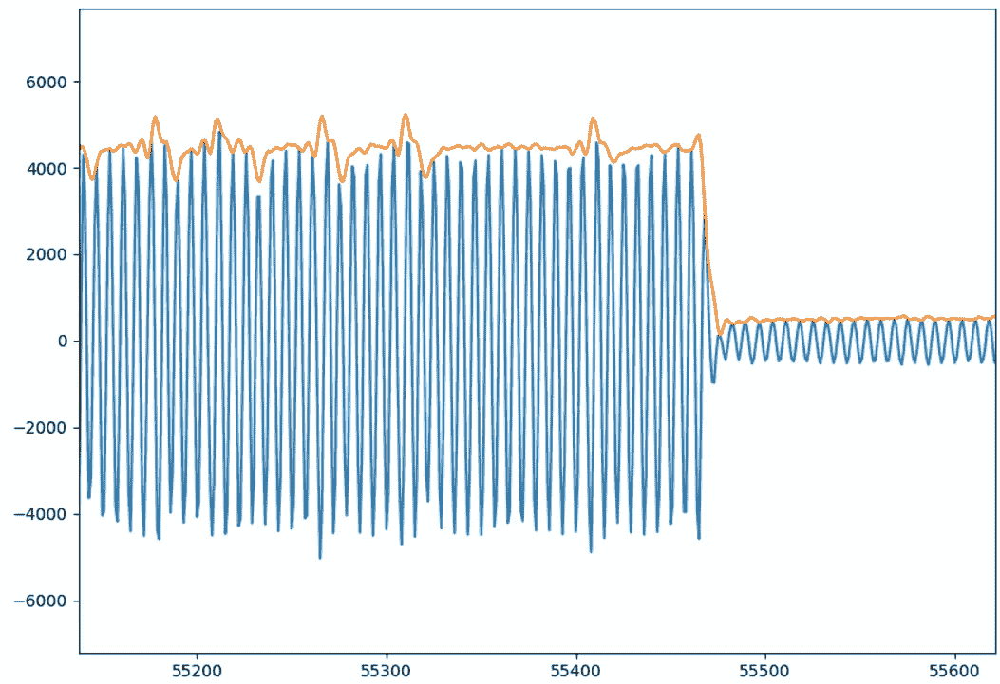

我们可以使用低通巴特沃兹 T2 滤波器来消除噪音。让我们也计算一下平均值，这对于后面的解析会很有用。

```
b, a = signal.butter(2, 20.0/sample_rate)
zi = signal.lfilter_zi(b, a)
A, _ = signal.lfilter(b, a, A, zi=zi*A[0])
avg = (np.amax(A) + np.amin(A))/2
```

结果(黄线)是一个非常容易分析的近似方波:

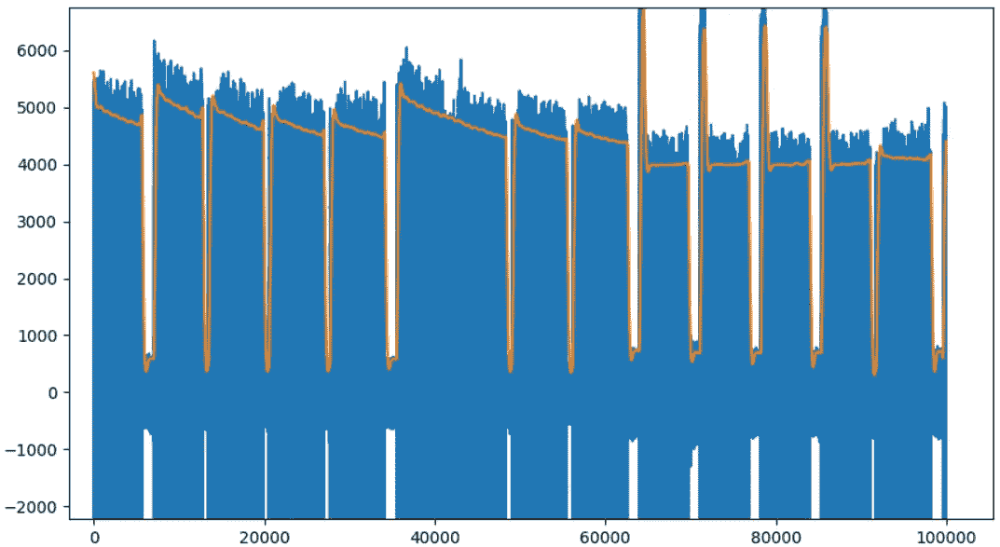

# 从语法上分析

首先，我们需要得到位序列。信号结构本身非常简单。

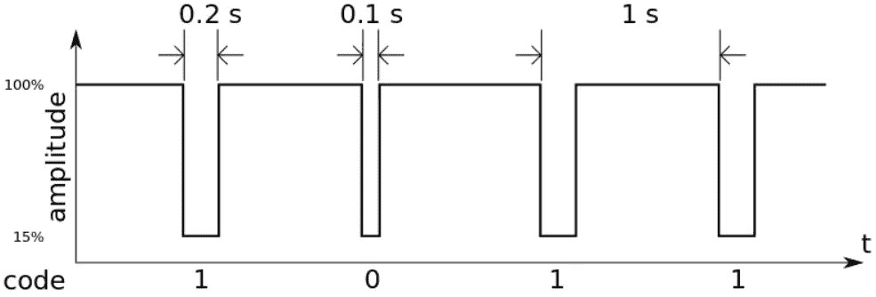

脉冲被分成秒间隔。如果脉冲之间的距离是 0.1s(即脉冲本身的长度是 0.9s)，我们给比特序列加“0”，如果距离是 0.2s(即长度 0.8s)，我们加“1”。每一分钟的结束由一个更长的 2s 脉冲指示。然后，比特序列被重置为零，并且重新开始填充。

以上用 Python 写很容易。

```
sig_start, sig_stop = 0, 0
pos = 0
bits_str = ""
while pos < cnt - 4:
    if A[pos] < avg and A[pos+1] > avg:
        *# Signal begin*
        sig_start = pos
    if A[pos] > avg and A[pos+1] < avg:
        *# Signal end*
        sig_stop = pos diff = sig_stop - sig_start

        if diff < 0.85*sample_rate:
            bits_str += "1"
        if diff > 0.85*sample_rate and diff < 1.25*sample_rate:
            bits_str += "0"
        if diff > 1.5*sample_rate:
            print(bits_str)
            bits_str = "" pos += 1
```

结果，我们得到一个比特序列，在我们两分钟的例子中，它看起来像这样:

`0011110110111000001011000001010000100110010101100010011000
0001111100110110001010100001010000100110010101100010011000`

顺便提一下，有趣的是信号还包含“第二层”数据 DCF 信号也是使用[相位调制](https://en.wikipedia.org/wiki/DCF77#Phase_modulation)编码的。即使在弱信号的情况下，这也应该提供更鲁棒的解码。

我们的最后一步是从 bits 中获取实际数据。它们每秒传输一次，因此我们只有 59 位，其中编码了不同的信息:

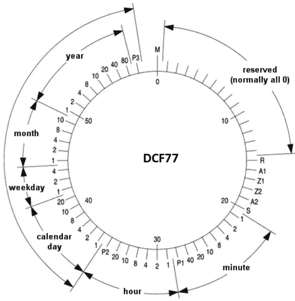

维基百科上描述了这些比特，它们非常有趣。前 15 位未被使用，尽管有计划将其用于公共警报系统。位 *A1* 表示时钟将在下一小时设置为夏令时。位 *A2* 表示下一个小时将多加一秒，有时用于根据地球自转修正时间。其余的位编码小时、分钟和日期。

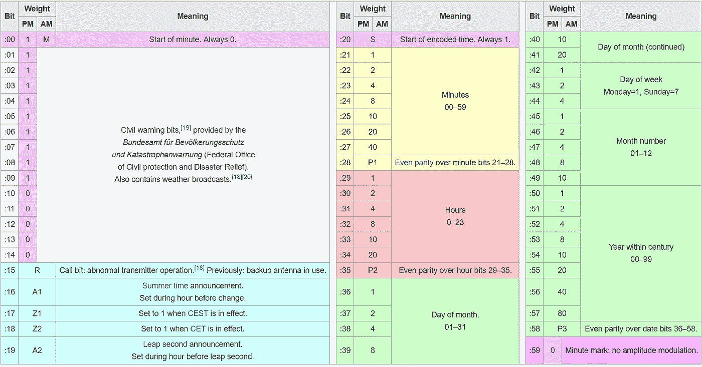

其实这就是全部的魔力。这种系统的优点是解码极其简单，可以在任何微控制器上进行，甚至是最简单的微控制器。我们只是计算脉冲的长度，累积 60 位，在每一分钟结束时，我们得到精确的时间。与其他时间同步方法(GPS 或互联网)相比，这种无线电同步几乎不需要电力——一个普通的气象站依靠两节 AA 电池可以工作大约一年。连接到 WiFi 并发出 NTP 请求的 ESP32 将在一周内耗尽电池。更有甚者，现在有些手表有无线电同步功能。

DCF 的方便和简单也吸引了 DIY 爱好者。只需 10-20 美元，您就可以购买一个带有接收器和 TTL 输出的现成天线，它可以连接到 Arduino 或其他控制器:

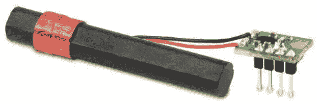

已经为 Arduino 编写了一些[库](https://github.com/udoklein/dcf77)。有了这样一个设备，获得精确的时间真的很容易，当然，如果你在信号覆盖区。嗯，在 DIY 设备上加上“原子钟”标签也是在给作者人气增加+100，可以给大家解释一下，这个设备真的是借助了一个原子钟同步的；)

感兴趣的人甚至可以升级老祖母的时钟，在其中安装一个新的基于 DCF 的时钟机芯:

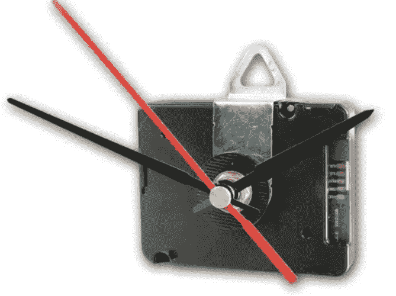

你可以找到一个关于易贝的关键词“无线电控制运动”。

最后，给已经读到这里的人一个生活窍门。即使最近的一千公里内没有单一覆盖，也很容易产生这样的信号。Google Play 有一个名为“DCF77 Emulator”的程序，将信号输出到耳机。根据描述，如果你全天候缠绕耳机线，他们将接收到信号(我想知道如何接收，因为智能手机声音输出很可能不会发出 77KHz 的信号，但接收很可能由于谐波而工作)。该程序在我的智能手机上根本不工作——完全没有声音(或者也许我只是没有听到——毕竟是 77KHz:)，但也许有人会更幸运。甚至可以使用 Arduino 或 ESP32 制作一个成熟的 DCF 信号发生器:

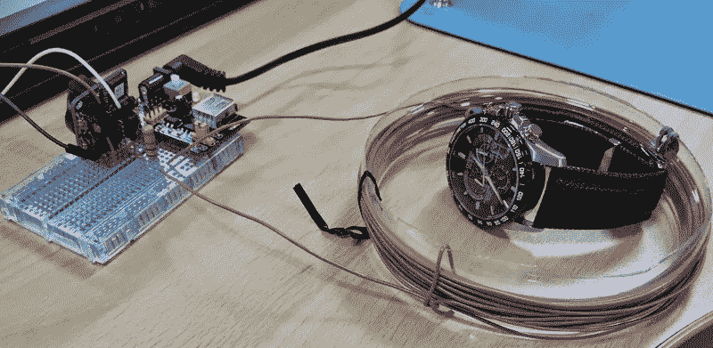

(来源[sgfantasytoys . WordPress . com/2015/05/13/synchronize-radio-controlled-watch-without-access](https://sgfantasytoys.wordpress.com/2015/05/13/synchronize-radio-controlled-watch-without-access/))

# 结论

DCF 系统被证明是非常有用和方便的。借助简单而廉价的接收器，我们可以在任何地方获得精确的时间，当然是在接待处。看起来，尽管数字化和“物联网”广泛存在，但这种简单的解决方案仍将有很长一段时间的需求。