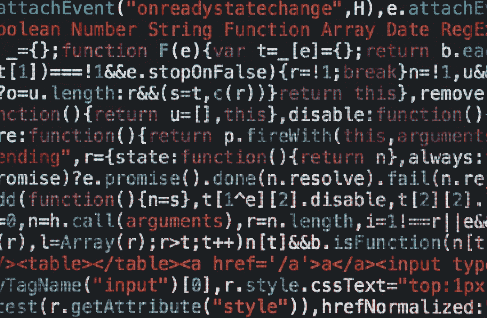

# 在 Python 中处理异常

> 原文：<https://blog.devgenius.io/dealing-with-exceptions-in-python-2d55f431bda9?source=collection_archive---------11----------------------->



由[马库斯·斯皮斯克](https://unsplash.com/@markusspiske?utm_source=unsplash&utm_medium=referral&utm_content=creditCopyText)在 [Unsplash](https://unsplash.com/s/photos/code?utm_source=unsplash&utm_medium=referral&utm_content=creditCopyText) 拍摄的照片

在 python 中处理异常很简单。你可以用`try-catch`块包围你的代码。要捕获/处理的异常消息将作为变量在`except`块中提及。

# 1.捕捉异常

让我们假设这是我们的代码块

```
def fun():
    try:
        result = 1 / 0
    except ZeroDivisionError as error:
        print(error)

fun()
```

结果如下

```
division by zero
```

# 2.重新引发异常

在某些情况下，我们希望捕获异常消息，并将该异常作为新的异常重新引发。我们可以通过以下方式实现这一目标

```
def fun():
    try:
        result = 1 / 0
    except ZeroDivisionError as error:
        print(error)
        raisefun()
```

结果如下

```
Traceback (most recent call last):
  File "scratch.py", line 9, in <module>
    fun1()
  File "scratch.py", line 6, in fun1
    result = 1 / 0
ZeroDivisionError: division by zero
```

添加`raise`关键字会从我们刚刚捕获的异常消息中引发一个新的异常，即引发上次捕获的异常。

# 3.带有自定义例外的再加注

我们还可以从最后一个捕获的异常中引发一个自定义异常。

```
def fun():
    try:
        result = 1 / 0
    except ZeroDivisionError as error:
        print(error)
        raise MyCustomException("Custom exception message") from errorfun()
```

结果如下

```
Traceback (most recent call last):
  File "scratch.py", line 6, in fun1
    result = 1 / 0
ZeroDivisionError: division by zeroThe above exception was the direct cause of the following exception:Traceback (most recent call last):
  File "scratch.py", line 12, in <module>
    fun1()
  File "scratch.py", line 9, in fun1
    raise CustomException("Something wrong") from error
CustomException: Something wrong
```

在我们希望用户只看到模块/包引发的异常的情况下，上述技术非常有用。