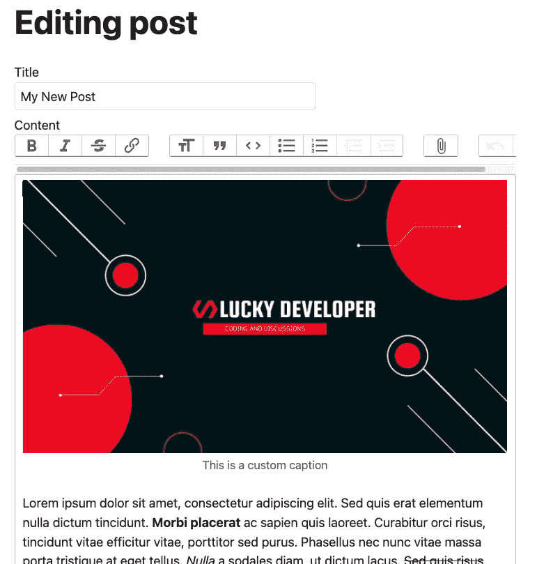

# 在 Rails 7 中处理富文本

> 原文：<https://blog.devgenius.io/dealing-with-rich-text-in-rails-7-6b36144f204c?source=collection_archive---------3----------------------->

照片由[詹姆斯·哈里逊](https://unsplash.com/@jstrippa?utm_source=medium&utm_medium=referral)在 [Unsplash](https://unsplash.com?utm_source=medium&utm_medium=referral) 上拍摄

如果你曾经在 Rails 上与富文本编辑器一起工作过，你就会知道如果你不能以正确的方式组织自己，事情会变得多么混乱。一般来说，你有一个节点包包含在这个特性中，所以我们已经知道你将处理 *Webpack* 和你可能需要的任何配置。

我知道这可能非常简单，即使 YouTube 上有所有“在 5 分钟内完成”的教程，但你必须同意我的观点，当涉及到 *Rails* 时，你可以做的最好的事情之一就是使用对你有利的约定来避免太多的配置。当您保持项目的可读性、整洁性和更新性时，它可能是一个平稳的版本过渡到令人头疼的版本之间的差别。

考虑到这一点，我们来简单谈谈富文本吧！

如果你想在你的文本编辑器上实现接近下面的结果，跟我来，我会告诉你最简单的方法。

# Importmap 简介

该过程将要求您使用来自 *Rails 7* 的新功能，即*导入图*。这个特性是默认提供的，但是你可以参考 [*GitHub* 库](https://github.com/rails/importmap-rails)将它安装在其他版本的 *Rails* 中。

基本上，它允许你使用一些只有使用 *Webpack* 、 *yarn* 或 *node* 才能使用的 javascript 包，但是它是直接从浏览器中完成的。如果我们使用它，我们就不需要使用这些其他工具，这是框架第 7 版中默认的 *Rails* 和这种包之间的新关系的主要问题。

为了构建我们的富文本编辑器，我们将使用该特性，让我们开始吧。

# 配置富文本支持

您需要做的第一件事是配置您的项目以使用完成工作的包，因此我们将运行以下命令:

它要做的第一件事是将一些*引脚*添加到您的`config/importmaps.rb`文件中，并在您的`app/javascript/application.js`文件中引用这些*引脚*。作为脚本的结果，您可以看到许多其他更新，但这些其他更新基本上是构建富文本编辑器，并添加对编辑器中可用的文件上传的支持。

在这些其他更新之间，您有两个表的迁移，您需要维护这些富文本内容和一条消息(如果您不注意，您将看不到它),该消息明确表示在您的`Gemfile`中添加对`image_processing` gem 的支持，因此我们将向它添加以下内容:

我们也不能忘记新表，所以让我们只运行迁移:

这就是配置支持的全部内容。

# 应用富文本编辑器

为了应用富文本编辑器，首先，您需要告诉 *Rails* 为特定的模型添加这种支持。假设我们有一个`Post`模型，我们将在上面添加第 3 行的内容:

之后，转到创建/更新对象的表单，我们将它改为类似于下面的内容，而不是原来的`form.text_area`元素:

就是这样！要查看内容，只需确保使用传统的`<%= post.content %>`将其显示在页面上。

# 使用

今天，当人们想要以最好的方式格式化他们的内容时，在你的应用程序的自由书写字段上提供丰富的文本是一件非常重要的事情。

我发现了这个，应用了它，从第一天开始就爱上了这个功能。我真的希望它能像对我一样对你有用！

非常感谢你陪我看完了这篇文章。如果你有任何问题、意见或顾虑，请务必在下面的评论区与我分享。你的掌声和分享对我继续发帖非常重要。

还有什么可以发到我在 jpmsantana14@gmail.com 的邮箱里