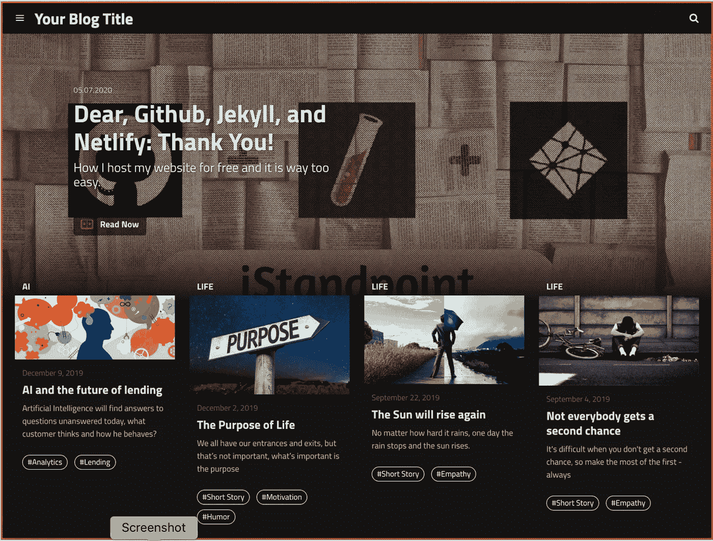
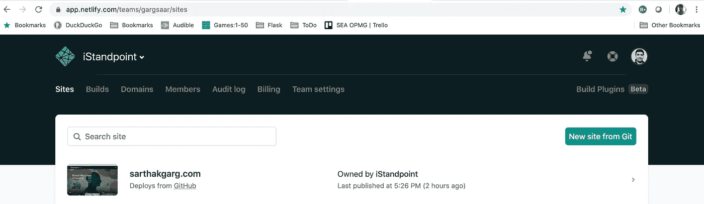
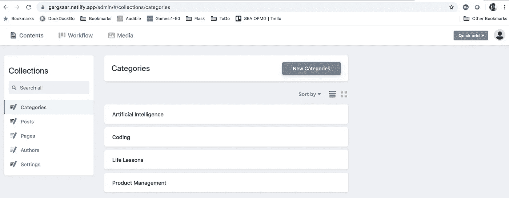

# 我免费托管我的网站，这很容易

> 原文：<https://blog.devgenius.io/dear-github-jekyll-and-netlify-thank-you-65e63c7e892d?source=collection_archive---------9----------------------->

如果你寻找，你可以找到上帝。搜索“如何免费托管一个静态网站”太容易了。

感谢 [Github Pages](https://pages.github.com/) 允许我们免费使用自定义域名托管静态网站。[杰基尔](https://jekyllrb.com/)，太牛了！它的 markdown 基于文件的主题不仅是轻量级的，而且非常容易配置和管理。最后但同样重要的是，谢谢 [Netlify](https://www.netlifycms.org/) ！没有你，Github 上的内容管理将会是一场噩梦。内容管理系统 NetlifyCMS 让内容管理变得超级简单。

尽管我不是一个技术人员，但建立我的博客[instandpoint](https://sarthakgarg.com/)，是一个简单的 **3** 步骤过程:**创建**，**上传**，以及**部署**

1.  在 GITHUB 中创建一个仓库

Github 帮助[上的优秀文档帮助我很好地开始使用。我在 Github 中创建了](https://help.github.com/en/github/working-with-github-pages/creating-a-github-pages-site) [iStandpoint](https://github.com/gargsaar/iStandpoint) 知识库，现在它托管着我的博客。我公开了这个库，这样我就可以在 Github 上免费托管我的站点。

对于使用自定义域，我可以选择在 Github 或 Netlify 中配置自定义域。我选择了[后者](https://docs.netlify.com/domains-https/custom-domains/configure-external-dns/)。(将 Github 设置中的**自定义域**留空。)

**2。上传一个 JEKYLL 主题并进行配置**

在设置页面上，在 **GitHub Pages** 部分，有一个选项是**选择一个主题**，但坦白说，还有无数其他的[主题](https://jekyllrb.com/docs/themes/)要好得多。所以我选择了 Thiago Rossener 的一个主题。我下载了 [Jeklix-template](https://github.com/thiagorossener/jekflix-template) 并上传了我的资源库中的所有文件。接下来，我要做的就是编辑一些文件，使主题个性化。

我按照模板 [wiki](https://github.com/thiagorossener/jekflix-template/wiki/settings) ，从 **_config.yml** 开始，更新了#Site 设置，更新了 [disqus_usename](https://disqus.com/) ，删除了#Social Media Settings 下的几个项目，更新了 [google_analytics](https://analytics.withgoogle.com/) id。在文件夹 **_authors 中为自己创建了一个 [markdown](https://www.markdownguide.org/getting-started/) 文件。**修改了 assets/img/icons 的 favicon 等图标，assets/img 的 blog_image.png，准备添加 **_posts** 。

同样，Jekyll 文档非常好，我理解了框架并进一步定制了模板。

**3。在 NETLIFY 部署站点**

部署 Jekyll 站点有很多选择，我推荐使用 Netlify。他们把部署这种非常复杂的事情变得非常简单。我首先在[Netlify.com](https://www.netlify.com/)创建了一个账户，并跟随[这篇](https://www.netlify.com/blog/2015/10/28/a-step-by-step-guide-jekyll-3.0-on-netlify/)帖子在 Netlify 中添加 Git 回购并配置回购**。**

一旦站点构建完成，在管理控制台**app.netlify.com**中，我为自定义域的外部 DNS 配置了[站点设置](https://docs.netlify.com/)和[域设置](https://docs.netlify.com/domains-https/custom-domains/configure-external-dns/)。

创建和管理内容的界面 NetlifyCMS 可从**netlify _ site _ name . netlify _ subdomain . app/admin**获得。

我走了，万岁！我现在在网上[活着](https://sarthakgarg.com/about_me.html)。

最后，我想说我并不反对 [Wordpress](https://wordpress.org/) 、 [Wix](https://www.wix.com/) 或[weely](https://www.weebly.com/in)——它们确实是建设网站的好平台。只是它们不是免费的(需要为使用自定义域付费)，最重要的是，它们不会给人一种你拥有代码的感觉。

既然可以免费托管静态网站，为什么还要花一分钱呢！