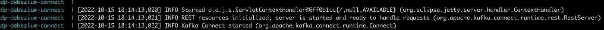
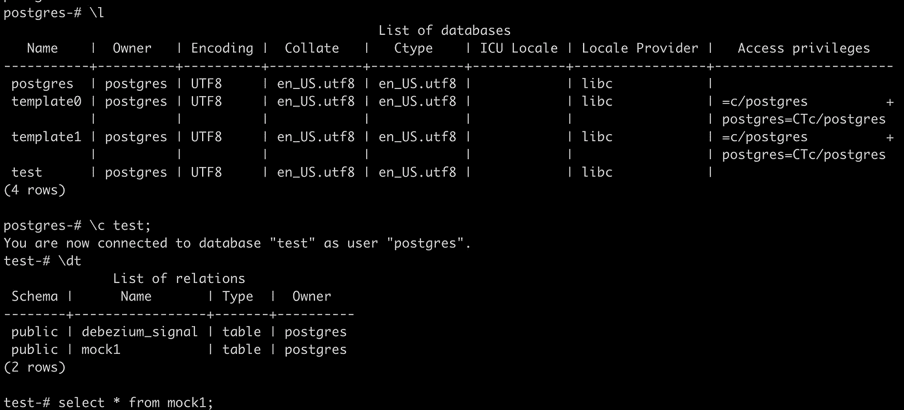
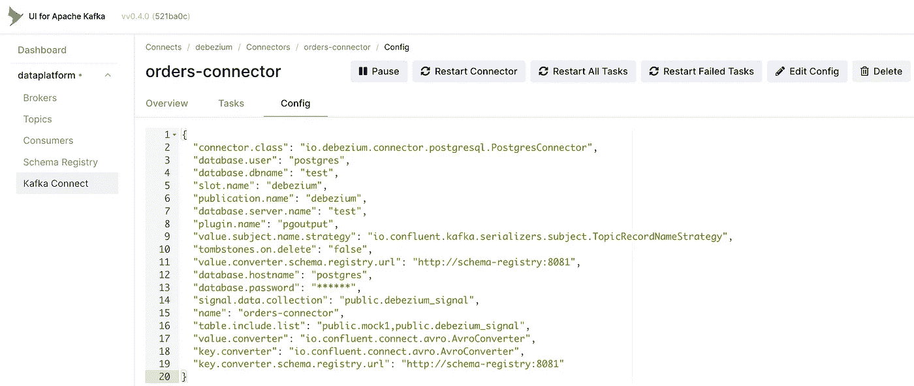
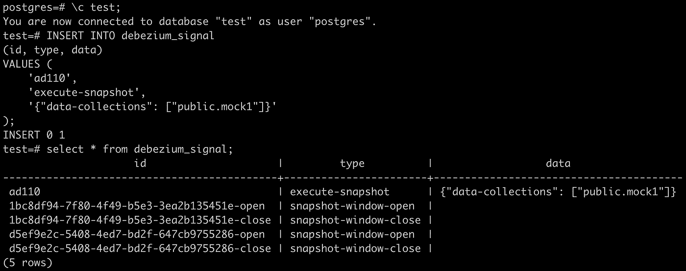
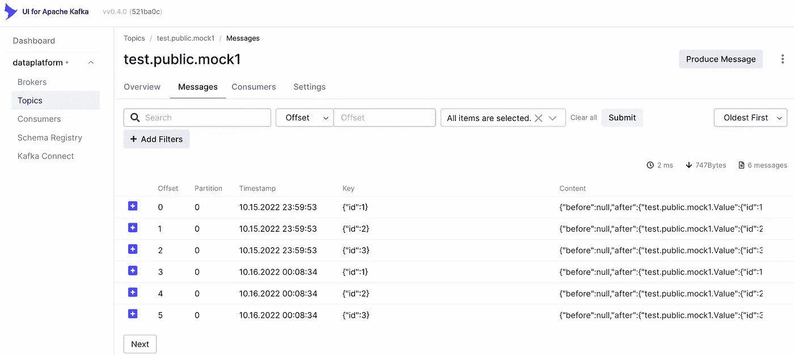

# Debezium Postgres 信号

> 原文：<https://blog.devgenius.io/debezium-postgres-signaling-3475ffb48aa?source=collection_archive---------1----------------------->

# 为什么发信号？

由于不断变化的业务需求，将会有表被频繁地添加到您从中捕获事件的数据库中。如果你是在一个成长中的和关键的创业公司，这是相当高的。此外，您可能会在新表发布到生产中之后，但在需要对新表进行一些分析之前收到通知。

您将有一个 Debezium Kafka 连接器用于一个数据库监控表。您不能监视数据库的所有表，因为有些表不是分析所需要的。例如，不需要将如下表格纳入您的数据平台:

1.  管理、用户的 Django 相关表
2.  丝绸相关的桌子。
3.  飞轮相关表格。
4.  一些内部团队活动的临时表，如数据更正或迁移。

因此，我们将使用 Debezium 连接器配置的`tables.included.list`配置[ [1](https://debezium.io/documentation/reference/stable/connectors/postgresql.html#postgresql-connector-properties) ]来监控分析所需的表。由于上述原因，这个列表将随着时间不断变化。

因此，我们需要将新表添加到`tables.included.list`属性中。一旦我们这样做了，Debezium 将捕获表中发生的新更新，但它不会对表进行快照。这意味着新表中已经存在的数据不会被吸收到 Kafka 主题中。如果表是刚刚创建的，并且是空的，没有行，这是可以的。不幸的是，在大多数情况下并非如此。该表将包含已经在生产中使用的数据，这些数据不会出现在 Kafka 主题中。我们可以尝试通过为带有新表的同一个数据库部署新的 Debezium 连接器来解决这个问题，但是这很快就会变得很糟糕，因为:

1.  Debezium 说“一个数据库一个连接器”。
2.  同一个源将有不同的主题名称前缀，这将影响下游数据管道。
3.  随着数据库中每个新表的增加，数据库的连接器数量将线性增加，这将增加维护开销和额外的处理。

所以，不要试图走这条简单的路，因为随着时间的推移，事情肯定会变得丑陋。别担心。Debezium 向救援发出信号！

# 设置

我在本地机器上使用 docker-compose 安装了所有组件。这是我使用的 docker-compose 文件:

> 注意:我没有使用默认的 Debezium docker 映像，因为它通常是预先配置好的，我可能会忽略一些在生产中设置时需要注意的配置。

Debezium Postgres 连接器的 Docker 编写设置

以下是 docker-compose 文件中不同服务的简要概述:

**动物园管理员和卡夫卡**

具有一个代理和一个动物园管理员的 Kafka 集群的最小设置。

**模式注册中心**

我痴迷于 Avro 和 schema registry 来加强模式管理和减少 Kafka 消息大小。在[ [2](https://docs.confluent.io/platform/current/schema-registry/index.html) ]中了解更多信息。没有它就没有测试。

**Debezium 连接器**

这是风云人物。以下是我做的一些额外的事情:

1.  我用的图片是 confluent Inc/CP-Kafka-connect:6 . 2 . 4
2.  为 Debezium Postgres 连接器插件附加了一个卷。

**卡夫卡 UI**

目前镇上最好的 Kafka UI。我需要很容易地想象我的卡夫卡中发生了什么。在[ [3](https://github.com/provectus/kafka-ui) 中了解更多相关信息。

**Postgres**

这将是 Debezium 捕获事件的来源。以下是我做的一些额外的事情:

1.  用于填充初始数据的附加卷，包括信令收集。
2.  将`wal_level`设置为`logical`的命令，以便 Debezium 连接器工作。

下面是我的 Postgres 信令表的结构:

```
CREATE TABLE debezium_signal ( id VARCHAR(50) PRIMARY KEY, type VARCHAR(50) NOT NULL, data VARCHAR(2048) NULL);
```

现在我们已经准备好测试这个设置了！

# 运转

1.  克隆存储库:

```
git clone [https://github.com/athultr1997/data_engineering](https://github.com/athultr1997/data_engineering)
cd data_engineering
```

2.运行 docker-compose 命令来设置基础结构:

```
docker compose up
```

3.等待几秒钟，直到所有容器都启动并运行。观察日志，看看是否一切正常。确保 Kafka 连接器正在接受请求，如图 1 所示。



[1] Kafka Connect 准备就绪

4.查看 Postgres 中的数据:

```
docker exec -it dp-postgres psql -U postgres# Inside psql>> \l (To list the databases)>> \c test;>> select * from mock1;
```

您将看到类似于图 2 的输出。



[2] Postgres 就绪

5.打开一个新的终端并运行以下命令来注册启用了信令的 Debezium Postgres 连接器:

```
curl --location --request POST 'localhost:8083/connectors/' \
--header 'Content-Type: application/json' \
--data-raw '{
    "name": "orders-connector",
    "config": {
        "connector.class": "io.debezium.connector.postgresql.PostgresConnector",
        "plugin.name": "pgoutput",
        "slot.name": "debezium",
        "publication.name": "debezium",
        "database.hostname": "postgres",
        "database.user": "postgres",
        "database.password": "password",
        "database.dbname": "test",
        "database.server.name": "test",
        "tombstones.on.delete": "false",
        "table.include.list": "public.mock1,public.debezium_signal",
        "key.converter": "io.confluent.connect.avro.AvroConverter",
        "value.converter": "io.confluent.connect.avro.AvroConverter",
        "key.converter.schema.registry.url": "[http://schema-registry:8081](http://schema-registry:8081)",
        "value.converter.schema.registry.url": "[http://schema-registry:8081](http://schema-registry:8081)",
        "value.subject.name.strategy": "io.confluent.kafka.serializers.subject.TopicRecordNameStrategy",
        "signal.data.collection": "public.debezium_signal"
    }
}'
```

6.通过转到 Kafka UI 的[http://localhost:8084/UI/clusters/data platform/connects/debezium/connectors/orders-connector](http://localhost:8084/ui/clusters/dataplatform/connects/debezium/connectors/orders-connector)检查连接器是否已正确启动。您将看到类似于图 3 的输出。

您也应该看到在 localhost:8084/connectors 中列出的连接器。等待几秒钟，为表 mock1 拍摄快照并创建主题。它目前将有 3 条消息。该话题可在[http://localhost:8084/ui/clusters/data platform/topics/test . public . mock 1 .](http://localhost:8084/ui/clusters/dataplatform/topics/test.public.mock1.)



[3]Kafka UI 中的 Debezium 连接器

7.为临时快照发送信号:

```
docker exec -it dp-postgres psql -U postgres
# Inside psql
>> \c test;
>> INSERT INTO debezium_signal
(id, type, data)
VALUES (
'ad110',
'execute-snapshot',
'{"data-collections": ["public.mock1"]}'
);
```

8.等待几秒钟，让快照开始。您可以通过检查 debezium_signal 表中的条目来检查快照是否正在进行，如图 4 所示。



[4] Debezium 信号表

9.在[http://localhost:8084/UI/clusters/data platform/topics/test . public . mock 1](http://localhost:8084/ui/clusters/dataplatform/topics/test.public.mock1)查看 Kafka UI。现在应该有 6 条消息，因为我们使用如图 5 所示的信令再次拍摄了同一个表。



[5]临时快照后的 Kafka 用户界面

10.一旦你核实了一切，你就完成了，拆掉 docker-compose:

```
docker-compose down --remove-orphans
```

# 密码

可以在[https://github . com/athultr 1997/data _ engineering/tree/main/debezium/001 _ postgres _ signaling](https://github.com/athultr1997/data_engineering/tree/main/debezium/001_postgres_signaling)找到代码和详细说明。

# ***参考文献***

1.  [https://docs . confluent . io/platform/current/schema-registry/index . html](https://docs.confluent.io/platform/current/schema-registry/index.html)
2.  [https://debezium . io/documentation/reference/stable/connectors/PostgreSQL . html](https://debezium.io/documentation/reference/stable/connectors/postgresql.html)
3.  [https://github.com/provectus/kafka-ui](https://github.com/provectus/kafka-ui)