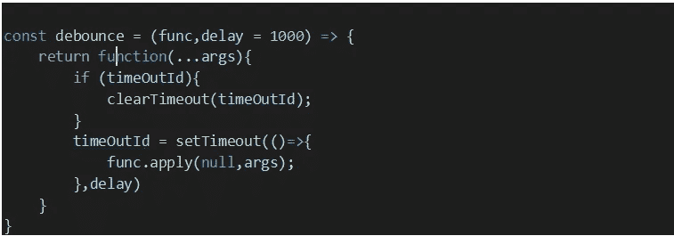
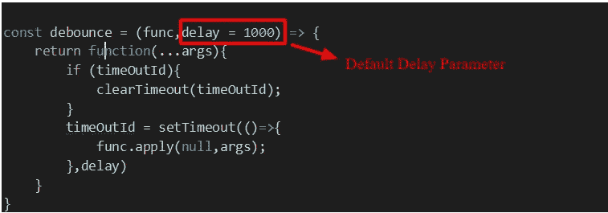
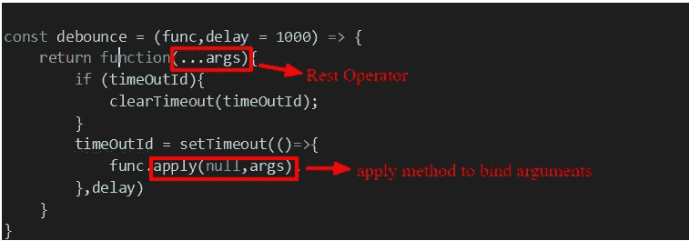
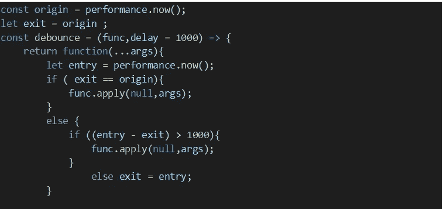

# JavaScript 中的去抖——延迟/防止不必要的用户动作的奇妙设计模式

> 原文：<https://blog.devgenius.io/debounce-in-javascript-a-fantastic-design-pattern-to-delay-prevent-unwanted-user-action-ce2bbe51f7cc?source=collection_archive---------7----------------------->

有时，我们希望减少在 web 应用程序中响应用户事件时调用函数或方法的次数。

例如，当用户输入一个搜索查询时，我们希望他停止输入一段时间，然后再触发 API 请求。像这样:

去抖演示

我们称这样的设计模式只允许在设定的延迟去抖后重复一个用户动作。

这种行为的几个原因可能是:

1.  ***计算量大的任务:***

如果特定的函数或方法调用计算量非常大，那么过于频繁地调用它可能会导致浏览器性能下降，因为 JavaScript 是单线程的。

这种行为的常见情况可能是在图像和视频丰富的网站(如脸书)上滚动事件，过于频繁地触发滚动事件会导致性能问题。

2. ***事件可以被触发的次数限制:***

如果一个特定的方法或函数调用实现了对我们可以执行它的次数有限制的行为，我们会希望减少它的调用频率。

例如，当我们向一个 API 发出 HTTP 请求，限制用户每天可以调用它的次数时(就像上面的演示视频)。

3. ***防止垃圾邮件等有害用户行为*** :

有时，用户可能会误用输入操作，比如重复单击表单中的提交按钮，向服务器端数据库发送垃圾邮件。

不允许用户在一小段时间间隔(比如 30 秒)之前重新单击 submit 按钮，可以阻止这种行为，从而保持数据库的整洁。

去抖让我们轻松实现这一功能。

# 去抖的基本逻辑流程:

1.设置您想要去抖的函数或方法的**超时，带有初始延迟间隔。**

2.如果某个用户动作**在延迟间隔**内调用了函数或方法，**再次将超时**重置为延迟间隔。

3.**如果超时，则调用**该函数或方法。

下面是一个简单的代码片段，它用 JavaScript 实现了去抖功能:

JavaScript 中的去抖

这种去抖实现有两个关键特性。它是:

## *1。灵活*

您可以在被调用的函数中传递尽可能多的参数(我们稍后将深入研究代码逻辑)。

您也可以将延迟设置为您喜欢的毫秒数。

## 2.可重复使用的

上面的去抖功能被很好地包装成一种“迷你模块”。

我们可以在任何一段代码中轻松地插入和播放它。此外，它的灵活性使它非常适合在任何情况下重用。

# 代码分解

1.  **默认延迟参数:**

我们已经给出了一个默认的延迟参数，使其无需定制即可重用。

默认延迟参数—去抖

2.Rest 操作符允许我们收集任意数量的参数:

我们使用了 **apply** 方法将参数绑定到被调用的函数。

我们使用 **Rest 操作符(…)** 来收集我们希望在被调用的函数中包含的参数。

Rest 运算符在去抖中收集许多参数

# 去抖的替代实现:

我们还可以使用 **performance.now()** 方法来实现去抖，该方法测量从时间起点(网页的开始)起经过的时间。

基本方法是这样的:

1.  **记录时间原点**并存储在某个变量中，比如原点。
2.  **初始设定从去抖到原点**的退出时间。
3.  **记录用户动作调用时进入去抖**的时间。
4.  **如果退出时间超过进入时间超过设定延迟**，则执行该功能。这是逻辑中的关键一步。
5.  **否则将退出时间设置为等于进入时间，**并退出去抖。

下面是我们如何用 JavaScript 实现这一点:

去抖——替代实施

我在这里顺便提一下，你也可以选择一个现成版本的去抖。相当多的 JS 库提供了现成的去抖功能。

去抖是一个很棒的功能，可以巧妙地引导用户的行为。正如我们在上面看到的，它还可以防止数据库损坏。

希望你喜欢这篇小文章，并准备好用一些有趣的反弹和谴责来震撼你的代码！Lol！