# 使用点网络运行调试(CLI)

> 原文：<https://blog.devgenius.io/debug-with-dotnet-run-cli-c70dcdc98237?source=collection_archive---------2----------------------->

在开发阶段，开发人员经常要运行程序来测试它。运行调试模式最常见、最简单的方法是单击 Visual Studio 上的绿色播放按钮。

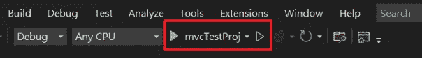

还有一种方法是使用。net CLI 与命令`dotnet run`。我的一个同事喜欢使用命令行。一开始我不太喜欢。点击 VS 按钮就是这么简单容易。要运行该命令，您必须打开一个命令窗口，更改目录，然后键入命令。但是当我使用 VS 按钮开发时，出现了一些问题…

## 问题 1: WebSocket

我使用的是一个 JS 库，它使用了另一个名为 [pace.js](https://codebyzach.github.io/pace/) 的 JS 库。该工具的目的是显示装载进度。出于某种原因，它会检查 WebSocket，我们知道这是一个将永远挂起的东西…在 pace.js 的情况下，如果网站使用 WebSocket，它将永远不会 100%加载。
发生在我身上的事情是，我不断看到 WebSocket 错误，看起来好像没有加载任何东西，因为它只有在完全加载时才会显示。有趣的是，如果我用命令`dotnet run`运行它，一切都正常。原来当你用 VS 按钮运行时，VS 会自动为你打开 WebSockets

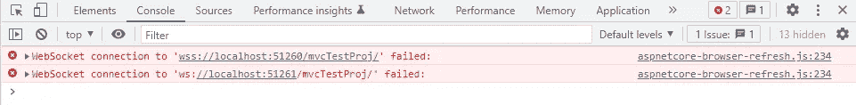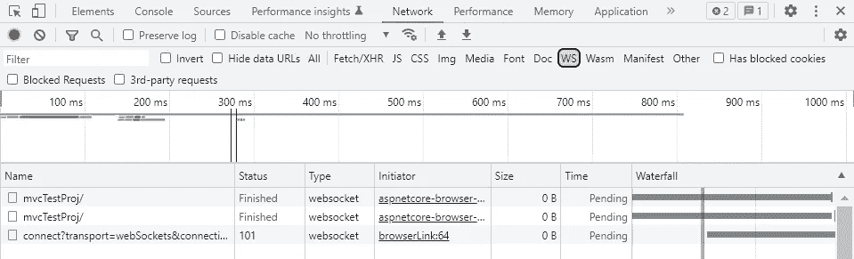

## 问题 2:内容安全策略

我不能用我为这篇文章而构建的测试项目来复制这个问题…但是它确实发生在我正在工作的一个项目上。它将内容安全策略添加到您的所有回复中，即使我明确指定了内容安全策略，我也无法覆盖它。同样，当使用`dotnet run`运行它时，它消失了。虽然这个问题的原因还不清楚…因为它只发生在使用 VS 按钮时，我现在要把它归咎于 VS。😅

来自同一项目的同一页面的同一请求的响应标头:

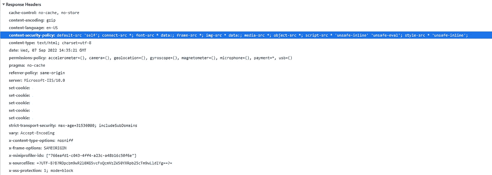

由 VS 运行

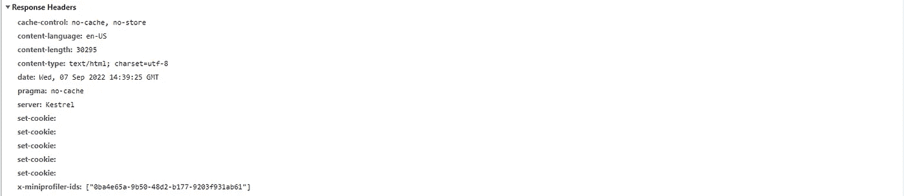

带点网运行

基于上述问题，无论如何使用`dotnet run`是我唯一的选择。但是使用`dotnet run`有一些额外的好处。

## 奖金 1

使用。net CLI 命令允许您像设置`--no-build`一样设置[选项](https://docs.microsoft.com/en-us/dotnet/core/tools/dotnet-run#options)。我正在做的项目到 build…🥱需要 9 分钟，所以当我不想重建它时，使用`--no-build`可以节省我相当多的时间。

## 奖金 2

对于一个非常消耗内存的项目，比如我正在进行的项目，使用 VS 来调试可能会使整个 VS 超级滞后，我的笔记本电脑非常慢。但是如果我使用`dotnet run`来运行它，VS 保持不变，就像什么都没发生一样。

但是使用`dotnet run`有一个缺点，那就是你不能用它来调试。下面是解决这个问题的方法。

# **如何用 dotnet run 进行调试**

对于演示，我们有一个名为`mvcTest`的解决方案，以项目`mvcTestProj`作为其起始项目。

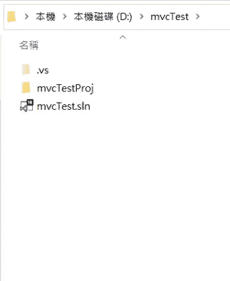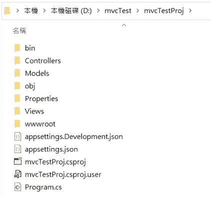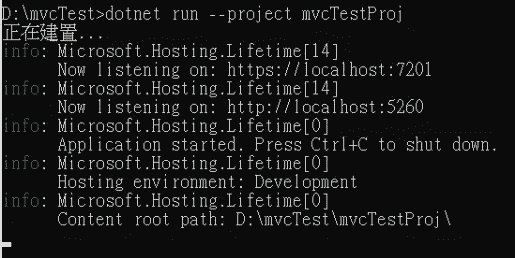

在我们用命令`dotnet run`开始运行它之后， [https://localhost:7201](https://localhost:7201/) 现在工作了。但是断点不起作用。

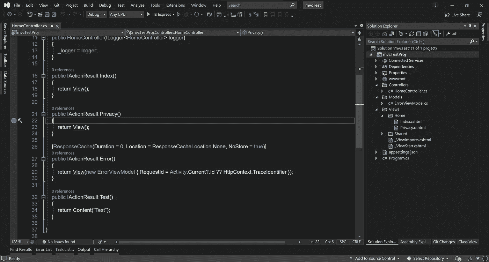

为了调试，我们需要通过点击顶部菜单上的`Debug`来附加进程，然后选择`Attach to Process...`

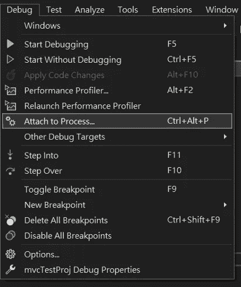

找到我们正在运行的项目的`.exe`,然后附加它。

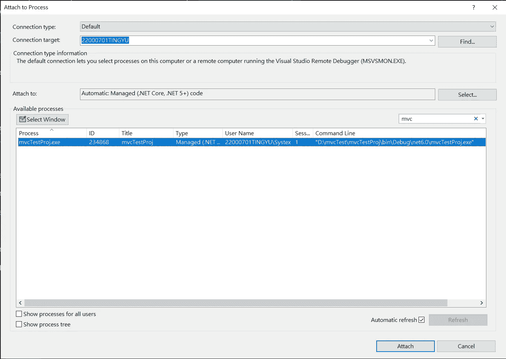

现在断点将被命中。🥳

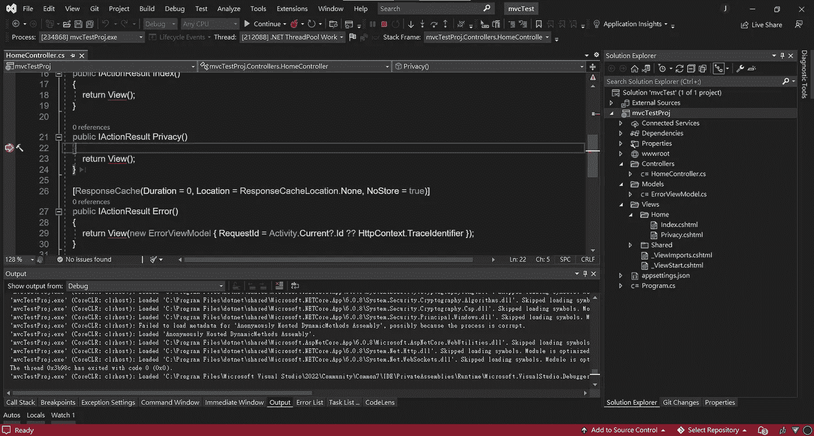

一个值得注意的事情是，一开始我附加了错误的进程。我附上了执行`dotnet run`命令的`dotnet.exe`。

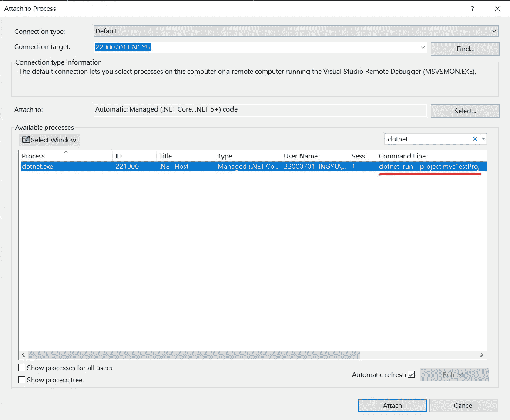

发生的情况是，断点仍然不能按预期工作，也没有加载符号文件。

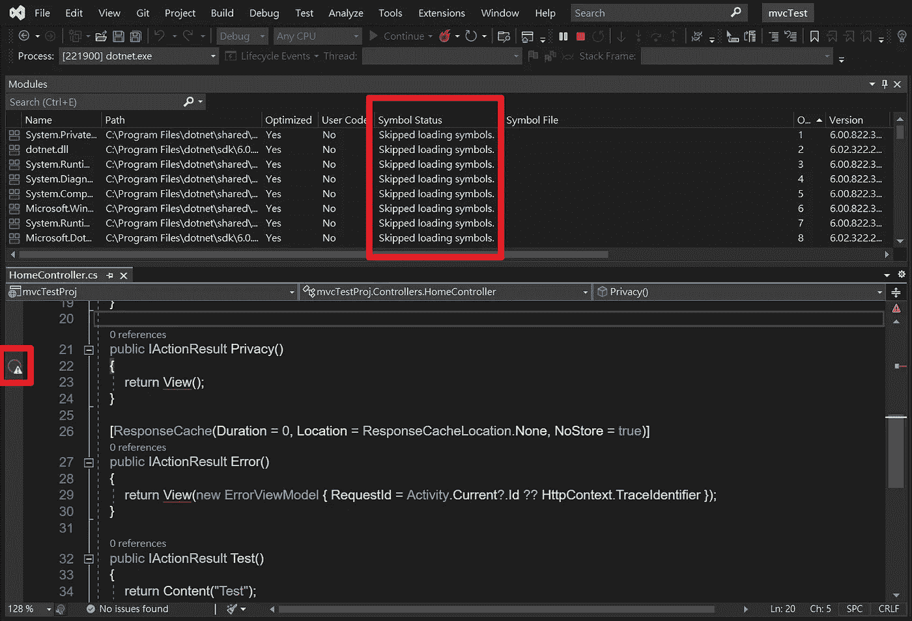

这里的问题是我们想要调试的`.exe`实际上是在`dotnet.exe`下运行的`mvcTestProj.exe`。

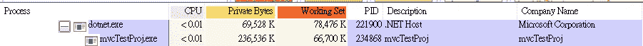

如果我们用正确的`.exe`重新连接它，你可以看到`.pdb`文件正在被加载。现在断点工作了。

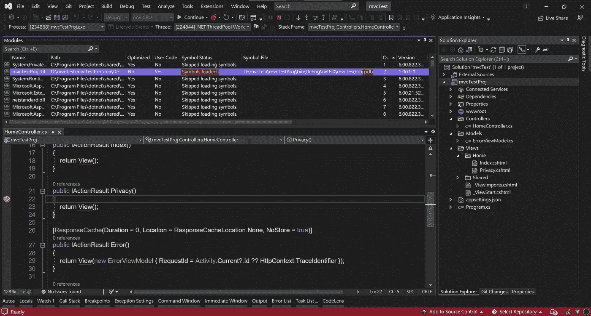

## 什么是. pdb 文件？

> 程序数据库(*)。pdb* )文件，也称为符号文件，将项目源代码中的标识符和语句映射到已编译应用程序中相应的标识符和指令。这些映射文件将调试器链接到您的源代码，从而支持调试。

来自:[微软](https://docs.microsoft.com/en-us/visualstudio/debugger/specify-symbol-dot-pdb-and-source-files-in-the-visual-studio-debugger?view=vs-2022)

您可以在项目的`bin`文件夹下找到该文件。

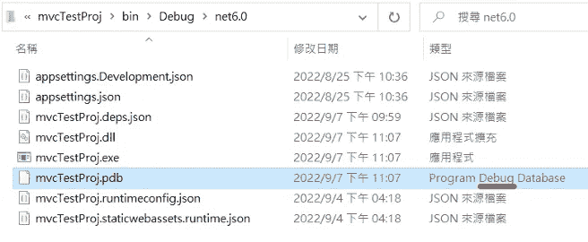

毕竟，现在即使绿色按钮就在那里，我也理解并欣赏使用命令`dotnet run`来运行它的好处。😌

#C# #dotnet #dotnetrun #debug

## 中文版 Chinese Version:

 [## 如何讓 dotnet run 用中斷點 debug

### 在開發的時候避免不了要常常把程式開起來跑跑看，一般用 Visual Studio 開發時比較直覺&簡單的做法就是直接按他的綠色 play 按鈕：

medium.com](https://medium.com/@jiang.tingyu/debug-with-dotnet-run-d78b2a48e28a)