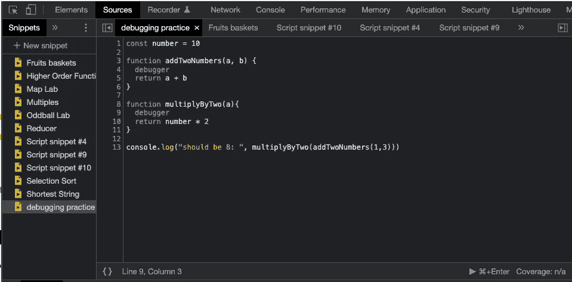
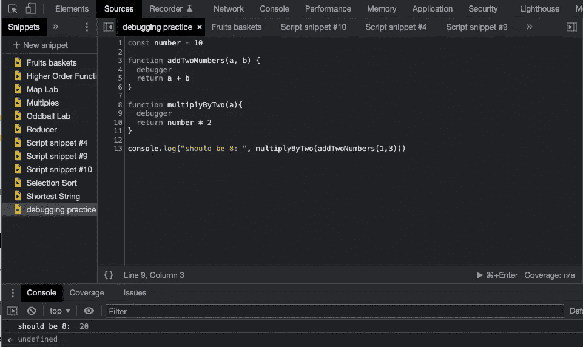

# 使用 Chrome 开发工具中的代码片段调试 JavaScript

> 原文：<https://blog.devgenius.io/debugging-javascript-using-snippets-in-chrome-developer-tools-ce7d41071ae8?source=collection_archive---------16----------------------->

如果你还不知道，Chrome 中的开发者工具是不可思议的！直到[托马斯·托巴尔](https://medium.com/@codetombomb)带我浏览它们，我才知道它们有多有用。

我将向您展示如何使用 Chrome 开发工具中的代码片段来帮助可视化您正在编写和调试的代码。

# 起初，我不喜欢使用控制台进行调试

我是 JavaScript 和 web 开发的新手。我开始使用 Replit 和后来的 VS 代码编写代码。因此，当我开始学习在控制台中编写和测试代码时，我不像使用其他工具那样喜欢使用它，因为:

*   我不知道如何使用它。
*   我需要刷新浏览器来修改我之前输入的代码，即使我已经清空了控制台。
*   感觉更像命令行终端，在那里其他人帮助我更好地可视化我的代码和各部分之间的关系。

# 但是现在我喜欢用它！

事实证明我做的那些假设是错误的。在开发者工具中使用代码片段可以帮助你可视化你的部分代码是如何以我以前无法做到的方式运行的。经过几个简短的步骤，你可以设置你的开发工具看起来像 Replit，并能够看到你的变量在每一步的值，看看他们在哪里走错了路。

# 如何在 Chrome 开发者工具中运行代码片段

这里有一个关于如何设置自己运行 Chrome 开发者网站代码片段的教程链接。有很多方法可以进入代码片段窗格，而且都非常简单！

我建议在开始之前打开一个像 [http://localhost:3000/](http://localhost:3000/](http://localhost:3000/)) 这样的网站，因为许多网站都采取了安全措施来限制你可以在上面运行的内容。

要进入“代码片段”窗格，您可以:

1.打开 web 浏览器到[http://localhost:3000/](http://localhost:3000/](http://localhost:3000/))
2。打开开发者工具。
3。键入`Control+Shift+P`或`Command+Shift+P` (Mac)
4。开始输入“片段”并选择`Show Snippets`，然后按`Enter`。它会带你去那里！

## 看起来怎么样

这是环境的样子:

你可以看到它看起来很像 Replit。我的代码片段文件在左窗格中，在中间窗格中我可以输入我的代码，在底部窗格是控制台。您可以将脚本保存为片段，以供以后使用或参考。

当您在代码中调用调试器时，它可以帮助您查看代码哪里出错了，尤其是在您没有收到错误消息的情况下！使用调试器，您可以通过停止断点来检查代码，也可以逐行检查。

## 它是如何工作的

在这段代码中:

我希望我的代码:

1.  运行 addTwoNumbers(1，3)应该会返回 4
2.  然后，将这个数乘以 2，得出 8。

它应该返回 8…

但是当我调用这个函数时，它返回 20。为什么？

你也许能马上发现错误。如果是这样，太好了！这是一个常见的错误，也是声明全局变量的危险的一个很好的例子。如果没有，调试器可以真正帮助您发现错误。

观看下面的视频，了解如何使用调试器来查找错误和检查代码。

 [## 调试代码片段

### 演示在 Chrome 开发工具中使用代码片段进行调试的简短视频。](https://drive.google.com/file/d/1T2JayUhfyOQZVVeCWtwC8ozCSmPiEwon/view?usp=sharing) 

我希望这对您的调试之旅有所帮助！