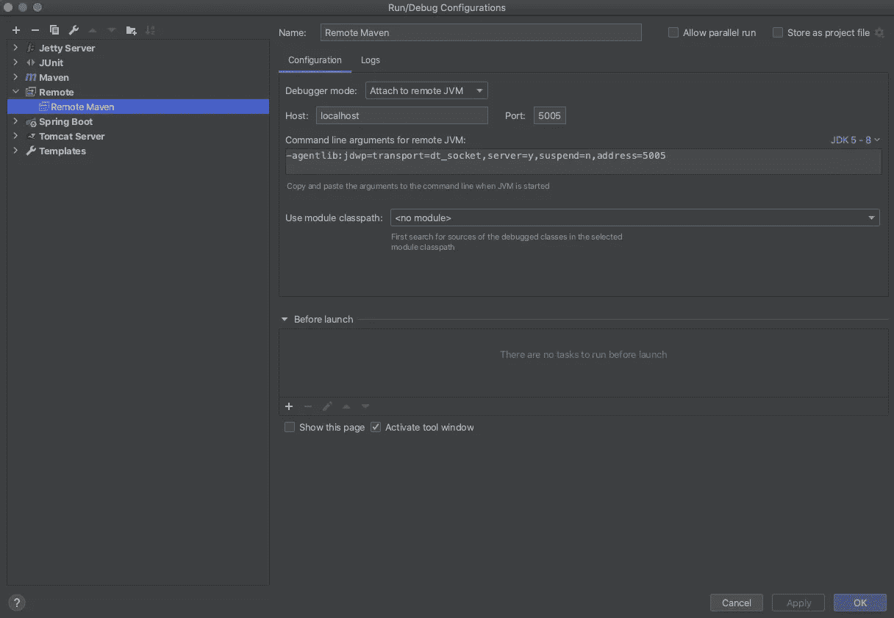

# 在 IntelliJ IDEA 中调试 Maven 测试

> 原文：<https://blog.devgenius.io/debugging-maven-tests-in-intellij-idea-ad72c4da24b1?source=collection_archive---------0----------------------->


我们都知道。您编写了测试，当您在 IntelliJ 中单击 Run 按钮时它可以工作，但是当使用`mvn clean test`运行时它会失败。

它可能是各种各样的问题，与 jar 打包有关，等等。你在测试中添加了断点，但是如何说服 Maven 的 Surefire 插件进入调试模式呢？如何使用 IntelliJ 调试工具的牛逼动力集？

**远程调试救急。**

# 智能理念

为 Tomcats 等设置远程调试可能非常麻烦，但为 Maven Surefire 插件测试设置远程调试实际上非常容易。

在 IntelliJ 中，我们创建新的运行配置。



我们可以只添加一个新的，并保留默认值。

# 专家

现在我们在调试模式下执行 maven 运行。

```
mvn test -Dmaven.surefire.debug
```

这将在调试模式下启动测试。读取终端文本，当出现调试模式开始的行时，启动 IntelliJ 运行配置。它会将自己附加到正在执行的测试中，并且您可以使用 IntelliJ 提供的所有工具。

如果您只想执行一个具体的测试，您可以这样做:

```
mvn test -Dtest=TestClass.java#testMethod -Dmaven.surefire.debug
```

如果你喜欢这篇文章，你可以在推特上关注我。

*原载于*[](https://ppolivka.com/posts/debugging-maven-tests-in-intellij)**。**