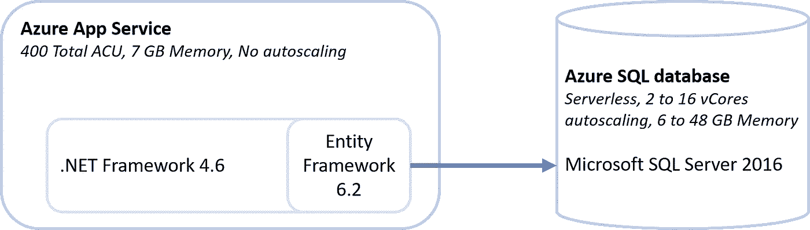
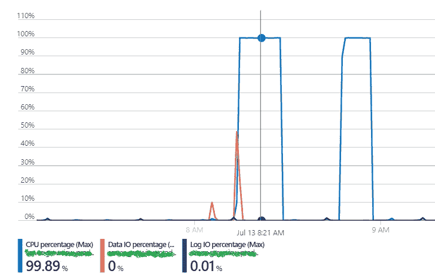
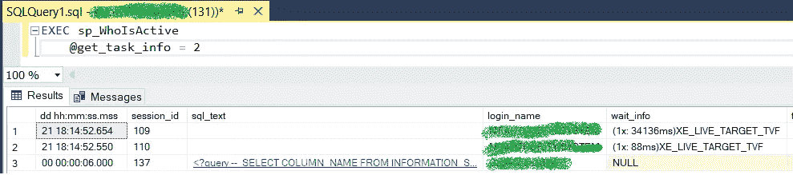

# 调试 Azure SQL 数据库中的性能问题

> 原文：<https://blog.devgenius.io/debugging-my-way-out-performance-issues-in-azure-sql-database-9a1c9380cd1d?source=collection_archive---------4----------------------->

## Azure / SQL 数据库

## 我如何阻止 Azure SQL 数据库在随机时间变得难以忍受的慢。


Joshua Hoehne 在 [Unsplash](https://unsplash.com?utm_source=medium&utm_medium=referral) 上拍摄的照片

我继承了一个*的遗留物* web API，并且我一直致力于支持一些试点项目。

最近，它决定给我最好的礼物:不眠之夜试图找出性能问题。有时，**生产 API 中的一个端点会变得非常慢**。从数据库中提取几个字节需要几分钟，计算利用率达到 100%。这将持续几个小时，有时几天，然后自己恢复正常。绝望让我克服了对堆栈溢出提问的恐惧，从那里我得到了找到解决方案的工具。

在这篇短文中，我想介绍一下我找到的**调试过程**、**工具**和**解决方案**。希望它能帮助其他开发者克服他们自己的问题！

# 起点



架构的高级视图

该申请包括以下两个部分:

*   **API:** 用 C#写的使用**。NET 框架** 4.6。它利用了使用**代码优先**方法的**实体框架** 6.2(简而言之，域模型是 EF 负责映射到数据库的 C#类)。API 作为 Azure 应用服务托管。
*   **数据库:** Azure SQL 数据库托管在 Azure 中(作为托管服务)，使用无服务器计划，自动从 2 个扩展到 16 个 vCores。

*受牵连的*端点试图使用以下查询从数据库中检索传感器数据，执行了大约八次。每个调用都返回一个数据点(时间戳和值)。在正常情况下，通话大约需要一秒钟。在*倒霉的时候*，花了几分钟。

导致性能问题的查询

# 调试:在堆栈溢出之前

这一切都始于团队中令人担忧的消息:*应用程序没有响应，你能调查一下吗？从技术上来说，它并不是没有反应。这只是一个非常小的端点没有在合理的时间内响应。*

*也许某个* ***bug 被推上了生产？*** 没有，最近没人碰生产代码。*也许* ***它降级了我们的订阅？*** 不，都是好的。 ***DoS？*** 否，数据库和 API 端的 CPU 利用率都为零，也没有来自 [AppInsight](https://docs.microsoft.com/en-us/azure/azure-monitor/app/app-insights-overview) 的请求记录。

然而，一些奇怪的事情引起了我的注意。如果我触发端点，我会看到**数据库计算利用率峰值达到最大值**。这种情况以前从未发生过，分配给数据库的资源超过了预期的工作负载。



执行查询时数据库上的使用峰值，来自 Azure 门户指标

好了，**让我们深入研究一下代码**。打开 Visual Studio >复制生产数据库的连接字符串>调试>打开[邮差](https://www.postman.com/)运行查询。完美表现，结果不到一秒就回来了。*什么？*让我们在已部署的应用上再试一次。它没有反应。*什么？*

让我们试试别的东西。打开[SQL Server Management Studio](https://docs.microsoft.com/en-us/sql/ssms/download-sql-server-management-studio-ssms?view=sql-server-ver15)，运行**原始查询**。完美的表现。*什么？*

好吧，也许是服务器坏了？让我们试试**在 Azure 中重启**应用。不管用。**停止**和**启动**。不管用。**重新部署**新版本。不管用。午休时间。

午饭回来，应用程序**运行的很流畅**，好像什么都没发生。*什么？*

# 调试:堆栈溢出后

它*自愈了*一次，但没有第二次。同样的故事，同样的尝试，浪费了一天时间查看应用洞察中的每个可能的指标和依赖关系。没什么有用的。


绝对是个谜。照片由[基兰伍德](https://unsplash.com/@kieran_wood?utm_source=medium&utm_medium=referral)在 [Unsplash](https://unsplash.com?utm_source=medium&utm_medium=referral) 上拍摄

我决定[询问栈溢出](https://stackoverflow.com/questions/62890402/azure-net-framework-with-ef-code-first-and-microsoft-sql-server-sudden-cpu-s?noredirect=1#comment111218372_62890402)，考虑到我所掌握的信息很少，希望很小。幸运的是，SO 用户 [Preben Huybrechts](https://stackoverflow.com/users/639829/preben-huybrechts) 开始问一些非常有见地的问题。

> 您是否有 SensorInfoId、开始时间和结束时间的测量系列索引？你有测量时间的递减指数吗？你调查过锁定吗？可以用 [sp_whoisactive](https://github.com/amachanic/sp_whoisactive/blob/master/who_is_active.sql)
> 
> 分享你的[等待统计数据](https://www.brentozar.com/sql/wait-stats/)也会有所帮助。
> 
> 如果可能，你也可以[分享执行计划](https://www.brentozar.com/pastetheplan/)

是，我有所有那些索引。很好，更多的工具来帮助我调试！

**sp_whoisactive 是带我找到解决方案的工具**。要使用它，请下载。sql 文件，用 Microsoft SQL Server Management Studio 打开它，然后运行它。下次执行查询时，运行

```
EXEC sp_WhoIsActive
@get_task_info = 2
```

这个命令将为您提供一个关于谁在使用数据库以及如何使用数据库的详细概述。您可以查看作者的文档以获得广泛的信息。



sp_WhoIsActive 执行结果的示例视图。

我可以看到我正在测试的查询:除了让我抓狂的那个之外，都很快。那台挂着，**除了 *wait_info*** 之外，一切似乎都是正确的。这是一个读查询，没有其他正在进行的查询，没有锁，但是在那个列中写了一些东西: **CXPACKET。**

正如 Brent Ozar 在[发表的一篇非常清晰的文章](https://www.brentozar.com/archive/2013/08/what-is-the-cxpacket-wait-type-and-how-do-you-reduce-it/)中所描述的，CXPACKET 意味着有一个查询正在多个内核上执行，一些任务正在等待其他任务完成。如果与性能问题一起观察，这可能是一个迹象，表明存在**过度的并行化，这会降低查询的速度，而不是优化查询**。

在 SQL Server 中，可以配置最大并行度( *Max DOP* )，而**微软自己建议 Max DOP 为 8** 。但是，在 SQL Server 2019 之前，默认值是 *infinite* (0)，就像我的例子。

通过[将 MaxDOP](https://docs.microsoft.com/en-us/sql/database-engine/configure-windows/configure-the-max-degree-of-parallelism-server-configuration-option?view=sql-server-ver15#SSMSProcedure) 配置为 8，应用程序又回到了*的工作状态。*

# 我的解释

即使问题得到了解决，找出为什么它只是偶尔发生，而且是在看似随机的情况下，仍然是一件有趣的事情。

有时，返回大量数据的传感器和时间间隔会触发相同的端点。我猜在那些情况下，**查询被认为是*慢的*并且随后像**一样被优化，即使是在查询返回一小组数据的(最频繁的)情况下。除此之外，SQL 数据库可以从 2 个扩展到 16 个 vCores，从而提高可能的并行化水平。

# TL；速度三角形定位法(dead reckoning)

SQL Server 最大并行度(Max DOP)被配置为无穷大。该查询即使很小，也是在并发级别运行的，这使得它太慢了。

**将最大 DOP 更改为微软建议的 8 级，解决了该问题。**